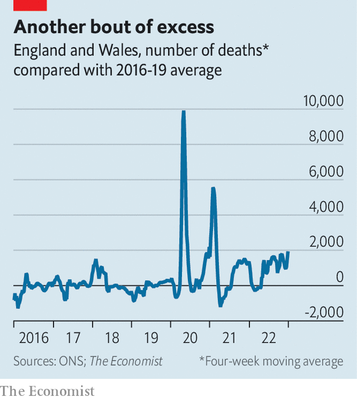

###### The NHS in crisis

# How many excess deaths in England are associated with A&E delays? 

##### Around 260 a week between August and November, according to our analysis 

 

> Jan 11th 2023 

The fact that the National Health Service (NHS) is under  is undisputed. Almost everything else is debated, including the question of how many patients are dying as a result of the chaos in hospitals. The proportion of patients who wait more than 12 hours in accident-and-emergency (A&amp;E) departments to be admitted to a ward has risen from 2% to 7% over the past year. The Royal College of Emergency Medicine (RCEM), a doctors’ association, has estimated that delays in A&amp;E are leading to 300-500 additional deaths per week. Officials at NHS England do not accept this figure. 

 


A glance at the data suggests that something is awry. Excess mortality in England and Wales—a measure of deaths from all causes compared with a baseline period—in the four weeks to December 30th was 17% higher than the average of this period in 2016-19. That is an extra 1,700 deaths per week (see chart). 

The primary basis for the RCEM’s claim is a paper published in the  in early 2022. Its authors used NHS data from 2016 to 2018 to estimate an individual’s risk of death after arriving in A&amp;E. They found that a wait of six to eight hours, rather than the target of less than four hours, for a patient to be transferred from A&amp;E to a ward increased their risk of death by 1.7 percentage points, other things being equal. 

The RCEM admits that its own estimates are rough. To verify them,  has built a model using hospital-level data on patient deaths and A&amp;E waiting times for 121 individual NHS trusts in England on a rolling 12-monthly basis between March 2016 and July 2022. We, too, find that delays in A&amp;E—from time spent waiting for initial treatment to the decision to admit—are associated with higher mortality after controlling for other things. A ten-percentage-point increase in the proportion of A&amp;E patients waiting between four and 12 hours for admission to a ward, for example, is associated with an additional 1.2 deaths per 1,000 patients arriving at hospital. 

NHS death data since July 2022 are not yet published, but data on waiting times are available up to November. Our model suggests that an additional 3,400 A&amp;E-associated deaths occurred between August and November 2022 compared with a scenario in which waiting times remained at 2019 levels. At around 260 per week, that number is below the ballpark figure from the RCEM, but would still account for one-quarter of the excess deaths in England over that period. 

There are caveats. The model uses hospital-level mortality data, not data for emergency admissions specifically. Other factors could be having an effect, from ambulance waiting times to : our estimate is not a ceiling on the number of excess deaths that can be associated with the NHS. The prevalence of covid-19 and flu is beyond its control. But that more people are dying—and dying in large numbers—because of delays in A&amp;E is clear enough. ■


