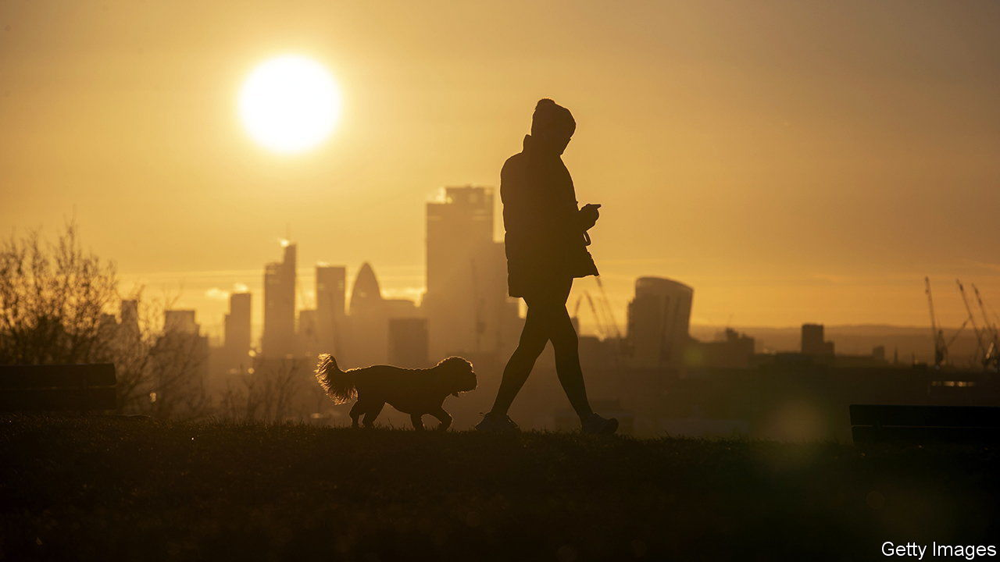

###### Weathering the storm

# Lower gas prices will provide only limited relief to Britons 

##### Unseasonably warm weather drives down wholesale energy prices but not household bills 

 

> Jan 12th 2023 

“He blew and they were scattered,” ran the inscription on English medals after a mighty storm helped save them from invasion by a Spanish armada in the 16th century. This winter, facing down an energy crisis provoked by Vladimir Putin’s war in Ukraine, Britons might well thank the Lord for turning up the temperature. 

A —as well as gusty weather for wind farms—has driven wholesale energy prices down across the continent. Unseasonable warmth, rather than energy-saving measures, explained the entirety of the fall in British gas demand from June to October, according to a study by academics at Imperial College London. The mild weather has largely persisted since. The cost of natural gas for delivery in February 2023 fell to about £50 ($61) per megawatt hour on January 1st, the lowest month-ahead price for a unit of gas since June 2022. Britain’s households, however, will not see the benefits of falling wholesale prices. Instead it is the government that will pocket most of the windfall.

Retail prices depend on two government policies: a price cap set by Ofgem, the energy regulator, which limits how much providers can charge; and the government’s energy-price guarantee (EPG), which fixes the unit prices that domestic users pay for gas and electricity and provides subsidies to make up the difference. During the first quarter of 2023 the cap will be set at the equivalent of a £4,279 annual bill for a “typical household”, based on normal energy use. The EPG aims to keep bills for such a family to around £2,500.

Households pay only whichever of the two policies sets prices at the lower level. In other words, when the guarantee keeps bills below the price cap, as now, then the cap is irrelevant to bill-payers. Just as the government shielded households from the full force of the increase in wholesale gas prices in 2022, they will not benefit from their more recent fall.

Indeed, “for most people energy prices are going up,” points out Emily Fry of the Resolution Foundation, a think-tank. The EPG will become less generous in April, as the government bids to reduce its cost. A typical household will pay the equivalent of around £3,000 for an annual bill. Although the price cap is forecast to fall at the same time—to £3,458, according to Martin Young of Investec, a bank—it will still be above the guarantee. (Higher consumer prices for gas will also raise headline inflation, although the Bank of England will focus on underlying price pressures.)

The Treasury will instead reap most of the benefits from lower wholesale prices. The Office for Budget Responsibility (OBR), a fiscal watchdog, forecast in November that the EPG would cost the government around £24.8bn (roughly 1% of GDP) in the fiscal year 2022-23 and an additional £12.8bn in 2023-24. That was predicated on prices peaking at £3.70 a therm in the first quarter of this year. Futures markets have it that the price for a unit of gas will be around half that level in March. Much can change, from colder weather to greater demand for gas from China, but the government could save around £22bn for the two years in which the EPG is due to run, reckons Investec’s Mr Young.

Jeremy Hunt, the chancellor of the exchequer, will decide how to use these one-off savings—lowering government debt, perhaps, or providing extra funding to ease the  in the National Health Service. (A more fundamental change in the long-term outlook for energy prices would be needed before he could start cutting the tax burden.) He has already recycled some of the money into support for business. 

On January 9th he announced that a cap on energy costs for firms will be replaced by a new scheme at the end of March, instead of simply expiring as originally planned. Businesses will then get a discount of £6.97 per megawatt hour of gas, so long as wholesale prices remain above a certain threshold. The government estimates the new scheme will cost £5.5bn compared with the OBR’s estimate of £18bn for the previous policy. Despite the continued largesse, it will still feel to most businesses as if energy prices are rising. 

Further falls in wholesale gas prices would provide more relief. These would be passed directly onto consumers and firms, as well as reducing inflationary pressure. For that, the warm weather has to hold.■


