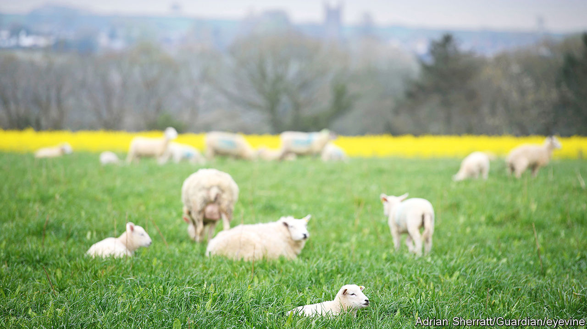
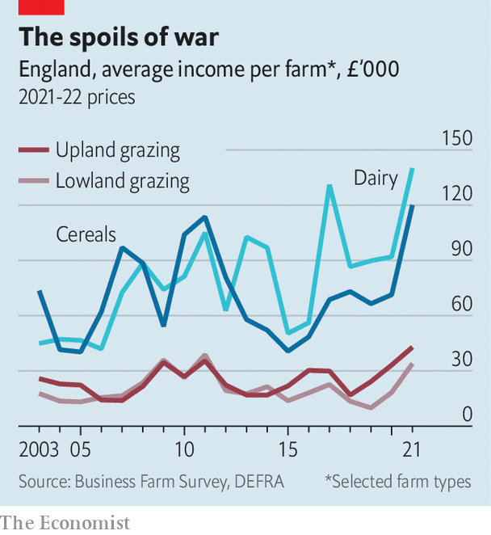

###### Agricultural subsidies

# The longed-for transformation of English farming isn’t happening 

##### The green revolution that failed 

 

> Jan 12th 2023 

“There’s been lots and lots of chat about it, and now it’s happening,” says Nic Renison, a livestock farmer in Cumbria. What has happened is that agricultural subsidies in England have been pruned hard enough that Ms Renison and others are seeing the effect on their bank statements. Puzzlingly, though, something more profound is not happening. The wholesale transformation of farming, which the government is trying to achieve through the subsidy cuts and other reforms, appears to have gone awry. 

Farming was supposed to be one of the great opportunities opened by Brexit. Freed from the eu common agricultural policy, the British government could stop paying people simply for farming and start paying them for delivering public goods. Per-hectare subsidies would be wound down and replaced by payments for doing benign things like planting hedgerows, creating ponds and conserving carbon in soil. Farmland birds like corn buntings and turtle doves would return to the fields. 

Other changes were expected to occur at the same time. Since (the thinking went) farm subsidies are capitalised into land values, their removal should take the pressure off prices. As a result, young people would find it easier to get into farming. Old farmers who were stuck in their ways would retire, encouraged by programmes that paid them lump sums to quit. 

England has already embarked on these changes; Northern Ireland, Scotland and Wales are sticking with the old-style subsidies for now. Last year a small English farmer could expect to receive 20% less in per-hectare subsidies than he or she did in 2020, in cash terms. This year the subsidy is 35% lower, and by 2027 it will have vanished. Subsidies are being cut even faster on large farms. 

But it has proved easier for the British government to promise superior alternatives to the old eu subsidies than to actually create them. Many of the new environmental grants are still not available, or are only being piloted. Some of the ones that have been unveiled fail to impress. In 2020, before the cuts began, the per-hectare subsidy generally amounted to more than £230 ($280; the average English farm is 85 hectares). The new Sustainable Farm Incentive pays as little as £22 per hectare for soil conservation, although on January 5th the government said it would boost payments. Robin Milton, a farmer in Exmoor, says many of his fellow-farmers do not see the point. 

Take-up of that scheme has been slow. The Department for Environment, Food and Rural Affairs says it has received about 1,980 applications from England’s more than 100,000 farms. Some farmers are signing up for older environmental schemes. But many others seem determined to “try and farm their way out of the financial hole”, says Joe Stanley, a cereal farmer and county chair for the National Farmers’ Union in Leicestershire, Northamptonshire and Rutland. Some could become less environmentally minded. 

If there is scant evidence that many farmers are becoming enthusiastic greens, there is even less sign of them leaving the land. Last year under 3% of farmers plumped for the government’s one-off “lump sum exit scheme”, barely more than the number of retirements you would expect in a normal year. Jason Beedell, director of rural research at Strutt &amp; Parker, an estate agent, saw not a single case last year of a farmer persuaded to sell his or her land by subsidy changes. Farmland prices continue to rise, partly because investors see it as a haven. Strutt &amp; Parker says that arable land values went up by 12% last year, while pasture rose by 13%. 

Farmers increasingly derive income from many activities, which helps them to hang on even as subsidies are reduced. The Farm Business Survey shows that 47% of them rent buildings and 22% produce solar power. In the beautiful Langdale Valley in the Lake District, Jonathan Benson and Nicola Marsh have built wooden glamping pods with hot tubs on their farm. “We knew what was coming, and we’ve diversified,” says Mr Benson, who also herds sheep and builds fences on other farms. 

 


Even old-fashioned farming has lately been profitable, thanks to the hot, dry summer of 2022 and Russia’s invasion of Ukraine, which has disrupted one of the world’s great cereal-growing regions. The average English cereal farm brought in £120,100 last year, 68% more than the previous year and the most in real terms since figures began in 2003. Livestock and dairy farmers fared well, too (see chart). 

Perhaps it is just too early to expect a transformation of English farming. Per-hectare subsidies are on course for further cuts. The government will roll out more environmental schemes, albeit painfully slowly, and farmers will grow more accustomed to them. In some years the weather will be bad, squeezing farm incomes. But it is also possible that jittery ministers will throw the entire process into reverse. 

The National Farmers’ Union has managed to persuade politicians that they ought to pay more heed to food security, which the NFU defines largely as growing more food in Britain. That could open the door to renewed subsidies. And English farmers can always complain that they are being treated differently from farmers elsewhere in the kingdom, where the old subsidies roll on.

Rural people tend to vote Conservative but can turn. Last June the Liberal Democrats won the Tiverton and Honiton by-election both by reminding voters about the behaviour of the then-prime minister, Boris Johnson, and by arguing that the Tories had neglected that mostly rural seat. Pausing the per-hectare subsidy cuts (something the Labour Party has supported) would mollify farmers fairly cheaply. As the next election nears, it will take a brave government to stay the course. ■


