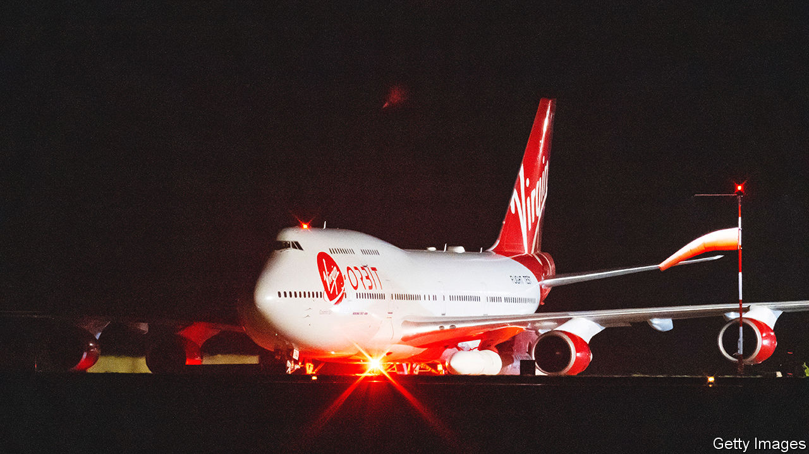

###### Newquay, we have a problem

# What the failure of Virgin Orbit means for Britain’s space ambitions 

##### And for the firm itself 

 

> Jan 12th 2023 

It was a slightly desperate example of the spin-doctor’s art. “Historic UK mission reaches space, falls short of orbit,” read the press release from Virgin Orbit, a satellite-launch firm, on January 10th. The night before, in front of crowds of space enthusiasts braving the weather, a converted jumbo jet had taken off from Newquay Airport in Cornwall, in south-west England, to perform the first-ever space launch from British soil. 

The first part of the mission went well. Once the plane was safely over the Atlantic ocean, a rocket detached, ignited its engine and made for the sky. But about half an hour later, Virgin Orbit released a terse statement talking of an “anomaly”. The firm later admitted that, although the rocket had technically reached space, it had not made it into orbit—and neither had any of the nine satellites it had been carrying.

It is not yet clear exactly what went wrong (other Virgin Orbit rockets have made it into orbit in the past). But the failure comes at an awkward time for the company, which hopes to carve out a niche offering cheap, small-scale launch services to the rapidly growing space industry. That market is highly contested, and Virgin Orbit’s prospects looked shaky even before the launch. (After, its share price, already down by 75% over the course of 2022, fell by 12%.)

It is also a bit of a setback for Britain’s  in the space business. The country has plans for seven “spaceports” (this year may also see launches, by different firms, from Sutherland and the Shetland Islands). Britain’s high latitude, a drawback for some orbits, gives easier access to others; its proximity to the Atlantic means rockets can be aimed away from populated areas. Still, launching rockets, despite the glamour, is not where most of the value lies. BryceTech, a consultancy, put the value of the space business at £270bn in 2019—but the value of launch services at just $7bn. ■


