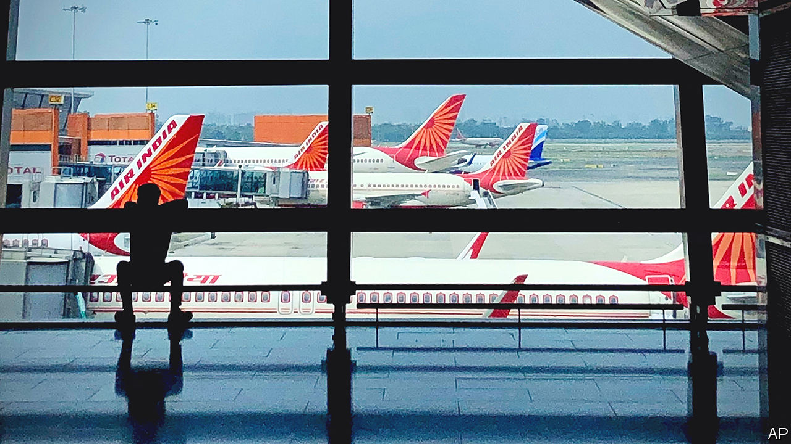

###### Scandal at Air India

# A humiliating incident on an Air India flight triggers outrage 

##### And, for Indian business, a bout of soul-searching 

 

> Jan 12th 2023 

Most in-flight horror stories, of which passengers everywhere experience too many, elicit a scripted apology from the airline or its chief executive. Then it is back to business; aggrieved travellers are left to stew. An incident in November on an Air India flight from New York to Delhi is playing out differently. On January 11th a court in the Indian capital heard a case of a 34-year-old man arrested for urinating while intoxicated on a 72-year-old female fellow business-class passenger. The man blamed the act on alcohol and told the court he had no memory of it when the cabin crew woke him and asked him to apologise, which he did. His bail request was nevertheless denied. 

India is full of stories of well-connected individuals escaping punishment for untoward actions. A brief spark of outrage is followed, sometimes, with a promise of an investigation that, if it happens, tends to be dragged out and soon forgotten. This case fitted that script—until late December, when a letter from the victim reached Natarajan Chandrasekaran, chairman of Tata Sons, the conglomerate that bought Air India from the government in 2022. The letter, which has been seen by , began innocently enough: “I am writing to express my deep disappointment regarding the appalling incident that occurred during my business-class trip.” 

Then came the lurid details. After the lights were dimmed she was confronted by the inebriated passenger, and sought help from a crew who lacked the ability or the capacity to respond. She recounts being told to return to her original seat (not next to the offender’s), which had been covered with sheets but still felt damp and smelled of urine. Another passenger pleaded for her to be upgraded to an empty first-class seat, to no avail. 

This sparked a reckoning, starting at the airline’s parent company. Mr Chandrasekaran called the incident “a matter of personal anguish for me”. The flight’s captain and four crew members were suspended. The offender, an Indian employee of Wells Fargo, an American bank, was sacked from his job. Delhi police tracked him to Bangalore using mobile-phone data. He was arrested on January 7th and has been held in pre-trial detention. Outrage has spilled onto newspaper pages and TV screens. The aviation minister weighed in, telling reporters, “Further action will be taken speedily after the completion of the ongoing proceedings.”

There may be a silver lining. Any passenger tempted to misbehave on a flight in the future may think again (including about consuming so much booze as to render them thoughtless). For Tata and Air India, the public-relations disaster has made it clear that turning around the flag carrier, diminished by decades of government mismanagement, will require instilling a new culture. Buying new aircraft and hiring new managers is one thing; shaking up encrusted union work rules that have for decades dulled staff initiative is something else entirely. As India’s most respected business house, Tata could pull it off. And where it leads, the rest of Indian business may follow. ■


