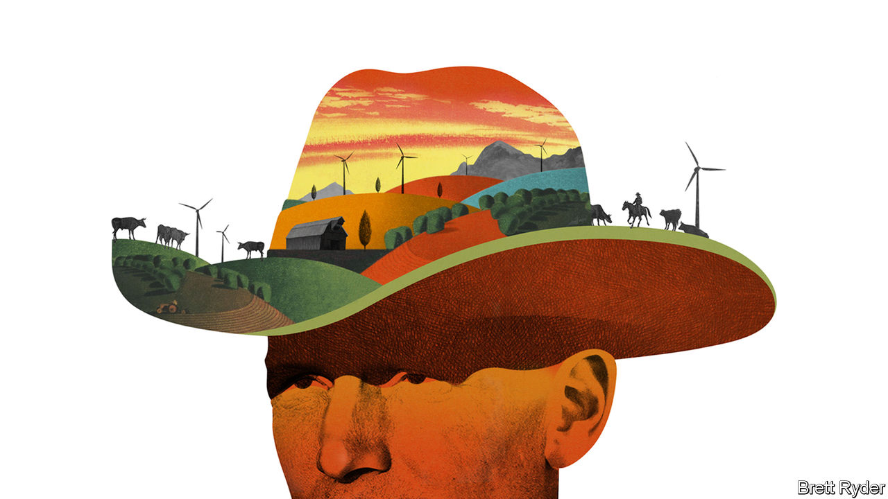

###### Schumpeter

# Go to Texas to see the anti-green future of clean energy 

##### Lessons for liberals from climate-sceptic wind ranchers 

 

> Jan 12th 2023 

For more than 140 years John Davis’s family has owned the Pecan Spring Ranch on the prairie lands of West Texas. He has a photo of his great-great-grandmother, known as “the sheep queen of Texas”, sitting in a horse-drawn carriage beneath a tree that still stands in front of the hay barn. It’s a tough business to maintain, even with a valuable herd of Wagyu beef cattle to raise. Yet when a renewable-energy developer offered Mr Davis a large payment to put wind turbines on his land, at first the staunch Republican—and former state congressman—turned it down.

His opposition was knee-jerk. “Clean energy has been branded a liberal technology. People literally say, ‘this is AOC coming into town,’” explains his son, Samuel, referring to Alexandria Ocasio-Cortez, the left-wing congresswoman whose name pops up with almost flattering frequency among conservative Texans. Eventually, though, economic sense prevailed. As the family points out, at an average return per acre, cattle generate $8, deer hunters $15—and wind hundreds of dollars. It assures the ranch’s future. 

Now hosting seven turbines, the family embraces renewables as religious converts would. Samuel is a representative for the Texas Land and Liberty Coalition, which promotes wind and solar energy among ranchers. His parents have bought a filling station, ripped out the petrol pumps, and are converting it into an electric-vehicle charging station (with a farmers’ market on the side). Your columnist sat down with the clan last month over a breakfast of quiche and tomato-jalapeño jam, before bouncing across their ranch in an electric buggy. He learned lessons about clean energy that challenged his own philosophical assumptions. 

The first is that you do not have to believe in climate change to support renewables. Quite the opposite. For a portion of conservative America, things like climate change and carbon taxes are still viewed as big-government malarkey. Even greenery is despised as a term co-opted by the left. “When someone says we are embracing green energy, it’s like shoving an ice pick through our ears,” says Matt Welch, head of Conservative Texans for Energy Innovation, another pro-renewables group. “We just say clean energy.” 

This is not just Texan recalcitrance. Wind power is abundantly harvested in states run by Republican governments and over land owned by climate-sceptic ranchers. The message they prefer is a more free-market one: that wind and solar are increasingly competitive sources of energy, help reduce electricity costs, foster entrepreneurship, and are no less American than oil and gas. 

It is a surprisingly effective mantra. You might think that California, which talks a good game about climate change and green energy, is on the forefront of renewables development. But Texas is far ahead. According to a study commissioned by Mr Welch’s organisation, in the second quarter of 2022 his home state had three times more wind, solar and battery storage under construction than California. The Energy Information Administration, a federal agency, predicts that this year the share of renewables in Texan power generation will for the first time exceed that of natural gas.

That helps explain the next lesson. For all the mockery of AOC, it is from their own Republican ranks that wind-energy ranchers face the most antagonism—especially from fossil-fuel producers who fear being undercut by renewables. Organisations like the Texas Public Policy Foundation (TPPF), which lobbies on behalf of oil and gas, and the Texas Landowners Coalition, backed by right-wing beneficiaries of the fracking boom, are fighting tooth and nail to curb wind development. The TPPF’s battle extends to proposed offshore wind farms as far away as New England. 

Jason Isaac of the TPPF says his organisation helped convince the Texas government to let a school-district tax credit lapse on December 31st that encouraged renewables investment in rural Texas. He argues that such fiscal support distorts the power market, though that stance ignores other incentives for oil and gas producers. He blames wind for the blackouts across Texas in 2021 caused by storm Uri, never mind that an official report concluded that “all types of generation technologies failed”, including natural gas and coal. Republicans accuse liberals of “cult-like decarbonisation”, yet their policies hurt some fellow conservatives. 

The third lesson is pragmatism. Even though Republican lawmakers unanimously opposed President Joe Biden’s Inflation Reduction Act (IRA), which provides hundreds of billions of dollars to curb America’s use of fossil fuels, red states like Texas plan to lap it up. The Davis family do not support the IRA, but they hope its expanded federal tax credits will entice more wind and solar to rural Texas. The state also expects to attract big hydrogen and carbon-sequestration projects. Other Republican states like Alabama, Georgia, South Carolina and Tennessee are welcoming billions of dollars of clean-energy investments spurred by the IRA. Even conservative businesses that lobby strongly for fossil fuels hope to benefit from the energy transition. For example, Koch Industries, an energy conglomerate, supported a big investment by Freyr, a Norwegian firm, in a battery factory in Georgia that will benefit from the law. 

Don’t waste your breath 

The upshot is that there are ways to promote clean energy that do not rely on convincing climate sceptics that they are bonkers. A better sales pitch may be to play up the cost advantages of renewables rather than the climate benefits, emphasise their contribution to cutting air pollution rather than carbon emissions, and acknowledge that, owing to intermittency factors, natural gas may have a role to play in power generation for years to come. As Michael Webber, a professor of energy at the University of Texas, puts it, “It’s not unusual for Texas to do the right thing for all the wrong reasons.” In the end, everyone’s aim is a better future. As the elder Mr Davis says, many ranchers lucky enough to have oil under their land have benefited for generations. “We struck wind.” ■


