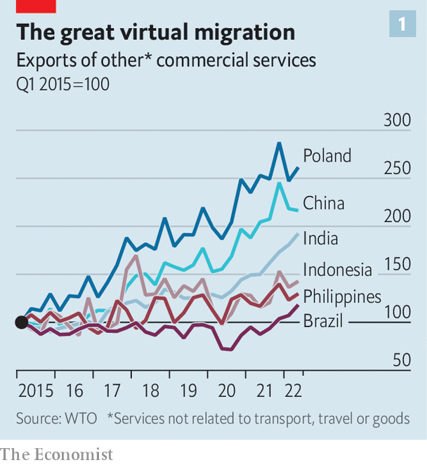
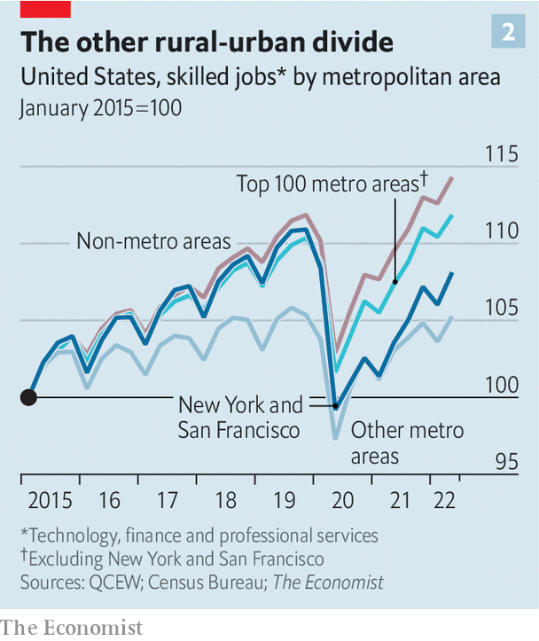
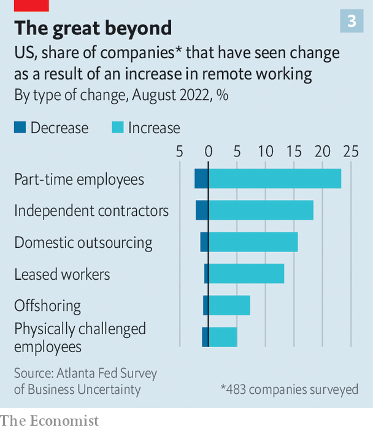
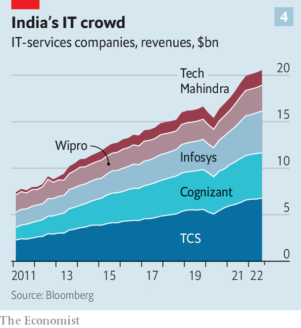
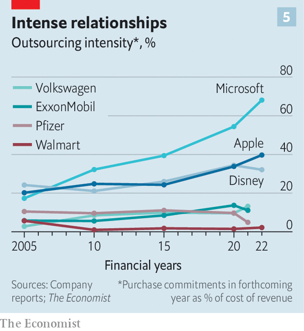

###### The fuzzy corporation

# How technology is redrawing the boundaries of the firm 

##### Companies are reorganising themselves in the wake of digital upheaval 

 

> Jan 8th 2023 

Technology and business are inextricably linked. Entrepreneurs harness technological advances and, with skill and luck, turn them into profitable products. , in turn, changes how firms operate. Electricity enabled the creation of larger, more efficient factories, since these no longer needed to depend on a central source of steam power; email has done away with most letters. But new technologies also affect business in a subtler, more profound way. They alter not just how companies do things but also what they do—and, critically, what they don’t do.

The Industrial Revolution ended the “putting-out system”, in which companies obtained raw materials but outsourced manufacturing to self-employed craftsmen who worked at home and were paid by output. Factories strengthened the tie between workers, now employed directly and paid by the hour, and workplace. The telegraph, telephone and, in the last century, containerised shipping and better information technology (IT), have allowed multinational companies to subcontract ever more tasks to ever more places. China became the world’s factory; India became its back office. Nearly three years after the pandemic began, it is clear that technology is once again profoundly redrawing the boundaries of the firm.

In the rich world, fast broadband and apps like Zoom or Microsoft Teams are allowing a third of working days to be done remotely. Jobs are trickling out from big-city corporate headquarters to smaller towns and the boondocks. And the line between collaborating with a colleague, a freelance worker or another firm is blurring. 

 


Companies are drawing on common pools of resources, from cloud computing to human capital. By one estimate, skilled freelance workers in America earned $247bn in 2021, up from about $135bn in 2018. The biggest firms in America and Europe are outsourcing more white-collar work. Exports of commercial services from six large emerging markets have grown by 16.5% a year since the pandemic began, up from 6.5% before it (see chart 1). On January 9th Tata Consultancy Services (TCS), an Indian IT-outsourcing giant, reported another bump in profits. 

A useful lens for understanding these changes was offered by Ronald Coase in his paper from 1937 entitled “The nature of the firm”. Stay small and you forgo the efficiencies of scale. Grow too big and an enterprise gets unwieldy—think of Soviet-style command-and-control economies. Most commerce happens in between those extremes. Coase, whose insights earned him a Nobel prize in economics, argued that firms’ boundaries—what to do and what not to do yourself—are determined by how transaction and information costs differ within firms and between them. Some things are done most efficiently in-house. The market takes care of the rest.

For example, between the 1980s and the 2010s, globalisation and the IT boom boosted economies of scale, which encouraged market concentration. But they also increased competitive pressures and cut the cost of communication and collaboration between firms. The net result was for many companies to shrink their scopes. In research published last year Lorenz Ekerdt and Kai-Jie Wu of the University of Rochester found that the average number of sectors in which American manufacturers were active fell by half between 1977 and 2017. By the 2000s many sprawling industrial conglomerates like Germany’s Degussa, which had a hand in everything from metals to medicine, or British Aerospace, which was poking at cars, had untangled themselves and picked the knitting to stick to (chemicals and aircraft, respectively). 

Today Coasean forces are ushering in a new type of corporate organisation. It resembles a 21st-century putting-out system—not for artisan craftsmen but for the white-collar professionals who epitomise modern Western economies. Micha Kaufman, boss of Fiverr, an Israeli marketplace which matches freelances with business around the world, observes that firms are getting better at measuring workers’ performance based on their actual output rather than time spent producing it. This is true both of employees and subcontractors. The result is a reorganisation of businesses both internally, and in relation to other companies in the economy.

 


Start on the inside. Using data from America’s Quarterly Census of Employment and Wages,  has examined jobs in three sectors particularly compatible with remote work: technology, finance and professional services. We find that such jobs have become far more distributed across America since the pandemic. Big metropolitan areas have lost out to smaller cities and even the countryside. Since the fourth quarter of 2019, the number of jobs in the three sectors has grown by six percentage points more in rural areas than in San Francisco and New York. 

Firms are also distributing more work across borders. Oswald Yeo, who runs Glints, a recruiting startup in Singapore, says his firm hires employees in batches by country. That helps the new recruits to form in-person bonds with compatriots, while expanding Glints’s talent pool, Mr Yeo explains. There is a premium for places with a small time difference. In Glints’s case, that is countries like Indonesia. 

For American firms, it is often Canada. Microsoft, which opened its first Canadian office in 1985, created a big new one in Toronto in 2022. Google is tripling its Canadian workforce to 5,000. A study last year by CBRE, a property firm, of the 50 cities in America and Canada with the most tech workers found that four of the top ten were Canadian. Together, the four added 180,000 tech jobs between 2016 and 2021, an increase of 39%, while the top four American cities gained just 86,000 jobs, or 8%. Lower living costs help; the Canadian quartet were among the 16 cheapest cities in the group in terms of housing.

Barriers to immigration are another factor forcing firms to look abroad, says Prithwiraj Choudhury of Harvard Business School. Mr Choudhury has documented a growing class of firms that help employers forge stable relationships with foreign employees without hiring them directly. One example is MobSquad, a firm that enlists skilled workers unable to obtain visas to America and employs them in Canada instead. Its American clients include Betterment, an investment firm, and Guardant Health, a biotechnology company.

MobSquad’s recruits sit somewhere between outsourced temps and full-time employees. This sort of arrangement points to the bigger Coasean shift—to how firms demarcate which tasks they perform on their own account and which they subcontract. 

 


A survey of nearly 500 American firms by the Federal Reserve Bank of Atlanta last year found that 18% were using more independent contractors than in previous years; 2% said they used fewer. On top of that, 13% relied more on leased workers, compared with 1% who reduced this reliance. MBO Partners, a workforce-management firm, estimates that the number of American workers engaged in independent work for at least 15 hours a week increased from 15m in 2019 to 22m in 2022. Figures from the Bureau of Labour Statistics are more conservative, but still show that nearly 1m more Americans are self-employed than at the start of 2020. Pandemic-era job losses forcing people into less desirable work arrangements cannot be the whole story; a similar surge in self-employment did not occur after the global financial crisis of 2007-09. 

The shift is again made possible by technology, notably the spread of platforms for freelance work. Having grown slowly, from 9% of America’s labour force in 2000 to 11% in 2018, self-employment is becoming more common. Gig work is no longer just about ride-hailing or food delivery. Whereas earlier platforms, such as Taskrabbit, focused on routine tasks, emerging new ones recruit freelances for complicated work. Upwork specialises in web development; Fiverr is known for media production. Amazon turned to Tongal, another freelancing platform, when it needed a team to rapidly produce social-media content for its Prime TV shows. 

 


Besides making it easier to tap non-employees, technology is enabling companies to collaborate more seamlessly with other businesses. In 2020 Slack, the messaging platform of choice in many a workplace, launched a feature that lets users communicate with outside firms as they would within their own organisations. More than 70% of the  100 list of America’s biggest firms by revenue use the feature. The Atlanta Fed’s survey found that 16% of responding firms had increased domestic outsourcing and 6% had offshored more. Already, combined revenues for six big IT-services firms with large operations in India—Cognizant, HCLT, Infosys, TCS, Tech Mahindra and Wipro—grew by 25% between the third quarter of 2019 and the same period last year. 

Pinning down just how much firms depend on outsiders is tricky—companies do not advertise this sort of thing. To get an idea, Katie Moon and Gordon Phillips, two economists, look at a firm’s external purchase commitments in the upcoming year as a share of its cost of sales. As a snapshot of the economy, this measure of “outsourcing intensity” must be treated with caution; it does not capture all types of outsourcing and different firms account for external purchases in different ways. But it usefully illustrates changes over time.

 


 has calculated the measure using data from financial reports for a sample of large listed firms in America and Europe. They are indeed growing more reliant on others. Average outsourcing intensity in our sample has doubled from 11% in 2005 to 22% in the most recent year of data. This growth is especially pronounced among tech titans such as Apple and Microsoft; businesses that grew more slowly, such as Walmart, a retailing giant, saw small increases. This is consistent with research which finds that as firms grow larger and adopt more technologies, thus becoming more complex and unwieldy, they outsource more operations—precisely as Coase would have predicted. 

As technology evolves further, so will the contours of the firm. Companies may gain more flexibility to seek out new workers for new tasks in new places. Portugal has created a visa for digital nomads, who will be able to work from the country for a year. Argentina wants to introduce a preferential exchange rate for freelance workers selling their services abroad: the “tech dollar” would ensure that they were not exposed to the rapidly devaluing peso. 

For Western white-collar types, stiffer competition for jobs may compress pay. According to a working paper published last year, by Alberto Cavallo of Harvard Business School and colleagues, wages differ less between countries for occupations that are more prone to outsourcing. That means higher living standards for workers in poorer countries and, possibly higher profits for their employers. And for Coase, it means continued relevance. ■


