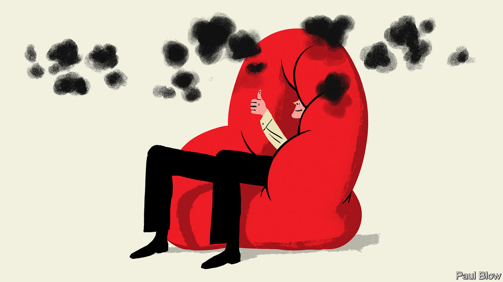

###### Bartleby

# How to unlock creativity in the workplace 

##### Forget drug use and hammocks. Try tedium instead 

 

> Jan 12th 2023 

Academics do not contend to write the most entertaining research paper of the year. But Yu Tse Heng, now at the University of Virginia, Christopher Barnes of the University of Washington and Kai Chi Yam of the National University of Singapore should take a bow nonetheless. In a study published in 2022, the trio tested the widespread notion that cannabis increases creativity.

The researchers recruited a bunch of Americans who take the drug recreationally, and asked them to take some standardised tests of creativity (from thinking of novel uses for a brick to coming up with money-spinning ideas for a music band). Some participants underwent the test immediately after taking cannabis; a control group only did so if 12 hours had elapsed since they last indulged. Independent evaluators assessed the innovativeness of their ideas.

The researchers found that cannabis increased users’ joviality, which is thought to encourage lateral thinking. Drug use also led people to rate their own creativity, and that of other participants, more highly. The problem is that the independent assessors could discern no effect on the actual quality of people’s thoughts. Cannabis users got high and duly found everything mind-blowing, regardless of whether it was or not. “Leaders may want employees to be sober, especially while evaluating ideas” is one of the paper’s dry conclusions. 

You might think that doesn’t need saying. But the search for ways to unleash creativity seems to scramble executives’ brains. There is rising interest in the use of psychedelics in the workplace, not simply as a health-care perk but also as a way of stimulating innovative thinking. But before you submit your book pitch for “The Smartest Guys on the Mushroom”, take a minute. A study published last year in , a scientific journal, tested the effects of taking low doses of psilocybin and reached a similar conclusion to the cannabis paper: participants may have gone on a trip but there wasn’t much evidence to suggest it ended in a creative destination. 

Drug use is at the extreme end of a range of techniques whose purpose is to jolt people into a more innovative mindset. There are specific exercises designed to encourage “divergent thinking”, such as sketching the person next to you or designing a unique sandwich (how about tripe and a dash of sour grapes?). There are team-building activities, from plate-spinning and karaoke to escape rooms and fire-walking (safety warning: if you have a brainwave during this exercise, never stop to write it down). 

And there is a near-universal obsession with turning bits of offices into playrooms: brightly coloured furniture, hammocks, blackboards, chairs that are far too low to the ground for adults. The idea is that using an unconventional space can help stimulate innovative thoughts. But much depends on the task at hand. 

In an experiment conducted by Manuel Sosa of INSEAD business school and Sunkee Lee of Carnegie Mellon University, participants were given a sheet of paper with 40 circles on it and asked to draw real-world objects that contained that shape. People who had been put in an unconventional workspace performed worse than those in a bog-standard office because they became fixated on the circular objects in their vicinity (they did better than cubicle-dwellers on tests that could not be influenced by their surroundings in this way). 

Group activities undoubtedly have their place: it’s called hell. But desperate efforts to induce creativity can be self-defeating, in the same way that telling yourself that you must get to sleep is bound to keep you awake. Plenty of evidence suggests that doing absolutely nothing is a better option. Allowing the mind to wander is a good way to unlock bright ideas. Aaron Sorkin, a celebrated screenplay writer, showered multiple times a day as a way of getting around writer’s block. 

Tedium itself can be a useful spur to inspiration. In a study presented in 2013 researchers found that people who had copied telephone numbers out—or, even better, just read them—before taking a creative test outperformed those who had not. Boredom, reckoned Friedrich Nietzsche, is that disagreeable “windless calm” of the soul that precedes a happy voyage and cheerful breeze. There is nothing like boredom to make you write, agreed a young Agatha Christie. Maybe she could have achieved much more if she had a beanbag, some Lego and a zoot. Or maybe creativity is just a bit less formulaic than that.


