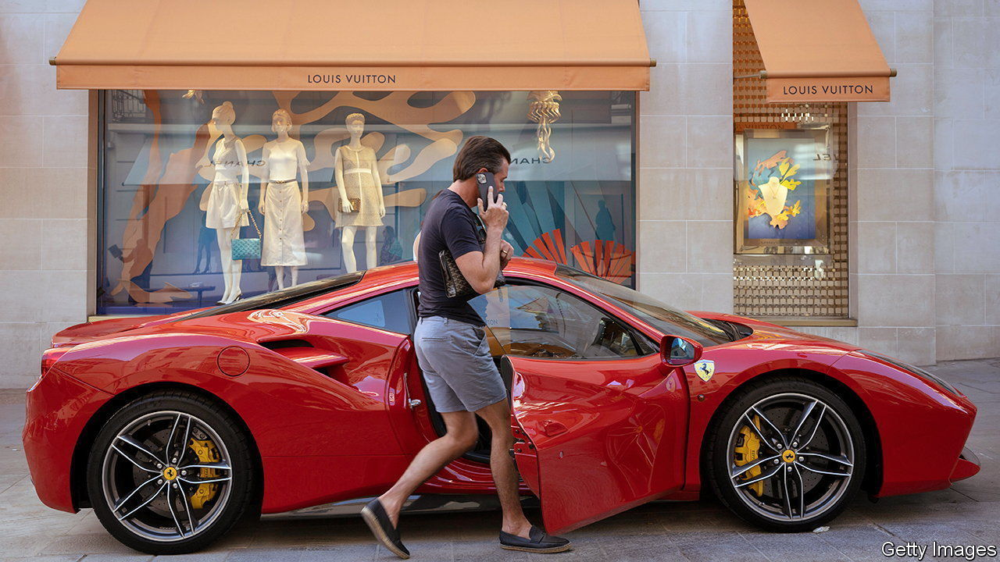
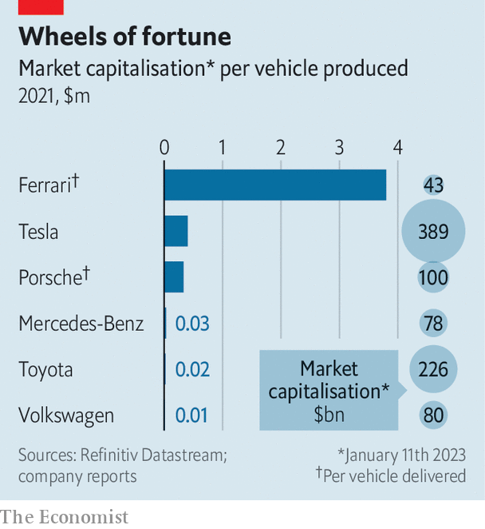

###### High-performance motoring

# The priciest cars are selling fast 

##### Rolls-Royce and Ferrari are at full throttle 

 

> Jan 12th 2023 

Pricey automobiles are impressive on paper and on the road. For their makers, they also often leave a good impression on the income statement. Global car sales in 2022, at around 79m vehicles, are below the level of a decade ago. Yet demand for fancier sets of wheels costing more than €100,000 ($107,000) grew by around 6.5% a year over the same period, according to Bernstein, a broker.

Last year the surge was particularly pronounced for the most exclusive motors. Whereas 1.3% fewer cars were sold in 2022 than the year before, according to s&amp;p Global, a consultancy, on January 9th Rolls-Royce said that it had sold 8% more of its ultimate automotive status symbols last year. Ferrari, the Italian manufacturer of rich persons’ playthings (whose biggest shareholder, Exor, also part-owns ’s parent company), may do even better. Between January and September Ferrari sold 20% more cars than in the same period the year before.

The pair dominate a tiny but profitable niche. Rolls, owned by Germany’s bmw, sold more than 6,000 cars last year—a record. In 2021 it supplied well over half the world’s cars costing over €250,000, reckons Bernstein. Ferrari’s share was more than a third. Lamborghini, an Italian sportscar firm owned by Volkswagen (vw), accounted for most of the rest. The two Italian marques are going strong in the €150,000-250,000 bracket, which is dominated by Porsche (spun off from VW last year to become one of the world’s most valuable carmakers). On January 10th Bentley, a VW-owned powerhouse in that (slightly) less ostentatious segment, said it had sold more than 15,000 vehicles for the first time in 2022, 4% more than in 2021.

Rolls does not dirty its hands with such proletarian rides. Bespoke elements—extravagant paint jobs, sumptuous leather-and-wood interiors, champagne chests to match—have pushed the average selling price of a Roller above €500,000. Each generates vast profits. True to the discretion prized by its customers, the firm won’t say how much profit; it may be more lucrative than Ferrari, which boasts a rich operating margin of around 25%. Even Porsche’s 15% or so, let alone around 10% for all premium carmakers, looks skinny by comparison. 

 


Ferrari’s market capitalisation of $43bn makes it the world’s 11th-most-valuable listed car firm. In terms of market value per car sold, it is miles ahead of the pack (see chart). Rolls would be, too, were it an independent company. Both have skilfully manoeuvred the luxury-goods market, keeping supply in check and prices high. 

Now both companies must navigate the industry’s progressing electrification. This poses different challenges to each. Even run-of-the-mill EVs are lightning-fast, dulling part of Ferrari’s appeal, and offer a smooth and silent ride, which distinguished Rolls’s engines in the petrol era. For Rolls, which will start shipping its first EV, the Spectre, in late 2023, quiet electric motors are at least on-brand. Ferrari, whose throaty roar is part of the attraction, faces a more delicate task. Its engineers are doubtless hard at work ensuring that its debut full EV, expected by 2025, handles like a racing car despite a heavy battery. ■


