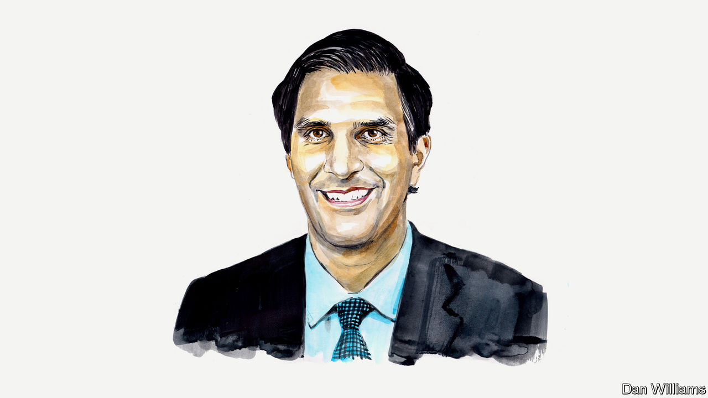

###### America and China

# Daleep Singh on America’s economic statecraft 

##### A former official in the Biden administration says it needs a principled framework for competition 

 

> Jan 11th 2023 

THE BIDEN administration is determined to challenge China’s high-tech aspirations. After a series of smaller moves, it has in recent months launched new export controls that broaden and deepen its denial of semiconductor technology to China in dramatic fashion.The rules add three big restrictions. First, they go beyond targeting specific companies and now start by denying exports to China of any chips that perform above a certain threshold. Second, they prevent any American citizen, green-card holder or company that does not have a licence to do so from working with any Chinese company to manufacture chips. Third, the new rules restrict the use of American tools, equipment or software anywhere in the world to manufacture and export advanced chips to China.


Some criticise the Biden administration’s actions, calling them tantamount to a declaration of an economic cold war. Arguments against such a war claim that it could accelerate Beijing’s drive for technological self-sufficiency, alienate American allies who resent the extraterritorial application of American economic force and push the world into rigid and separate technology ecosystems. 

In reality America is simply adapting to intensified geopolitical competition for pre-eminence in the foundational technologies of our time. Targeted American efforts to permit China’s access to high-end chips for commercial purposes, while blocking sales to Chinese military users, have largely failed because of the fusion of military and civilian sectors within China’s industrial complex. Indeed, the Commerce Department acknowledges this in its filings for the new export controls.

Meanwhile, American firms earn $100bn each year from semiconductor-related sales to China. It would be naïve for policymakers to expect any individual company to consider the collective risks to national security from the unfettered supply of high-end technology to China, including critical inputs to Beijing’s nuclear and digital-surveillance programmes.

And yet, pretending that American companies are competing on a level playing-field with China’s state-directed national champions over cutting-edge technology is to put our heads deep in the sand. China’s pursuit of absolute advantage across virtually all advanced technologies—including semiconductors, robots, electric vehicles, batteries, biotech, artificial intelligence, blockchain and supercomputing—is well documented. Beijing has implicitly rejected the logic of comparative advantage, in which countries specialise in the production of products at which they are most efficient and trade for the rest. 

The export controls announced by the Biden administration reflect a sober recognition that the dynamics of global economic competition are not as they should be, and that will not change for the foreseeable future. The best we can hope for in this environment is for America and China to put in place economic guardrails to prevent an uncontrolled and destructive race to the bottom. 

To start, the Biden administration should establish and articulate a doctrine of economic statecraft at the highest levels of government. America has spent hundreds of years developing military doctrine. But it has spent only a fraction of that time setting out the rules of economic engagement for the growing list of potent measures used by major powers across the world. These include export controls, but also sanctions, tariffs, capital and investment restrictions, subsidies and price caps. Producing clear rules would serve two purposes: to prevent overreach and overuse of economic statecraft, and to provide comfort to the world that America is not firing economic weapons in an arbitrary and capricious way.

The foundation of such a doctrine would be a set of guiding principles. For example, sanctions and export controls should be used sparingly—when core international principles that underpin peace and security are at stake—and not for commercial advantage. They should be designed to avoid unnecessary spillovers into the global economy, while recognising that costs are inevitable and must be outweighed by expected benefits. They should be calibrated to maximise the chance of co-ordination with like-minded partners. They should be designed flexibly so they can be ratcheted higher or lower depending on the target’s response and on the impact delivered; for this reason, calls for America and its allies to unleash their economic weapons pre-emptively against Russia were misguided. Last, the use of economic statecraft must be sustainable. These measures tend to work over the long term and so they must be robust enough to endure even if the targeted country is able to counter their initial effects.

Putting these principles into practice requires an upgraded analytical infrastructure across America’s government. The first step is to take stock of the full suite of economic tools at the government’s disposal, much as central banks have done for their growing and increasingly unconventional toolkit. Civil servants could then assess and regularly update policymakers on the efficacy of these tools when used alone or in tandem with other measures, and distinguish between the effects of unilateral and multilateral deployments.

Policymakers should also study history and simulations to understand the spillovers and limitations of using economic statecraft, learning from previous experiences and interdisciplinary expertise that draws from economics, finance, foreign policy and the law. For example, the sanctions regime against Russia should receive careful study as to whether the chosen pressure points—mostly the capital account and cutting-edge technology rather than the current account, namely energy exports—would be appropriate elsewhere.

Most importantly, America should make every effort to achieve balance in how it uses economic statecraft. Export controls and sanctions are known as negative coercive devices: if a target’s behaviour does not change, it will feel economic pain. That is rarely the way to win hearts and minds, either in a target’s constituency or in other countries. As such, the use of export controls and their kin should be balanced with an even greater emphasis on measures that offer the prospect of mutual gain. Global infrastructure finance, debt relief, loan guarantees, bilateral support, multilateral assistance through the IMF and World Bank, supply-chain linkages and the sharing of technological expertise are all tools that deserve top billing as America revitalises its approach to economic leadership.

Context is crucial to consider. Great-power competition is not going away and it will probably intensify for decades to come. Set against the alternatives of direct confrontation between nuclear-armed forces or doing nothing to defend dearly held principles when conflict emerges, economic statecraft will remain a fixture of foreign policy. That is all the more likely since national power is increasingly measured in terms of economic heft. America cannot afford to defer the development of an overarching strategy for economic statecraft any longer.■

_______________


