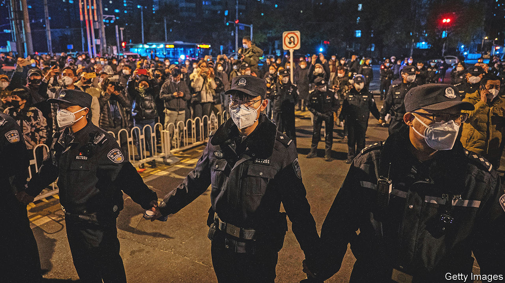

###### A different type of lockdown

# China is still punishing those who protested against zero-covid 

##### The government has ditched the policy, but not its repression of dissent 

 

> Jan 12th 2023 

When protests against the government’s “zero-covid” policy  in November, some observers feared a violent crackdown was in the offing. The Communist Party, after all, has a history of such things. But the authorities’ initial response was measured. Police watched in silence as crowds of young people in Beijing, Shanghai and other cities called for an end to mass testing and lockdowns. Officers did not interrupt even when a few protesters called for freedom of speech and the right to vote. The police chief of Beijing told one protester that the crowd had been heard.

Soon after the demonstrations, China’s government ditched most of its covid controls. A recent article by Xinhua, a state news agency, did not mention the protests, but it noted that public “fatigue, anxiety, and tension” had been rising and that this had helped change policymakers’ minds. The party likes to claim that it is responsive to the public mood.

But it does not like politically charged protests. So even as the government was dismantling its zero-covid machine, it was also pursuing those who pushed for it to do so. In the days and weeks after the protests, police tracked down many of those involved using facial-recognition technology and mobile-phone data. Some were brought in, interrogated and made to sign a document confessing their mistakes. Others were reportedly strip-searched.

Most were released within a day. But at least eight people who attended the protests in Beijing have been detained since mid-December, according to their friends. Most of them are women in their 20s with white-collar jobs. Reports suggest that several other people have been detained as well. In a post on Weibo, a social-media platform, a lawyer for one of the detainees claimed the police were making it hard for him to meet his client.

The detainees might be released after they have been held for 37 days, the maximum allowed before a formal arrest must be made. Protesters in the city of Guangzhou were released this month after a few weeks in jail. But there is also the possibility that those still locked up will be charged under vague public-order laws and kept in detention.

Paranoia may be shading the government’s treatment of the protesters. Officials and pro-government commentators have claimed that foreign forces were behind the unrest. America and other Western countries are the usual suspects. China’s ambassador to France, Lu Shaye, likened the anti-covid protests to the “colour” revolutions that swept through the former Soviet Union. China blames those on Western machinations, too. “White is also a colour,” noted Mr Lu, in reference to the blank sheets of papers held up by protesters in China as a way of highlighting official curbs on expression.

It is not as if public anger needed stoking from abroad. The government’s covid controls were ensnaring an increasing number of people and harming the economy. Frustration with zero-covid was growing. The protests were just the latest sign of this. People had already been tearing down barriers and clashing with police. As the Omicron variant spread, it was becoming increasingly clear that zero-covid was unsustainable. At last, the government bowed to reality. It does not want to be seen as having bowed to the demands of protesters, lest it encourage more. ■


