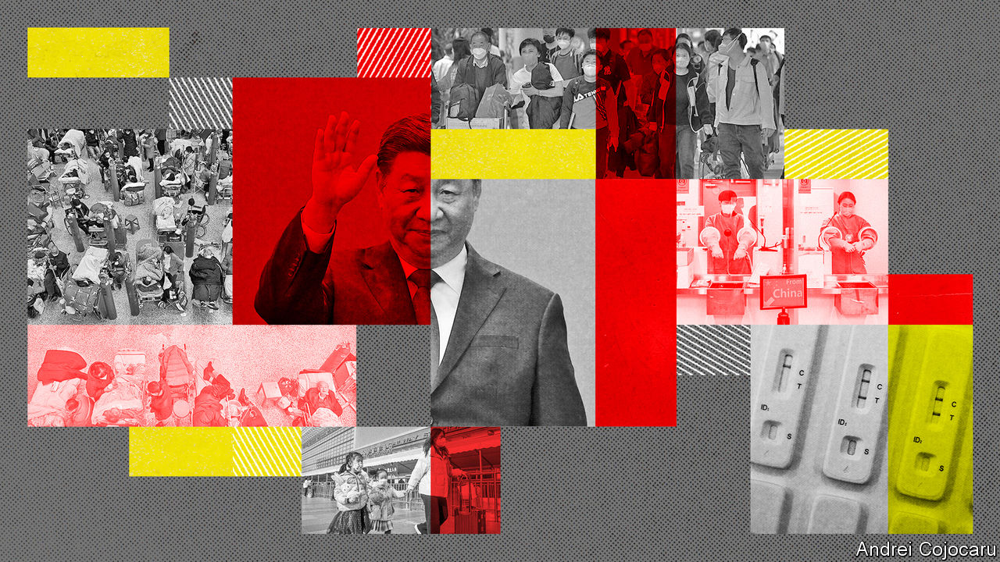
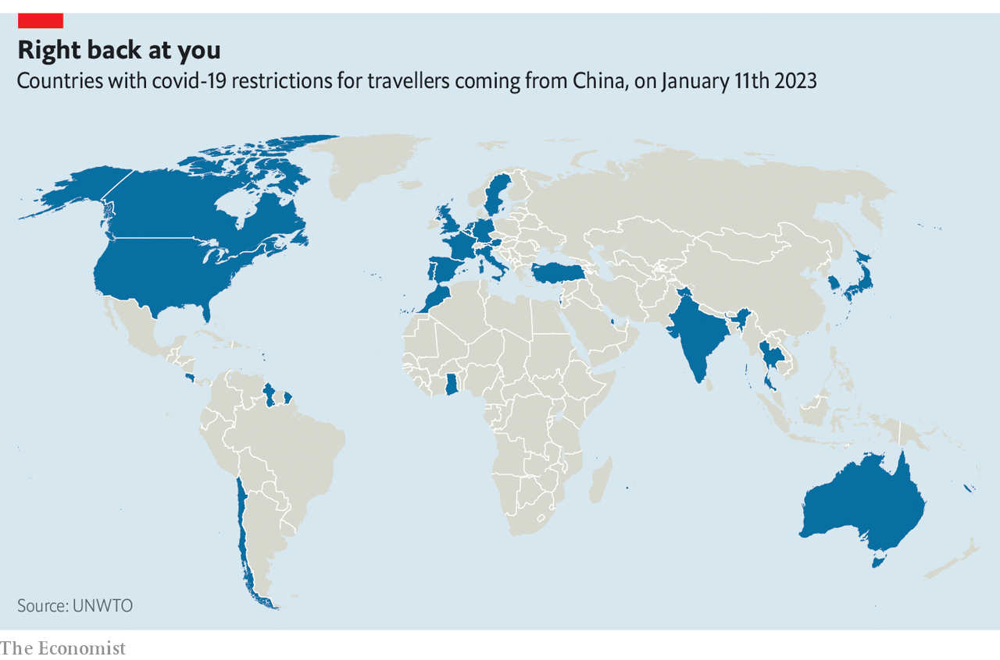

###### Data, diplomacy and disease

# Covid is complicating China’s efforts to re-engage with the world 

##### Foreign critics have seized on the country’s lack of transparency 

 

> Jan 10th 2023 

IN HIS ANNUAL New Year’s Eve address,  struck an unusually measured tone. There was no call for , unlike the previous year, and none of the dark warnings about external forces that he voiced at a Communist Party congress in October. “We cherish peace and development and value friends and partners,” he said on December 31st. At home it is “only natural for different people to have different concerns or hold different views on the same issue,” he added. 

Some detect a similar timbre in China’s recent , including with countries long in Mr Xi’s bad books. The sweet talk has extended even to America. In a  op-ed on January 4th, Qin Gang, China’s outgoing ambassador in Washington and new foreign minister, expressed his appreciation for America’s “friendly and hard-working” people, as he recalled his exploits there, including riding a tractor in Iowa and throwing the first pitch at a baseball game in Missouri. 

The shift suggests to many observers that, as , Mr Xi is keen to repair some of the damage done to his country’s foreign relations over the past three years, when it was largely isolated from the outside world and saw attitudes towards it hardening in America and many other democracies. But if Mr Xi’s aim is to undermine his critics abroad and empower those advocating re-engagement with China, there is a flaw in the plan: his reluctance to share more complete data on the  ripping through the country. 

After repeated requests from the World Health Organisation (WHO), China has started sharing more genetic sequences of the virus from recent cases. According to GISAID, an international repository of viral genetic information, China submitted 15 sequences from two regions in the 17 days after lifting its “zero-covid” restrictions on December 7th. By January 9th it had provided 880, covering 11 of its 31 provinces (and province-level cities and regions). There was no evidence of new variants.

Still, relative to the size of its population and its covid wave, the number of sequences China has submitted is insufficient to track the evolution of the virus, public-health experts say. Moreover, China is still not providing enough data on intensive-care-unit (ICU) admissions and deaths to allow experts to assess quickly how the virus is behaving there and how dangerous any new mutations may be. Most absurdly, Chinese authorities reported only 37 covid deaths between December 7th and January 8th, the latest date for which official figures were available. Scientists’ models, satellite images of crematoriums and other independent sources suggest the real total is probably in the tens, if not hundreds, of thousands. 

Even the WHO, usually reluctant to criticise China, has been damning. Dr Michael Ryan, its emergencies chief, said on January 11th that China was “heavily” under-reporting covid deaths and blamed the narrowing of its definition in December to include only those from covid-caused pneumonia or respiratory failure. He also praised America’s transparency over the XBB.1.5 variant spreading rapidly there. Liang Wannian, a senior Chinese health official, said China’s priority was treatment, not establishing cause of death. 

 


Several foreign governments have been critical, too, with at least 32 imposing restrictions on travellers from China as of January 10th, mostly requiring a negative covid test result (see map). With notable chutzpah, China has denounced such measures as politically motivated and threatened counter-measures—while maintaining its own demand that arrivals must show a negative PCR test result. Tellingly, though, it is not just Western countries imposing such restrictions on China: India, Ghana, Qatar and Costa Rica have done so too. And while these may do little to contain the virus, the WHO says China’s lack of transparency makes them understandable. 

The row over travel restrictions may blow over soon, not least because many countries are desperate to welcome back Chinese tourists. But the spat could get uglier, especially if China singles out America or European countries for new restrictions. On January 9th China’s foreign ministry voiced concern about the XBB.1.5 variant, urging America to do more to contain it. The next day the Chinese government stopped issuing some visas in South Korea and Japan in retaliation for their new restrictions on travellers from China.

China’s obfuscation of covid data is stirring memories of how it failed to share relevant information early in the pandemic and how it is still withholding data that could help to trace the origins of the virus. Nor is it lost on many democratic governments that Mr Xi is motivated by a desire to keep portraying his covid strategy as a success—and a demonstration of the superiority of his political model. 

That could make it trickier for those who want America and its allies to take a less confrontational approach towards China. Few believe that Mr Xi’s shift in tone implies a substantial rethink of policy, especially on core issues like Taiwan. But it does suggest to many a willingness to limit confrontation and perhaps seek progress in less sensitive areas. 

 


Ryan Hass of the Brookings Institution, a think-tank, suggests that Mr Xi may be emulating Mao Zedong’s strategy of “fight fight, talk talk”, buying time to regroup and study opponents. Nonetheless, Mr Hass is urging the Biden administration to seize the opportunity to make progress in areas of mutual concern, such as climate change and disease surveillance. 

But with an American presidential election looming in 2024, any such initiatives could be an even harder sell to America’s public, given the fresh controversy over covid data and travel restrictions. China hawks on both sides of Congress will no doubt be emboldened too, including Kevin McCarthy, the new Republican Speaker of the House of Representatives. On January 10th the House overwhelmingly approved his proposal to create a new China select committee that can conduct investigations and hold public hearings. Another Republican-led committee is likely to pursue a probe into covid’s origins. 

European governments will probably be less overtly critical of China’s approach to covid, just as they were in 2020. But that could change if a new variant does emerge in China and spreads to Europe, or if the Chinese government imposes new travel restrictions on European countries, says Noah Barkin of Rhodium Group, a consultancy. “I would not underestimate China’s ability to undermine its own rapprochement with Europe by over-reacting.”

Nor will Mr Xi’s withholding of covid data help to reverse the deterioration of public attitudes to China in Europe, where many are upset by its failure to criticise Russia’s invasion of Ukraine. That is already fuelling a fraught debate within the European Union over how to balance commercial interests against national security and democratic values in dealings with Mr Xi. Any new tension over covid could further complicate efforts to re-engage with China by Olaf Scholz, the German chancellor, who visited Beijing in November, and by Emmanuel Macron, the French president, who is due there early this year. 

The potential fallout for China is much less severe in the global south, especially among recipients of Chinese vaccines. At a briefing for foreign diplomats in Beijing on January 6th, ambassadors from Ecuador, Madagascar, Mongolia and Algeria praised China’s covid response. Mr Qin, the new foreign minister, is unlikely to hear much criticism from his hosts during his first trip abroad in the post, which started on January 9th and includes stops in Ethiopia, Gabon, Angola, Benin and Egypt.

The risk, though, is that in Mr Xi’s determination to preserve his public image, he will lose a rare opportunity to reset links with the West and make progress on issues of global concern. Among the biggest casualties would be preparations for the next potential pandemic. China is essential to such efforts because of its vast population, wildlife trade and large numbers of coronavirus-bearing bats. But as the world learned in the SARS pandemic of 2002-03, and again over the past three years, transparency is also of vital importance. ■


