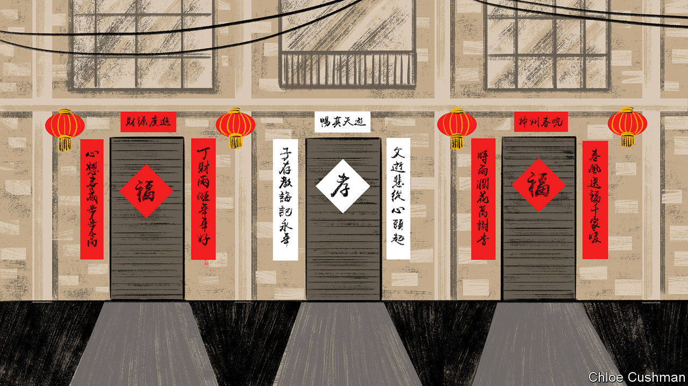

###### Chaguan

# Many Chinese villagers seem ready to move on from covid-19 

##### Even as the virus tears through their communities 

 

> Jan 12th 2023 

In rural China, the story of this month’s lunar new year will be told in two colours: festive red and the white that signifies mourning. For many country folk, the holiday—which this year falls on January 22nd—will mark a return to near-normality. China has dropped the pandemic controls that blighted each new year after a strange virus emerged in the city of Wuhan weeks before the Spring Festival in 2020 (to use the holiday’s other name).

A mood of pent-up celebration can be felt in Goulin, a scruffy township strung along a busy highway in the south of Henan, a poor central province. On a recent weekday, locals throng a street market selling red , the new-year banners that will soon hang above and to either side of front doors, bearing poetic couplets expressing wishes for good fortune and health. Other traders hawk red underclothes, worn for luck. There is food in abundance: supplies for the homecoming feasts and family reunions that mark this most important of holidays, and that were thwarted by travel curbs and lockdowns for three years. Adults and wide-eyed children examine boxes of tiny tangerines, haunches of mutton and severed pigs’ heads, basins of doomed, thrashing fish, and wooden barrows heaped with winter cabbages.

Yet more sombre scenes may be glimpsed at the same time, inside Goulin’s bare-bones hospital. Though central authorities have stopped issuing credible covid-19 statistics, signs are that the virus swept through Henan’s cities and villages at astonishing speed after controls were scrapped on December 7th, with infections peaking about two weeks later. Henan officials suggest that perhaps 89m of the province’s 100m people caught the virus.

In Goulin hospital a faded poster from 2016 announces that the emergency department employs five doctors to cover a population of 200,000 (for comparison, America has 15 emergency-room doctors per 100,000 people). A doctor says the situation has stabilised, though many severe cases remain. His patients have low expectations. For instance, only a few have even heard of Paxlovid. In China’s big cities, that potent antiviral treatment for covid has become an obsession, with boxes of the imported drug changing hands on the black market for staggering sums. Paxlovid is not available in Goulin. Instead, some patients receive a domestically made HIV treatment, Azvudine, given emergency approval in China as a covid therapy, despite scant reliable evidence that it works. To eke out limited supplies, the pharmacy opposite Goulin hospital sells such basic anti-fever medicines as ibuprofen in packets of a few pills, rather than by the box.

As of January 8th, China reported a total of 23 covid fatalities in 2023, an artificially low number that excludes deaths involving other conditions or complications. The true toll is very different. —white banners bearing memorial couplets that adorn the front doors of households in mourning—will be hard to avoid in Goulin and surrounding villages this year. The crematorium in Dengzhou, the nearest county-level city, is still cremating over 100 people each day, and was handling up to 160 a day in recent weeks, says a funeral worker. The facility handled just 30-40 daily cremations before the pandemic, adds the worker, who reports that he is three times busier than usual, and blames covid.

Chaguan was not in southern Henan by chance. When the pandemic began three years ago, he headed to Goulin and nearby villages, because they lie on the border with Hubei, the province that surrounds Wuhan. Hubei was locked down on January 23rd 2020. Your columnist visited Weiji, the last Henan village on the road to Hubei, four days later. He found its muddy streets brightened by red lanterns and new-year banners, but largely emptied by fear. With covid’s dangers still unknown, nervous police tested incomers’ temperatures at a checkpoint and turned any cars from Hubei away. Neighbouring hamlets sealed themselves behind barriers of freshly dug earth. In Weiji some 200 migrant workers, back from Wuhan for new year 2020, had to quarantine at home while village doctors checked them for fever twice daily. Back then locals described obeying orders as a comfort.

Three years later Weiji residents talk of moving on. They have just endured a brutal few weeks that, village doctors estimate, saw over 90% of locals catch covid after a first case was found on December 4th. At moments 100 locals crammed each day into Weiji’s clinic for saline drips and intravenous infusions of amino acids and antibiotics, supplemented by ibuprofen tablets and Chinese herbal treatments (drugs that may comfort but cannot cure covid). Reportedly, one villager died. Four more were sent to Goulin hospital. Locals seem focused on resuming normal life. A woman in her 80s sits on her doorstep washing mahjong tiles. She recalls when mahjong playing was banned during the strictest lockdown in 2020, on pain of fines. A migrant worker, home for the holidays, compares covid to “a wind that has blown through”. Asked if they fear returnees bringing the virus, locals scoff: “we’ve all had it.”

The cruel gulf between China’s cities and villages

Asked whether clinics were prepared for the sudden policy change, a rural doctor instead describes how onerous controls became late last year. An end to zero-covid, followed by a surge in cases, was unavoidable, says the doctor, holder of a vocational degree. “Everything has to have a beginning and an end,” she says.

Evidence of official bungling is there to see. In nearby Tongbai county a two-storey quarantine centre for 1,000 people sits empty, brand-new air-conditioning units bolted to its windows. It was still being built as zero-covid ended in December, neighbours report. Amid such waste, Tongbai’s largest hospital has no spare beds when Chaguan visits, and no Paxlovid. As often before, rural Chinese are mourning avoidable losses. China may see a second wave in coming months. But in Henan villages resignation, and the human need for hope, are more commonly encountered than indignation. At new year, red is more popular than white. ■


