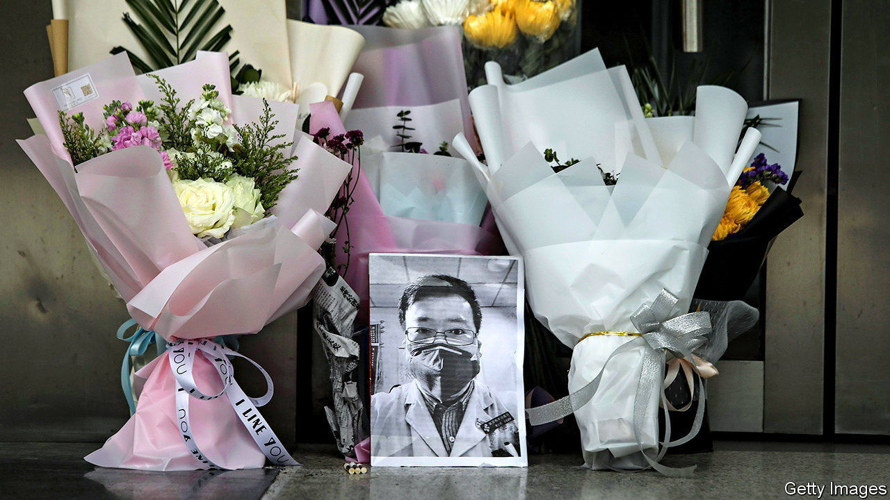

###### Shrine to a whistleblower

# The cult of Li Wenliang, the doctor who spotted covid-19 

##### Many Chinese turn to one of the pandemic’s earliest victims for comfort, and to vent 

 

> Jan 12th 2023 

It is nearly three years since Li Wenliang posted his last message on Weibo, a Twitter-like service. “The result of the nucleic-acid test today was positive. The dust has settled, and the diagnosis has finally been confirmed,” the eye doctor wrote. A week later, on February 7th 2020, . His Weibo account, however, still hums with life. 

As the disease, now freed from China’s “zero-covid” restraints, sweeps the country, @xiaolwl is a shrine that draws an endless stream of visitors. Every three or four minutes someone adds a comment on his parting words. “Older brother Liang, recently I’ve been reading Camus’s ‘The Plague’,” wrote one on January 10th, hinting at the calamity now unfolding.

Li Wenliang is a household name in China. Many Chinese hail him as a whistleblower who was among the first to draw attention to the pandemic as it emerged three years ago in the central city of Wuhan, and who suffered for his honesty. At the end of 2019 he posted a private message to a group of former medical-school classmates on WeChat, another popular social-media platform, about the detection of several SARS-like cases. He told them to be on guard. Within hours officials forced him to write a “self-criticism” for divulging “false information”. On January 3rd 2020 the police made him sign a warning that any repetition of his “illegal action” could result in prosecution.

When Li died, his Weibo account became a lightning rod for public discontent. It was flooded with hundreds of thousands of messages of condolence, and sympathy for the injustice he had suffered. The numbers soon subsided, but people kept on posting comments on Li’s last message. By mid-2020 the counter began showing “1m+”. At that point Weibo stops updating the figure. But researchers at Fudan University in Shanghai, Zhou Baohua and Zhong Yuan, tallied more than 1.34m within a year of Li’s death. In a paper in 2021 they said numbers shot up on certain occasions, such as in March 2020, when the government rescinded the police notice chiding him, and the following month, when provincial authorities recognised him as a “martyr”. 

The posthumous honouring of Li (not for whistleblowing, but for being a Communist Party member who was fearless in the face of covid) went some way to appeasing his supporters. It helped that many Chinese, at least until 2022, were backers of the zero-covid strategy. Still, some expressed dismay when, in September 2020, Li was not among hundreds of covid-fighting heroes honoured by Chinese leaders at a big ceremony in Beijing.

But instead of becoming a forum for dissent, Li’s Weibo account took on a different hue: as a “wailing wall”, as Chinese media described it. Visitors often posted messages about their daily tribulations. They asked Li for help in their love lives and their exams. Some simply bade him good morning or good night. Among emoticons they used was one of a fried chicken leg. Li loved fried chicken. 

Since China began dismantling its covid controls in December, some have been using Li’s wall to air their anxiety. “Older brother Liang, old people are dying one after the other in my village and others around,” said a visitor from Shanxi province. “Now we’ve basically all been infected. Fortunately the mutated virus is weaker, but many people are dying,” said another from neighbouring Shaanxi. “Dr Li, death notices are filling the wall. Many old people have not survived the winter, including my grandfather,” mourned someone from Zhejiang. 

Most wailers refrain from directly attacking the official line. But they describe a scene that sharply contrasts with the government’s claim of only a few dozen deaths from covid since early December. On the wall and other Weibo accounts, netizens refer to Li’s most celebrated quote, from an interview given shortly before his last Weibo post: “In a healthy society, there shouldn’t be just one voice.” For all his celebrity as a whistleblower, he was a cautious man who said he didn’t intend his warning about the coronavirus cases to spread beyond his friends. But among some Chinese, increasingly suspicious of what the government is telling them, those words resonate. ■


