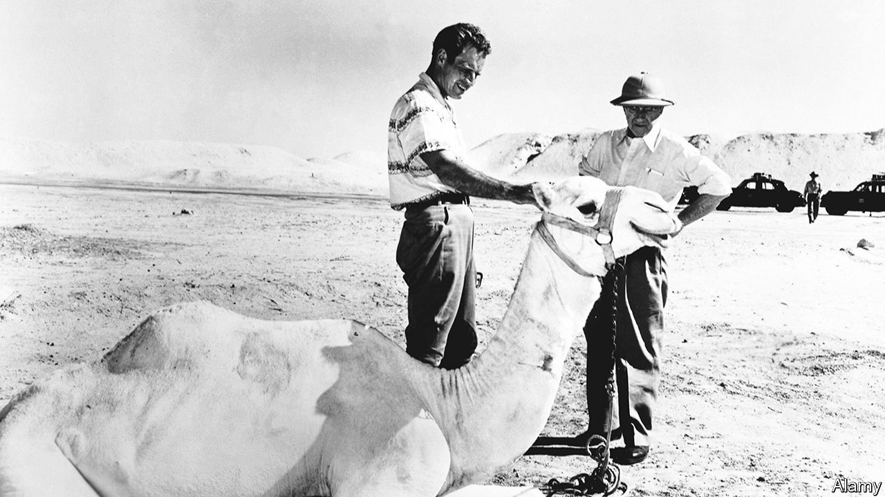

###### Swords and sandals

# Cinema meets radicalism in “Picture in the Sand” 

##### Peter Blauner’s insightful novel is set in Egypt in the tumultuous 1950s 

 

> Jan 12th 2023 

. By Peter Blauner. 

In its gruesome propaganda videos, Islamic State reviled the West. Yet the cinematic horror seemed —not surprisingly, given many of the jihadists would have grown up on American action films and video games. Peter Blauner’s new novel, “Picture in the Sand”, depicts a fictional case of this split-personality syndrome.

Alex is an Egyptian-American whose earliest memory is of being called “Osama” in the playground after the terrorist attacks of September 11th 2001. Disillusioned, he swaps Cornell University for war in Syria. In a desperate bid to bring him home, his grandfather emails him with a long-kept secret: he too once fell under the sway of violent Islamists. What follows is both a cautionary tale and a mesmerising tour of Egypt in the tumultuous 1950s.

The grandfather is a cinephile named Ali Hassan. He grows up a short walk from the pyramids, but his object of worship is American cinema. In a darkened auditorium, the film projector’s “celestial white beam” entrances him. Ali dreams of changing his name to Al Harrison and cruising the coast of California in a Chevy. In autumn 1954 his Hollywood stars align when Cecil B. DeMille (pictured with ) arrives in Egypt to shoot “The Ten Commandments”. The 24-year-old lands a gig as DeMille’s assistant: “I was parked along the corniche of the Nile, humming movie music to myself as if the epic motion picture of my life was about to finally begin.”

Mr Blauner’s enchanting novel draws on the odd but true story of how “The Ten Commandments” was filmed amid political chaos in Egypt. Two years before DeMille’s arrival, Gamal Abdel Nasser and his revolutionary Free Officers had deposed the British-backed monarch, ending centuries of foreign rule. Then, in 1954, Nasser ousted the new republic’s president, whom he accused of cosying up to the , a popular Islamist group. In the novel, Ali is pulled between the bright lights of Hollywood and the austere but noble-sounding Brothers.

The real Nasser was a fan of DeMille. He reportedly watched “The Crusades”, another of the director’s pictures, more than 20 times and was nicknamed “Henry Wilcoxon”, after the British actor who played Richard I. In the book, Nasser is as much a “matinée idol as Emad Hamdy [an Egyptian actor] or Clark Gable”, and his stardom is a political tool. In an episode adapted from history, he dodges eight bullets while giving a speech in Alexandria, dusts himself off and implores his followers to persevere. Mr Blauner’s characters wonder if the assassination attempt was staged: “Those sound like some pretty flowery words for someone who’d just been shot at,” says another film-maker. 

Nasser uses the attempt on his life to unleash a brutal crackdown. By this point the mercurial DeMille has sacked Ali, who joins a Brotherhood plot to blow up the film set. He pulls out but is arrested anyway. In prison a Brother who closely resembles Sayyid Qutb, an influential Islamist thinker, makes an ominous prediction: “They’ve turned peaceful little kittens into hungry panthers who will eat them alive as soon as we’re let out of our cages.” 

The real Qutb’s texts, written in jail after his arrest in 1954, inspired generations of radicals (he was eventually executed in 1966). Some of those disciples ended up in Syria, waving black flags and producing flashily horrific propaganda films. Mr Blauner’s novel revisits the moment when these contradictions were born. ■


