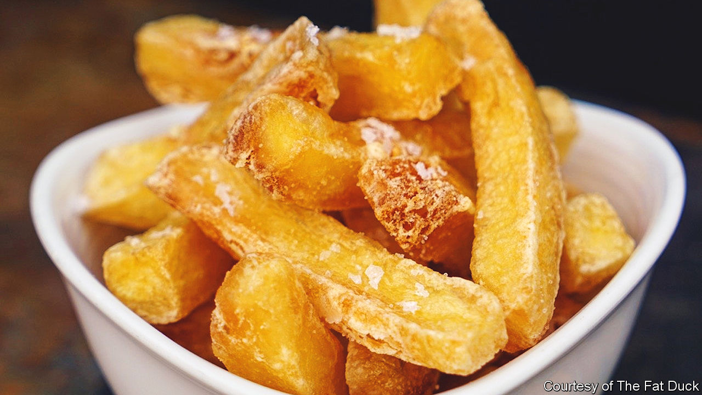

###### World in a dish

# The quest for the perfect chip 

##### Triple-cooked chips may be Heston Blumenthal’s most influential dish 

 

> Jan 9th 2023 

It is easy to see why so many classic recipes are difficult to cook. A gleaming duck pâté en croûte, a deeply savoury , a vast , a perfectly clear consommé: they all involve long tallies of ingredients, tricksy processes and towers of specialist equipment.

The chip, by contrast, needs none of these. It is a simple thing—a long, narrow piece of potato, fried in oil. To be clear, these are the sort of thick, dependable chips that go with fish, not skinny  or French fries, nor the kind shoved into American children’s lunch bags. Chips are one of the “cheaply pleasant” foods with which the “underfed, harassed, bored and miserable” may console themselves, wrote George Orwell in “The Road to Wigan Pier”. Fish and chips were thought to be  well-being during the second world war that they were one of the few foodstuffs exempted from rationing. 

Everyone knows the quiet but profound joy of a good chip. Soused in vinegar, splattered in mayonnaise or ketchup, their straightforward plainness is a comforting delight—even, or especially, in a post-festive season when you are . So it is striking that the creator of the über-chip is known for his inventiveness and complex experimentation. 

Heston Blumenthal, a British chef, is famed for bewildering dishes such as the meat fruit—a chicken liver parfait disguised as a mandarin. In his hands liquid nitrogen went from something to be used to freeze off warts to a tool for making the smoothest of ice-cream (bacon-and-egg flavoured, naturally). He serves a seaside scene of edible sand with kelp and seafood, eaten to an accompanying soundtrack of ocean waves and the cawing of seagulls. He is one of the original “”, with their foams and gels that taste of the unexpected.

And yet his greatest gift to the world may be the triple-cooked chip. Mr Blumenthal became obsessed with chips around 1992, before he had begun feeding restaurant diners snail porridge, before he even had a restaurant. The traditional double fry can too often end with chips that are either undercooked or soggy, a result of steam escaping from the middle and softening the crust. He wanted a “glass-like” crispy crust with a fluffy centre. An elaborate multi-stage process—involving boiling, freezing and frying—was his characteristically detailed solution.

Since becoming one of its doyens, Mr Blumenthal has expressed his frustration with the term molecular gastronomy. This, he has pointed out, is “simply the science of cooking”. Like science, preparing food is a form of puzzle-solving. Why did your cake rise to a dome in the centre? Why won’t my onions caramelise? High-end chefs like Mr Blumenthal must grasp the intricacies of transforming ingredients into ever more delicious things to eat. 

But as he has demonstrated, . And like artworks, dishes must be judged according to their ambitions. A pop song can be as great in its way as a symphony—and a chip as miraculous as a viridescent spherified pea. ■


