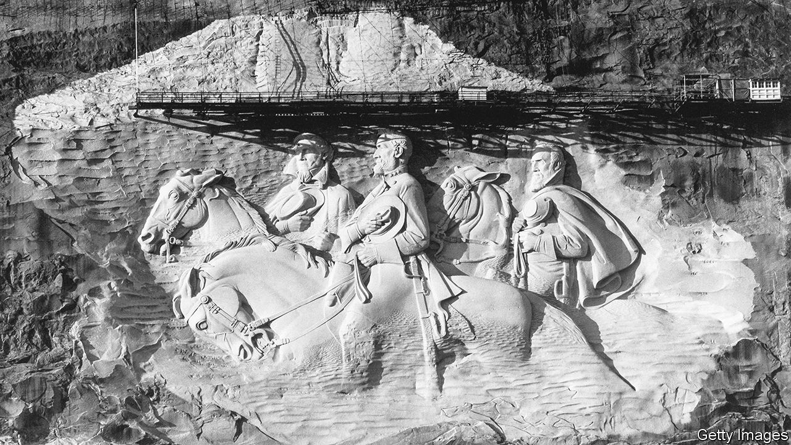

###### Back Story

# The truth about Stone Mountain’s giant Confederate memorial 

##### A new documentary explains how the vast carving in Georgia really got there 

 

> Jan 12th 2023 

Carving people in stone creates two contradictory impressions, both misleading. Because the shapes are human, meddling with them can seem like an assault. At the same time, the stone confers an aura of antiquity, even if the sculptures aren’t very old; they look both mortal and immutable, as much a feature of the landscape as the work of people or politics. That is doubly true if the forms are carved into a mountain.

The Confederate memorial on Stone Mountain in Georgia seems elemental. The vast bas-relief sculpture of Jefferson Davis, Robert. E. Lee and Stonewall Jackson—the Confederacy’s president and two top generals—stretches over three acres of elevated rock face. As  made by the Atlanta History Centre, an innovative museum, makes clear, the carving’s history is as dramatic as its size. Yet it  as other controversial memorials, if on a bigger scale: misconceptions about the past (not least its own), the fog of passionate loyalties and the virtue of dialogue.

It may look as if it has basked on the mountain for ever, but the memorial was first proposed only in 1914, almost 50 years after America’s civil war ended. In the new film, available on the website of the museum, Sheffield Hale, its pithy boss, says the many  erected in that era were meant to show that “the people who had lost the war were now back in charge.” They buttressed the Jim Crow segregation regime with public symbols of white supremacy. From the start, this particular memorial was linked to the Ku Klux Klan, which, after decades of quiescence, was reformed on Stone Mountain in 1915.

This association was deep and enduring. There was talk of including Klansmen in the carving. Gutzon Borglum, the original sculptor, hightailed it from Georgia after spats in part relating to the Klan’s leadership. Borglum’s preliminary work was blasted off the mountainside. He went on to carve Mount Rushmore.

The project petered out in the Depression but was revived in the 1950s. The prompt was not Appomattox but . Soon after the Supreme Court ruled that segregated schools were unconstitutional, Marvin Griffin ran to be Georgia’s governor. He pledged to uphold segregation—and finish the memorial. Once elected he bought the mountain (and surrounding park) for the state, calling it “a rallying point for all of us who believe in preserving the ideals for which our forefathers fought”. The work resumed in 1964, just after the  was signed. It wasn’t finished until 1972.

All monuments simplify; many lie. The film shows that the real subject (or target) of this one was the civil-rights struggle, not the civil war or the valour of Southern soldiers, as some still claim. All the same, “Monument” even-handedly includes a defence of the sculpture by the daughter of the chief carver in the 1960s. “I want people to value that carving”, says Donna Barron, “because I want them to value my dad’s life.” That is a version of the strongest case that can be made for keeping Confederate memorials: as a form of fealty to honoured forebears, recent or more remote.

Strongest, but not strong enough, given Stone Mountain’s back story and the cause for which Davis, Lee and Jackson fought, namely maintaining the abomination of slavery. In the film, Genesis Reddicks, an activist in Georgia, observes that commemorating your roots is all well and good, but not if they are linked to your neighbours’ trauma. The carving looms over hiking trails and attractions enjoyed by all kinds of Georgians; it is a short drive from Atlanta, a fulcrum of black history and culture.

What should be done about it—or to it? Stacey Abrams, a candidate for Georgia’s governorship in 2022, has advocated the monument’s removal. Others have suggested letting vegetation cover it over or putting a bell on Stone Mountain’s summit (from which  dreamed freedom would one day ring). But Brian Kemp, who beat Ms Abrams, has vowed to protect the carving. State law prohibits its alteration.

This powerful film doesn’t take a view, though a preservationist contributes a key distinction: “We should not erase history,” says Brent Leggs, but “we don’t have to revere that history.” Instead, “Monument”, and the museum, do something more important than settling a debate—by laying out the facts, they aim to start one. The implicit faith is that the past can be a compass rather than a battleground, and that opinions and divisions need not be carved in stone. 


