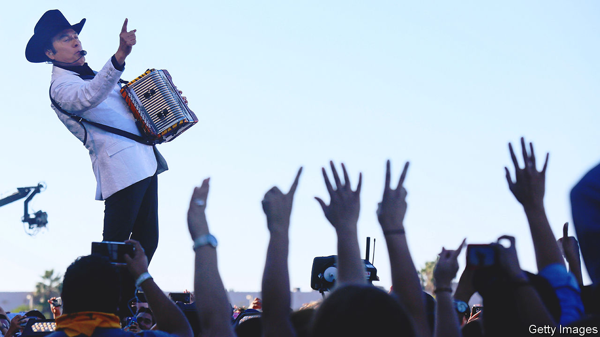

###### Arms and the men

# To their critics, Mexican drug ballads glorify violence 

##### For their fans, they are tales of guts—and a reflection of reality 

 

> Jan 11th 2023 

On January 5th Mexican security forces captured Ovidio Guzmán in the north-western state of Sinaloa. He is a son of Joaquín Guzmán, an infamous drug lord better known as . Irate gunmen took to the streets; at least 29 people were killed. Something similar happened when Ovidio was apprehended in 2019. On that occasion, the country’s president ordered his release. 

The fiasco was immortalised in a song called “Soy El Ratón” by the group Código FN. The title means “I am the Mouse”, a reference to its subject’s nickname: 

Guzmán’s first name is Ovidio

His father as a child

Nicknamed him ‘the Mouse’

A boss with a lot of brains

He is the son of El Chapo…

This is a , or drug ballad. Today some of Mexico’s most popular bands, such as Los Tigres del Norte (the Northern Tigers, pictured), write and perform songs about crime bosses and their activities. Most Mexicans could sing or hum one of them. Performed by several other high-profile Mexican singers, Soy El Ratón” has become particularly well-known, and has contributed to a rolling debate about the propriety and impact of the ballads.


Some authorities are unimpressed. To prevent the spread of “narco-culture”, radio stations have been cajoled by local leaders to stop playing ; some have eschewed them voluntarily In 2017 Los Tigres del Norte were fined 500,000 pesos (then $26,400) for performing a drug ballad at a concert in Chihuahua, capital of a border state of the same name. 

It is true that some of these songs seem to glorify not only the gangsters’ wealth but their violence, too. Some are written at a baron’s request, to boost his image (it is almost always a man), and thus involve contact with gangs. Other artists seek permission from their subjects, lest they face grave repercussions for crooning out of turn. At the very least, some singers seem to condone the criminals—though criticising them would be rash. 

“These are people who have done things I wouldn’t do,” says Lupillo Rivera, a singer known as “the bull of the ”. But “you have to respect their talent and wisdom and intelligence.” When another of El Chapo’s sons was killed in the city of Culiacán in 2008, he is said to have ordered that all the roses in town be bought for the funeral—a gesture immortalised in a song that Mr Rivera wrote on an aeroplane after reading the news. YouTube banned a video for another of his tracks in 2020. “I started to sing  because people in clubs and bars like them,” he says, “but the radio wouldn’t touch them.” 

Yet  are more nuanced than they may seem. To begin with, they are reflections of reality, much like , a hit Netflix series about drug-traffickers in Latin America. They can be a source of information; sometimes they are more accurate than newspapers.

Take “Wheel of Fortune” by Alfredo Olivas. Released in 2017, the song told of an unlikely pact between Rafael Caro Quintero, another old-school drug boss, and Nemesio Oseguera Cervantes, or “El Mencho”, the head of the newer Jalisco New Generation Cartel, now the country’s strongest organised-crime group. A few years later the existence of the agreement was confirmed.

Like followers of gangsta rap, the genre’s fans—including millions of Mexicans who moved to America and their descendants—are overwhelmingly law-abiding. For them  are cracking songs, but they also represent a reclamation of ethnic identity. Amid the bling and gore, they can even come across as salutary tales of values such as loyalty, hard work, bravery and hope for a better life. “For an undocumented person in the United States, a three-minute musical fantasy of a powerful Mexican can be intoxicating,” says Juan Carlos Ramírez-Pimienta of San Diego State University-Imperial Valley.

They emerged out of the ballad tradition, not at the behest of the cartels. , or narrative songs, have a long history in Mexico, recounting the exploits of fictitious or real people from the war of independence that began in 1810 to the revolution a century later. In the late 1920s and early 1930s ballads in the northern regions began to tell of tequila-trafficking to Prohibition-era America. Later narcotics seeped into the lyrics.  really took off in the 1970s, along with the drug trade.

The evolution of the music has since reflected changes in the drug business. Rafael Saldívar of the Autonomous University of Baja California has studied the lyrics. From the 1970s to the mid-1980s most ballads focused on the trafficking itself, the vehicles or routes used and the violence involved. Then, as the likes of El Chapo made their names, they turned to the , their women and their luxurious lifestyles. With the Mexican economy in crisis, the  became an aspirational figure and the songs more admiring.

Shooting the messenger

Then came the “war on drugs” waged from 2006 to 2012 by Felipe Calderón, a former president. A government assault on the cartels led to : murders in Mexico rose from eight per 100,000 people in 2007 to 24 in 2011. The songs became more graphic. “With an AK-47 and a bazooka on my shoulder,/Cross my path and I’ll chop your head off./We’re bloodthirsty, crazy and we like to kill,” runs a number by the group BuKnas De Culiacán.

Meanwhile the advance of  into mainstream popular culture mirrors the spread of organised crime across Mexico.  a matter of a few , or rural farmers, in the northern Mexican states trafficking locally grown opium. Gangs have evolved to transport cocaine from Colombia (where  have also taken off) and , alongside various other rackets. They operate across the country, including in cities. In tandem, young urban listeners now see  as just another genre of popular music.

The number of  and singers of them has risen in the age of the internet. This growth has made the critics nervous—even if history suggests that banning things often increases their appeal. The current federal government seems relaxed about the trend, however. Grupo Firme, a band whose repertoire includes drug ballads, played in the Zócalo, Mexico City’s main square, on Independence Day in 2022. Mexico’s organised-crime problem is getting worse.  reflect that grim trend, for better or worse. ■


