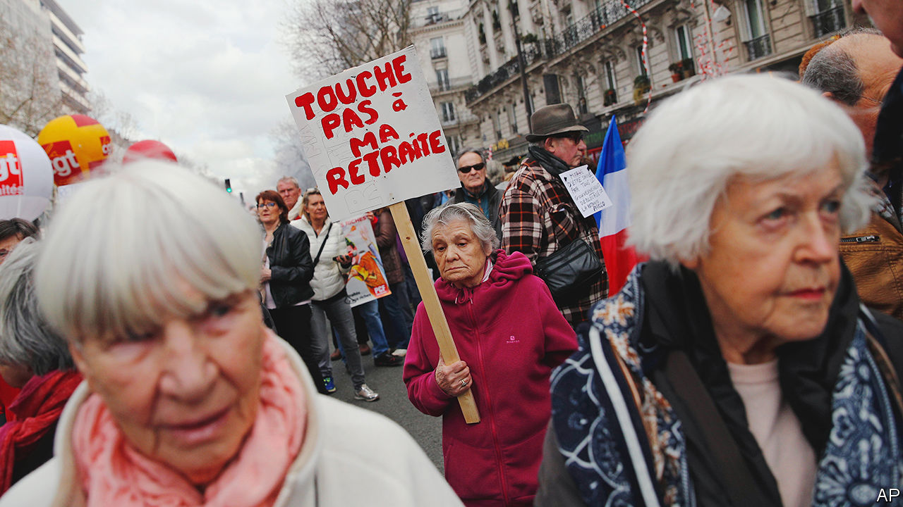
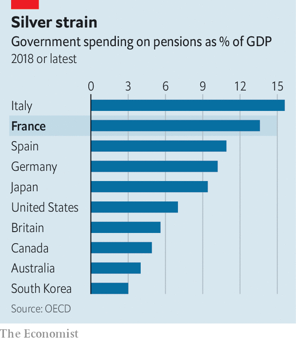

###### Retirement gamble

# Emmanuel Macron unveils his pension reforms 

##### He wants the French to work longer. Good luck with that 

 

> Jan 10th 2023 

The French government has decided to go ahead with a controversial pension reform that looks set to divide the country and spark social unrest. On January 10th Elisabeth Borne, the prime minister, unveiled the details of changes to the country’s mandatory pension rules. The fate of these measures will test ’s ability to continue to reform France during his .

The centrepiece is a raising of the legal minimum retirement age from 62 to 64, by 2030. This measure is deeply unpopular with the , but in line with Mr Macron’s campaign promise ahead of his re-election in April 2022. Ms Borne’s package includes an increase of €100 ($107) a month to €1,200 for the minimum state pension, which is paid to those who have made the required contributions over a lifetime. The prime minister made other concessions designed to win political support, including extra pension credits for those who have physically demanding jobs or began to work when very young.

France’s new pension rules are at once bold, overdue and less radical than once planned. Bold, because the decision to go ahead at all comes in the middle of a cost-of-living squeeze, as part of the fallout from Russia’s invasion of Ukraine. Thanks to generous French state subsidies and caps on price increases, the country’s inflation rate, at 6.7%, is one of the lowest in the euro zone, and fell in December. But the French still feel the pinch in their pockets, and this will get worse. This year the government is allowing energy bills for households to rise by 15%, up from 0-4% in 2022. Corporate bills are soaring. Small businesses are under particular stress.

The reform is bold politically too. Few outside Mr Macron’s party and his support base want it, though the employers’ federation applauded. Fully 68% of the French and 77% of 35- to 49-year-olds are against a rise in the pension age to 64. All the country’s trade unions are against any increase in the retirement age, including—to Mr Macron’s frustration—the Confédération Française Démocratique du Travail (CFDT), a moderate union. Its leader, Laurent Berger, called it “one of the most brutal pension reforms for 30 years”. Most opposition parties also oppose the reform. Indeed Marine Le Pen’s nationalist-populist National Rally, and Jean-Luc Mélenchon’s Unsubmissive France on the left both want to lower the retirement age to 60, at least for some workers. A first day of protests and strikes has been called for January 19th.

In any event, the reform is overdue. Mr Macron has been promising it since he was first elected, in 2017. Endless consultations, mixed messaging and a failure to build a consensus around a previous version, in 2019, led to the longest period of strikes in France since the uprising of 1968. This first attempt by Mr Macron was finally shelved when covid-19 struck in 2020.

Yet France cannot afford to keep things as they are. At 60, the average age at which French men actually retire (for women it is 61) is the third-lowest in the OECD, a group of mainly rich countries. Thanks to a high life expectancy, a retired man then spends an average of 23.5 years in his armchair (and a French woman 27 years), the second-longest. The share of 55- to 64-year-olds still at their desks is just 57%, compared with 74% in Germany and 65% in Britain. Indeed many firms edge out workers before retirement. The government says it will now make them publish statistics on the employment of older workers, to nudge them into better behaviour.

 


This lifestyle comes at a cost. France spends 14% of GDP on public pensions, nearly double the OECD average. By 2030, according to Bruno Le Maire, the finance minister, the deficit in the French pensions system will reach €14bn. The new measures should comfortably close that gap. “Given the current environment of upward pressure on interest rates, this pension reform is an important message to investors,” says Ludovic Subran, chief economist at Allianz, an insurer.

Overall, however, the reform is less radical than the one that Mr Macron originally dreamed up. When first elected, he wanted to bring in a universal points-based system, in order to make sense of the labyrinthine system of regimes and rules that governs different employees’ rights. As it is, most French workers have no idea of their exact retirement entitlement, which in turn muddles decisions about staying on at work later in life. If France is to raise the share of older workers in jobs, it needs at some point to make things simpler.

The government’s new rules now need to go to parliament. The best hope for Mr Macron, who lost his majority there last June, is to secure the support of the opposition Republicans. The president’s centrist alliance holds 250 seats, 39 short of a majority. But the Republicans, who when in power themselves raised the retirement age, are not keen to hand Mr Macron an easy victory. If a parliamentary majority cannot be found, the government may have to resort to using a special provision of the constitution to force the rules through, at the risk of prompting fresh elections.

Technically, in other words, Mr Macron could get this reform on the statute books by September, as the government wants. The stiffest opposition, though, may come not from the benches of parliament but from the street. Unions and opposition parties promise demonstrations. New forms of protest and industrial action could yet emerge. Strikes over the Christmas period at the sNCF, the national railway, were organised via Facebook without the support of the unions.

In short, France looks set for a period of unrest. Mr Macron remains unpopular, with an approval rating of only 36%. Any ill-considered remark on the new proposals that slips from his tongue could sour the mood yet more. If the president is to leave a mark on his second term, he may have little choice but to hold firm, stay quiet, and sit it out. ■

