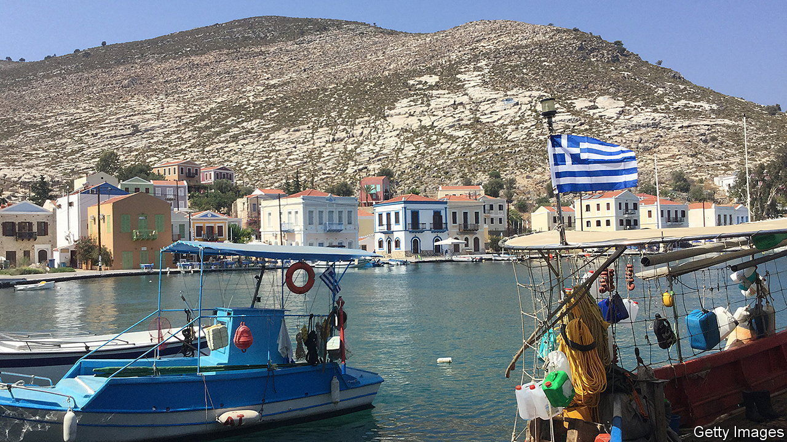
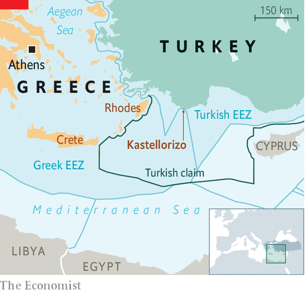

###### Gyros and gunboats

# Might Turkey seize a tiny Greek island? 

##### Kastellorizo could be a flashpoint 

 

> Jan 12th 2023 

KASTELLORIZO, a small Greek island in the Mediterranean, home to only a few hundred people, does not look like a flashpoint. Dozens of pastel-coloured houses rise from the shores of its main bay. Locals exchange greetings with tourists and daytrippers arriving by ferry from Turkey. A large sea turtle pokes its head out of the turquoise waters nearby.

But not all is well. A Greek warship, the , patrols the waters around the island. A couple of army trucks watch over the harbour. A few troops trickle out of a cruise ship, which has come from Athens. Kastellorizo has recently taken centre stage in a dispute between Greece, to which the island belongs, and Turkey. Greece says Kastellorizo enjoys a continental shelf area, or Exclusive Economic Zone, of 200 nautical miles, in line with the UN Convention on the Law of the Sea. Turkey says Kastellorizo is too small and far from the Greek mainland to be entitled to an EEZ. The Greek claim locks Turkey out of the Mediterranean, Turkey complains. 

 


Turkey challenges Greece’s sovereignty over Kastellorizo and a number of other islands. Last month its president, Recep Tayyip Erdogan, said Turkish ballistic missiles could strike Athens. “We may suddenly come one night,” he had warned a couple months earlier, suggesting an invasion. Turkey’s shores are within swimming distance of Kastellorizo. The nearest Greek island, Rhodes, is 120km away. 

A number of things militate against the risk of armed confrontation between Turkey and Greece. One is the fact that both are members of NATO. The other is that war would crush each country’s tourism sector. But the risk is there, also because Mr Erdogan’s government has developed a taste for using force in pursuit of its interests, especially in Syria. 

Turkey accuses the Greeks of militarising the islands, contrary to international treaties. Last year, Turkish media outlets published images, captured by drones, showing deliveries of armoured vehicles to some of the islands. Greece does not deny sending new troops, but says it is doing so only for defensive purposes. With elections scheduled in both Greece and Turkey this year, nationalists on both sides may be tempted to rattle their sabres. The locals on Kastellorizo, as well as the visiting Turks, are trying to tune out the noise. “It’s only theatre,” says a waiter. NATO leaders should hope he is right. 

