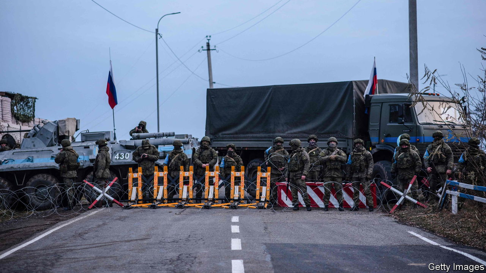
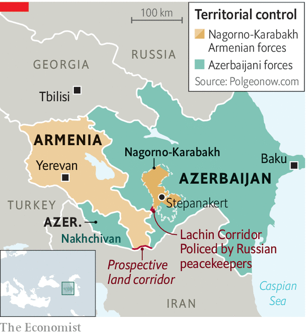

###### No way in

# The Armenians of Nagorno-Karabakh have been blockaded by Azerbaijan 

##### There are fears of fresh conflict 

 

> Jan 12th 2023 

The shelves at the Gurman supermarket in Stepanakert, the main city of Nagorno-Karabakh, are empty. There are occasional deliveries of milk from a local dairy, “and people line up for it”, says Svetlana Martirosyan, an employee. But they have to bring their own jars since the dairy ran out of containers. “Sometimes we also get sugar, and we distribute it, a half kilogram per family. There isn’t anything else.”

Karabakh has in effect been under blockade for nearly a month, since a group of Azerbaijani government-supported protesters launched a demonstration on the only road connecting the enclave to Armenia and the world beyond. As a result, traffic on the road has almost vanished, and the tens of thousands of ethnic Armenians living in Karabakh are cut off. 

The protesters’ ostensible demand is that Azerbaijani environmental officials be allowed to visit mines in Karabakh that they say have been illegally expropriating the mineral resources of Azerbaijan. It is a pretext that few, including the leadership in Baku, Azerbaijan’s capital, take seriously. The real goal appears to be to ratchet up pressure on the Armenians to cede more sovereignty over Karabakh.

 


A short war in 2020 saw Azerbaijan regain control of much of the territory it had lost to Armenia in the first war, in the 1990s. Now Azerbaijan is pushing for a deal that would complete that victory, cementing its control over the remaining parts of the enclave and establishing a land corridor through Armenian territory to connect mainland Azerbaijan with its own enclave of Nakhchivan (see map). 

The immediate aim of the blockade appears to be to establish Azerbaijani checkpoints on the road to Stepanakert. “It is our legitimate right,” Azerbaijan’s president, Ilham Aliyev, said last month. “This is our territory, recognised by the international community.”

But the move is part of a wider push by Azerbaijan to take advantage of a favourable international environment. Russia, the big regional power and Armenia’s traditional patron, is bogged down in Ukraine. Russian peacekeepers, deployed as part of the ceasefire agreement of 2020, are supposed to provide security on the road but have been impotent in the face of the protests. Meanwhile, the European Union, which is brokering the peace talks, has embraced energy-rich Azerbaijan as a part of its strategy to wean the European continent off Russian gas. 

On the ground, though, the Armenians are digging in. Ruben Vardanyan, the de facto ruler of Karabakh, says the pressure will not work. “We can stay a long time in these conditions,” he says. “It’s not about food. It’s about are we living in our homeland, or will we be part of Azerbaijan?”

Mr Vardanyan, a Russian-Armenian billionaire well-known for his philanthropy in the Armenian world, rose to power in Karabakh quickly and in murky fashion: he unexpectedly renounced his Russian citizenship last autumn and moved to Stepanakert. Within two months he was in charge. His arrival has enraged Azerbaijanis, who see him as a Kremlin asset there to sabotage the peace talks. Formerly an adviser to Vladimir Putin, Mr Vardanyan is cagey about his current ties to Moscow and studiously avoids criticising Russia. 

International pressure has mounted against the blockade, but Mr Aliyev remains defiant. “No one can influence us,” he said last month. “There may be some phone calls and some statements, but we do not need to pay attention.”

The protests remain popular among Azerbaijanis because they are seen as undermining the Russian peacekeepers, says Zaur Shiriyev of the International Crisis Group, a think-tank. But Mr Aliyev and his allies will need results, such as the visits to the mine the protesters demand and perhaps some sort of official Azerbaijani control over what passes along the road. Ending up empty-handed could be risky for Mr Aliyev’s government. It all augurs a rocky 2023 in the Caucasus. ■

