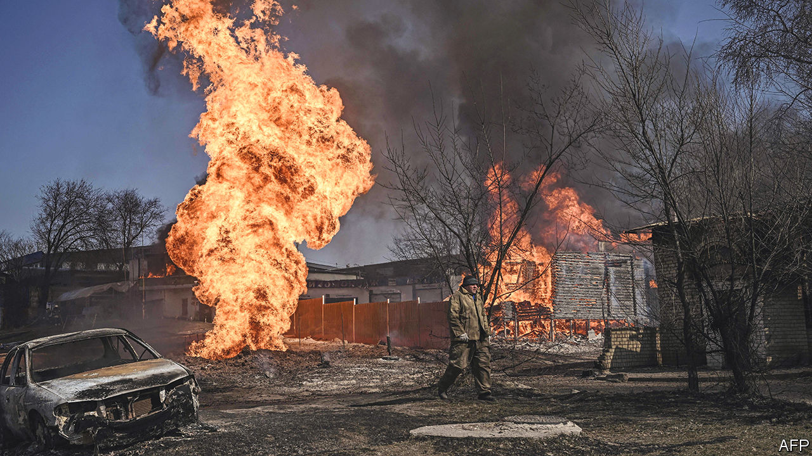

###### Little green mayhem

# The war has devastated Ukraine’s environment, too 

##### Trees, animals, fish and crops all suffer 

 

> Jan 12th 2023 

Before the Russian invasion, people from nearby villages used to flock to the banks of the Oskil reservoir, which stretches for about a hundred kilometres south of Kupyansk, in eastern Ukraine, to swim, listen to birdsong and catch fish. Today, much of the area is changed beyond all recognition. Destroyed villages, recaptured by the Ukrainians during a counter-offensive four months ago, charred trees and the husks of Russian tanks line the reservoir’s eastern banks. Last spring, to prevent Russian troops from crossing the Donets River, downstream from the Oskil, Ukrainian forces blew up the reservoir’s floodgates. The move helped slow the Russian advance. But it also spelled doom for the Oskil. Over 350m cubic metres of water gushed out of the reservoir. The water level plunged, exposing great swathes of the reservoir’s bed. Birds that once nested in the area disappeared. Some 2m fish are thought to have died. Local wells have dried up. 

Forests ravaged by fires caused by relentless shelling, or cut down to build trenches; groundwater and soil contaminated by heavy metals and toxic chemicals from detonated munitions; and wild animals killed or driven from their habitat: these are some of the less talked-about victims of the war in Ukraine. Because about 18% of the country remains occupied by Russian forces, measuring the impact of the invasion may be impossible as long as the fighting rages. But even the fragmented data available reveal a picture of environmental catastrophe. 

Since the start of the war, Ukraine’s environment ministry has recorded almost 2,300 instances of environmental damage caused by the fighting. About 2.9m hectares of the country’s protected areas, home to thousands of species of plants and animals, are at risk of destruction, the ministry estimates. Another 3m hectares of forests, about a third of the total, have been affected by the fighting already. Of these, at least 23,300 hectares have completely burned down. Illegal logging has been documented at many of the 18 national parks and nature reserves that have been illegally occupied by the Russians. The war, say Ukrainian officials and scientists, is also to blame for the deaths of thousands of dolphins in the Black Sea, killed by mines and sonar from Russian submarines. (On the other hand, air quality in parts of Ukraine has improved because of lower traffic.) Other dangers, notably the risk of damage to the Zaporizhzhia nuclear power plant, occupied by the Russians since early March, lurk ahead. 

So far, the combined damage already amounts to more than $46bn, which Ukraine will in time demand as war reparations from Russia, according to Ruslan Strilets, the Ukrainian environment minister. Air pollution, at $27bn, accounts for the bulk of the sum. In only ten months, over 42m tonnes of carbon dioxide, roughly the same as the annual emissions of Bulgaria, have been released into the atmosphere as a result of the war, the ministry says. Forest fires caused by shelling, as well as Russian attacks on Ukrainian depots, which have caused 680,000 tons of oil and fuel to go up in flames, are mostly to blame for the emissions. 

The war has poisoned large areas of Ukrainian farmland. Dangerous chemicals and fuels, released from exploded rockets and the tens of thousands of artillery shells that are being fired by both sides every day, have leaked into the ground along the length of the front line. Such contamination can harm local ecosystems and crops decades after the guns have gone quiet, says Olexiy Angurets, the author of an upcoming report on the war’s impact on the environment. Damage to farmland has already cost Ukraine $18bn, says the environment ministry. 

Ukraine’s environmental record was hardly stellar before Russia invaded. The country ranked 52nd (out of 180) in last year’s Environmental Performance Index, a measure compiled by experts at Yale and Columbia universities. Post-war reconstruction may offer a unique chance for improvement. “What we’re afraid of is that recovery will be just a few green projects here and there,” says Tetiana Riabokin of the World Wildlife Fund. Ukraine needs to place the transition to a low-carbon economy at the heart of its recovery plan, she says. This would also make the programme more palatable to foreign donors and taxpayers, and improve Ukraine’s prospects for EU membership.

For the most part, repairing the harm done to the environment will have to wait until the end of the war. But some projects are already going ahead. Over the past year, Ukraine’s forest agency has planted over 180m new trees as part of a reforestation programme. In late September its foresters opened a tree nursery a few kilometres from the border with Belarus, from where one wave of the Russian assault came in February 2022. “We showed them we’re not scared,” says Mr Strilets, “and that victory will come.” ■


