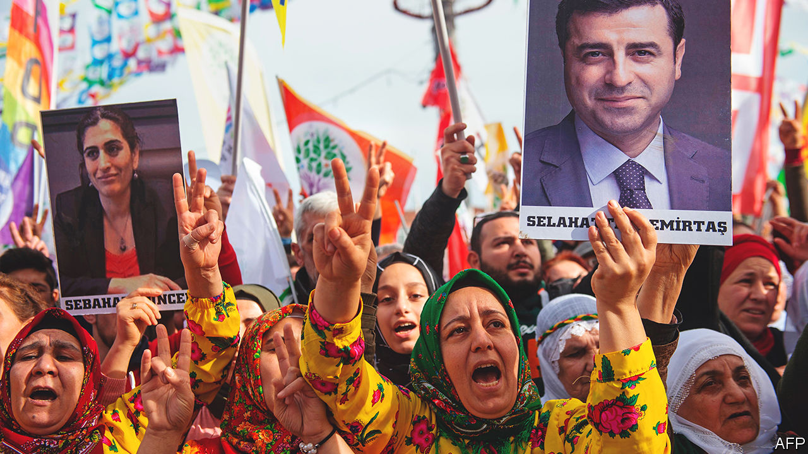

###### Taking aim at the Kurds

# Turkey is on the point of banning the main Kurdish opposition party 

##### The HDP’s MPs may also be barred from politics 

 

> Jan 12th 2023 

Turkey’s biggest Kurdish party is banned from spending its own money. Its mayors, despite the fact that they have been directly elected, have been removed from city halls and replaced with caretakers appointed by the government in Ankara, the capital. The party’s former leader, Selahattin Demirtas (pictured), has been imprisoned since 2016. And now it looks as though its elected members of parliament could be expelled and the party banned, ahead of national elections that are due to be held in June. Welcome to democracy under President Recep Tayyip Erdogan. 

The decision is “99% made”, says Ertugrul Kurkcu, one of the members of parliament in question for the People’s Democratic Party (HDP). “We can say the HDP has already been closed.”

The HDP made history in June 2015 as the first Kurdish-rooted party to win more than 10% of the vote, then the threshold to take seats in parliament. It managed to reach beyond its ethnic base to win votes from liberal Turks, depriving Mr Erdogan’s Justice and Development party (AK)  of an outright parliamentary majority for the first time since it took power in 2002, and obliging it to rule in coalition.

Since then, the HDP has spent much of its time fighting indictments. Mr Erdogan accuses it of links to the Kurdistan Workers’ Party (PKK), a banned separatist militia that has been waging an insurgency in south-eastern Turkey since the early 1980s. Last week Turkey’s constitutional court slapped a block on the bank accounts that hold HDP’s state funding, citing its “organic ties to the PKK”. This means that it has no access to 539m lira ($29m) that it was due to receive this year. This week, in the same court, the prosecutor presented evidence in a mass terror case against 451 party officials, including all but four of its 56 MPs, accusing the HDP of acting as the PKK’s “recruitment agency”. If found guilty, they will be banned from holding elected office for five years. In a parallel case, the prosecutor has asked for the party’s closure.

Mr Erdogan and his allies insist such trials are purely judicial, and free from political interference. His opponents disagree. They say that the courts have been almost entirely captured since a coup attempt against the president in 2016 and the huge purge of the public sector that followed. More than a quarter of Turkey’s judges and prosecutors were sacked and replaced, and its top courts gradually filled with loyalists. “It is not the constitutional court, it is the AKP court,” Mr Kurkcu says.

Banning the HDP may help Mr Erdogan and his coalition partners win at the parliamentary election, but it is a gamble. If banned, the HDP could regroup as a new party, as others have done in the past (Mr Erdogan’s own AK party is an example of that), although it may not have time to do so before the election, and all its most experienced officials will probably be banned from running. The main six-party opposition coalition may struggle to win homeless HDP voters, because one member is a nationalist party. However, it would probably benefit more than AK, which has been tarnished in Kurdish voters’ eyes by Mr Erdogan’s military operations against the PKK and his crackdown on Kurdish civil society.

There would, in fact, be some benefits for Mr Erdogan should the HDP remain in the presidential race, which is taking place at the same time as the parliamentary one. If the HDP fields its own candidate, separate from the joint nominee (still to be chosen) of the six-party coalition, that would split the opposition vote and could push the election to a run-off round. “This is the beginning of a negotiation, with the HDP saying don’t shut us down, and we’ll nominate someone,” says Can Selcuki, founder of Turkey Report, a polling firm.

A succession of Kurdish parties have been banned in Turkey over the past three decades. But no previous one has come close to the success that the HDP has enjoyed, and it is for that reason, its supporters say, that the cases being brought against it are so comprehensive. “This is a wide liquidation decision,” said Saruhan Oluc, chairman of the party’s parliamentary group. “To try to close a party that is heading into elections is a strike against the democratic space.” ■

