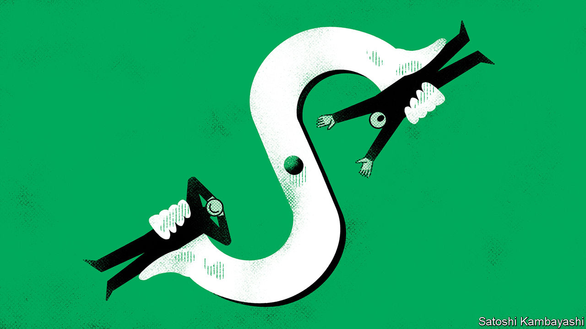
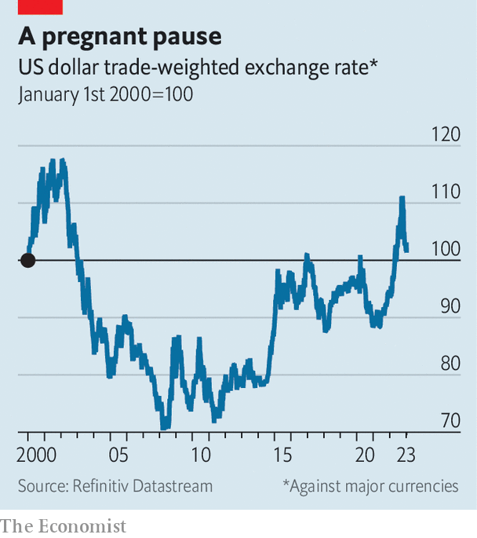

###### Buttonwood

# The dollar could bring investors a nasty surprise 

##### Virtually everyone thinks the greenback will weaken 

 

> Jan 12th 2023 

Our currency, your problem. That is how John Connally, America’s Treasury secretary, described the dollar to European leaders in 1971. The phrasing was apt. His boss, Richard Nixon, had suspended the convertibility of the dollar into gold and demanded a change to the exchange-rate system established at Bretton Woods in 1944. Other countries were told to strengthen their currencies, or America would subject them to trade restrictions. Compliance followed in short order. By the end of the year, the Smithsonian Agreement had devalued the dollar by around a tenth against key foreign currencies. 

Today’s exchange rates are mostly floating, set by the market rather than at crunch talks. Yet once again a weaker dollar is prompting sighs of relief. Last September the dxy, a gauge of the dollar’s strength against other currencies, was at its highest in 20 years (see chart). The yen had tumbled; the pound at one point looked like it was racing towards parity with the dollar; the euro spent a few brief spells below it. Since then, the greenback has weakened: measured by the dxy, it is now 10% below its recent peak.

 


A mighty dollar causes no end of problems. Poorer countries tend to borrow in the currency. When it strengthens, these debts become heftier. Even in rich countries, where governments mostly issue debt in their own currency, a stronger dollar squeezes corporate borrowers. Analysis in 2020 by Matteo Maggiori, Brent Neiman and Jesse Schreger, three economists, showed that in Australia, Canada and New Zealand more than 90% of corporate bonds held by foreigners were denominated in outside currencies, typically dollars.

It is not only debtors that suffer. Commodity prices are quoted in dollars; when the currency strengthens they get dearer. American exporters become less competitive, as their products are more expensive for foreigners. American investors with overseas assets have their returns eaten away. Good reason, then, for the cheering at the greenback’s retreat. 

Unfortunately, the relief may be temporary. To see why, consider the sources of the dollar’s recent strength. One is monetary policy. Throughout 2022, America’s Federal Reserve raised rates higher and faster than other central banks. This made the dollar a good target for a “carry trade”: selling a low-yielding currency to buy a high-yielding one and pocketing the difference. A second source is fear. Russia’s invasion of Ukraine, China’s unsustainable “zero-covid” policy and the teetering of the global economy towards recession all ratcheted up markets’ anxiety levels. In anxious times investors tend to reach for the perceived safety of American assets. A final source is America’s economy. In part because of higher energy prices and the country’s status as an energy exporter, it seems in better shape than much of the rest of the world’s.

True, the pace of the Fed’s tightening is slowing, and its governors expect rates to peak this year. But they expect that peak to be higher than investors do, at above 5%, and that it will be maintained longer before being cut. Were the market to accept the central bank’s view, the carry trade might yet have another leg. So may the fear trade, which is dependent on the progress of an unpredictable war.

Even an American recession may not dent the dollar. The greenback tends to do well both when America’s economy is motoring ahead and when it falls into a downturn, a phenomenon currency traders call the “dollar smile”. If American growth is sputtering, the global economy is likely to be in jeopardy as well, enhancing the appeal of dollar assets as havens.

Yet the best argument that the dollar will strengthen is investors’ conviction that it won’t. In Bank of America’s recent survey of fund managers, a near-record proportion thought that the greenback would weaken. Among forecasters surveyed by Bloomberg, a data provider, the median projection is for the dollar to fall against every other major currency this year, and to continue to drop after that. 

With some $6.6trn traded against other currencies every day, it is difficult to imagine that at least some of these bets have not already been placed. The more that have, the greater the potential for a rise. Shortly after the Smithsonian Agreement was struck, speculators threw currency markets back into chaos by forcing the dollar to devalue further, eventually breaking the Bretton Woods system altogether. Nowadays, the greatest pain would come if the dollar were driven in the opposite direction. Investors could be in for a shock.


