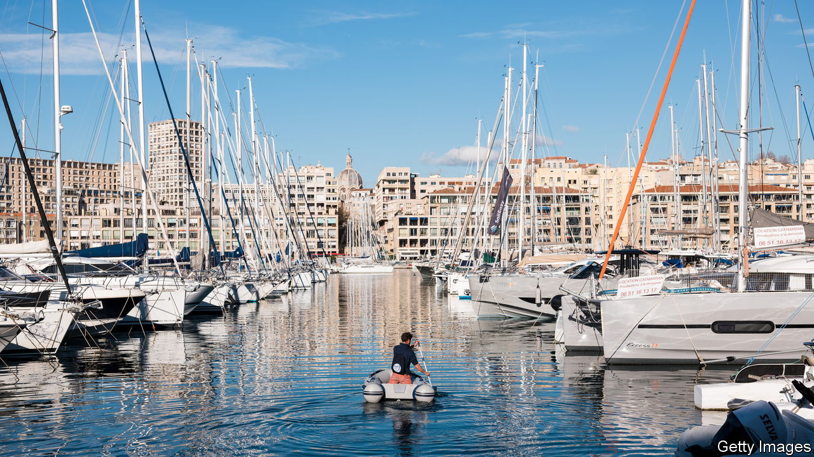
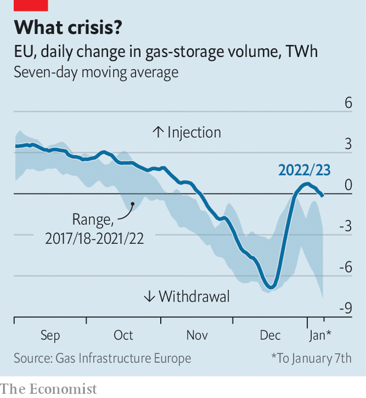

###### Good day sunshine

# The energy crisis and Europe’s astonishing luck 

##### National leaders must make the most of the good weather 

 

> Jan 11th 2023 

Visitors to warsaw at this time of year do not usually bask in temperatures nearing 20°C. Bilbao tends to be frosty, not tropical, in January. But this winter is a strange one. Temperature records are being broken across Europe and energy prices are plummeting: the price of natural gas at the continent’s main hub has fallen to levels last seen before the war in .

 


A warm autumn postponed the heating season, allowing gas-storage facilities to be filled to the brim. The present warmth has enabled them to be topped up again (see chart)—a startling turn in the middle of winter. All told, Europe has sucked out half as much gas from storage facilities as at this point in the past two winters. And forecasts suggest a mild end to the season. 

The good weather is not the only reason for cheer. Gas supply is growing as new liquefied-natural-gas terminals begin work. A wet autumn and windy winter have helped propel hydro and wind generators. French nuclear plants, turned off for maintenance, are slowly returning to the grid. “The stressors that caused the energy crisis of 2022 are all relaxing at the same time,” notes Lion Hirth of the Hertie School in Berlin. Power prices in Europe have fallen back to levels last seen before the summer. 

This is providing the continent with an economic boost. Indicators of sentiment have risen for two months in a row. Defying gloomy predictions, German industrial production continues to hold up. Unemployment remains at rock-bottom across Europe, and firms plan to hire more, rather than make job cuts. Forecasters are lifting their growth projections. Goldman Sachs, a bank, no longer sees the euro zone slipping into recession in 2023. In a , a change in weather is changing Europe’s economic fortunes. 

Yet it is still too soon to announce an end to the energy crisis. For a start, prices remain well above normal. Overall power prices are roughly twice what they were in mid-2021. The same gas that costs around €75 ($81) per megawatt-hour today sold for €10 before covid-19. Further drops are unlikely. Gas demand from industry will probably pick up; gas-fired power stations may start to replace coal-fired ones.


And even with bursting storage facilities, Europe is still short of what the International Energy Agency, an official forecaster, reckons the continent will need for a bad winter next year. Asian demand for gas is increasing, and will rise further still as China’s economy returns to normality. As Timera Energy, a consultancy, notes, the gas market is still operating on the edge of supply capacity, meaning sharp price movements remain possible.

Europe would do well to bank its luck. Leaders could use the chance to rethink the myriad support schemes they introduced over the summer, many of which are are costly, inefficient and untargeted. They would be wise to focus money on the vulnerable, and to tie it to green investments. After all, it is weirdly hot weather that has given Europe its current reprieve. The fight against climate change will only become more acute as the energy crisis fades. ■


