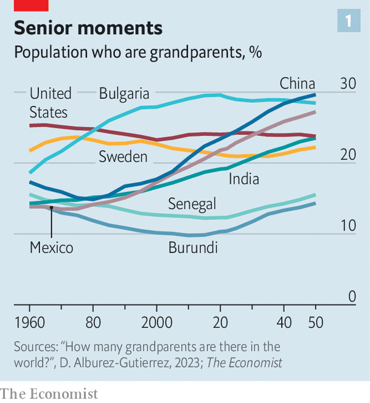
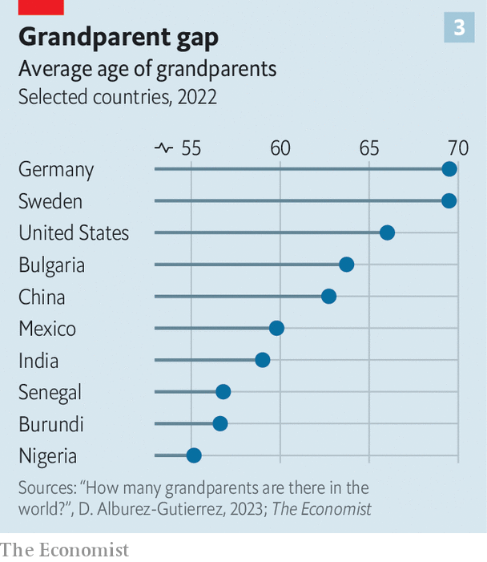
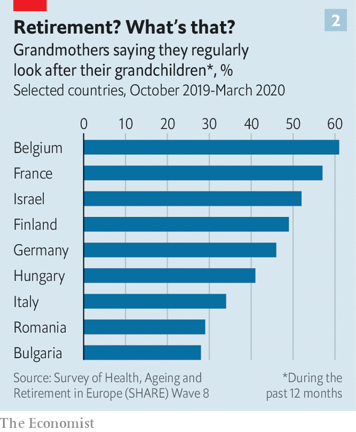
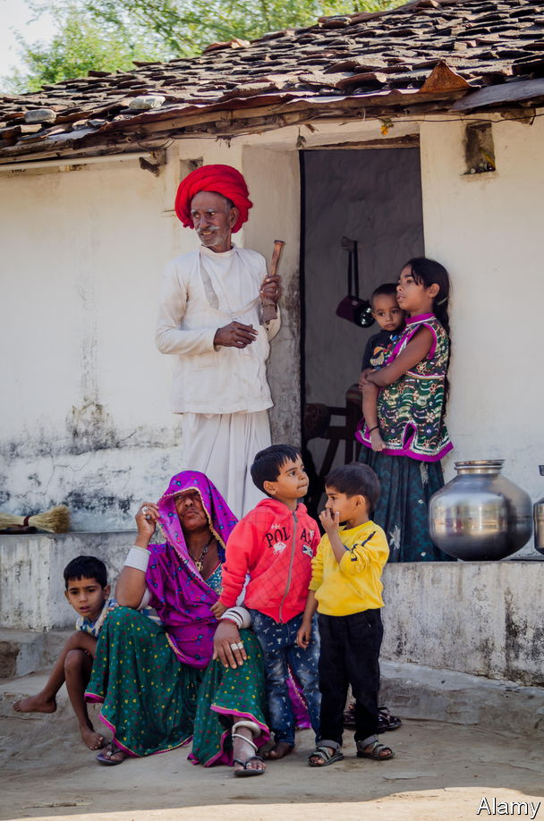

###### The generation game

# The age of the grandparent has arrived 

##### The ratio of grandparents to children is higher than ever before. That has big consequences 

 

> Jan 12th 2023 

The most saccharine song of 1980 was “There’s No One Quite Like Grandma”, performed by the St Winifred’s School choir from Stockport, England. It shot to the top of the British charts as kids everywhere gave it to granny for Christmas. “Grandma, we love you,” they sang. “Grandma, we do. Though you may be far away, we think of you.” 

Today, as the once-cherubic choristers start to become grandmas and grandpas themselves, grandparenting has changed dramatically. Two big demographic trends are making nana and gramps more important. First, people are living longer. Global life expectancy has risen from 51 to 72 since 1960. Second, families are shrinking. Over the same period, the number of babies a woman can expect to have in her lifetime has fallen by half, from 5 to 2.4. That means the ratio of living grandparents to children is steadily rising.

Surprisingly little research has been done into this.  could not find reliable figures for how many living grandparents there are, so we asked Diego Alburez-Gutiérrez of the Max Planck Institute for Demographic Research in Germany to produce some estimates by crunching UN age and population data with models of kinship structures in each country. 

We found that there are 1.5bn grandparents in the world, up from 0.5bn in 1960 (though the further back one goes, the fuzzier the estimates become). As a share of the population they have risen from 17% to 20%. And the ratio of grandparents to children under 15 has vaulted from 0.46 in 1960 to 0.8 today. 

By 2050 we project that there will be 2.1bn grandparents (making up 22% of humanity), and slightly more grandparents than under-15s. That will have profound consequences. The evidence suggests children do better with grandparental help—which usually, in practice, means from grandmothers. And it will help drive another unfinished social revolution—the movement of women into paid work. 

 


Since fertility rates and life expectancy vary enormously from country to country, the age of the grandparent has not yet dawned everywhere (see chart 1). They are 29% of Bulgarians but only 10% of Burundians. Their average age varies widely, too, from 53 in Uganda to 72 in Japan (see chart 2). To understand what a difference plentiful grandparents make, a good place to start is in a country where they are still scarce. 

 


Consider Senegal. Most rural Senegalese are subsistence farmers. Although fertility has dropped from 7.3 babies per woman in 1980 to 4.5 today, large families remain the norm. Children under 15 outnumber living grandparents by 3.5 to 1.

Amy Diallo, an 84-year-old matriarch wrapped in a blue and white hijab, has to think carefully when asked how many she has. “Thirty,” she concludes, looking up from her cross-legged position on the floor of her home in Tally Boubess, outside Dakar, the capital, on a street where horses and carts jostle with sheep and cars.

As the oldest member of her family, she commands respect. She offers moral guidance to the young: be honest and pious, uphold tradition and stop hitting your younger brother. Every year she leads a family pilgrimage to Tivaouane, a Muslim holy city, with children, grandchildren, great-grandchildren and various in-laws, perhaps a hundred in all. 

Grandparents pass on traditional beliefs, stories, songs and a sense of history. More prosaically, they bring an extra pair of hands. That helps both parents and children. A study in rural Gambia, for example, found that the presence of a maternal grandmother significantly increased a child’s chance of living to the age of two. In sub-Saharan Africa the odds of being in school are about 15% higher for children living with a grandfather and 38% higher for children who live with a grandmother.

As for Mrs Diallo, she has never worked outside the home. But she has helped some of her offspring to do so. Ndeye, one of her daughters, got a job in an office despite having eight kids herself, because Mrs Diallo helped out with the children. 

Yet for all her sense of love and duty, Mrs Diallo cannot babysit all 30 grandkids. The state offers little help. Unlike Ndeye, many of Mrs Diallo’s daughters and granddaughters have never worked outside the home. This is common: barely a third of working-age women in Senegal are either in work or seeking it. Grandparents in the poorest countries do their best, but there are not enough of them. 

She’s there in times of need

In richer places, fertility has fallen much further than in Africa. A typical Mexican woman, for example, can expect to have only two children, down from nearly seven in 1960. Mexico’s ratio of living grandparents to children is three times higher than Senegal’s. Mexican  thus have more time to lavish on each grandchild. 

Irma Aguilar Verduzco lives with her daughter, also called Irma, and two grandchildren, Rodrigo and Fernanda. She cooks, does school runs and reads with her grandchildren. Ever since he was three, Rodrigo, now 16, has liked to take a cup of coffee and sit down for a chat with his grandmother. Fernanda, now 12, still likes to get into bed with her. Irma junior, meanwhile, has long worked 12-hour days, currently as a manager at the Maya Train, a big rail project. She is divorced, and says her ex-husband “does not help”. She “could not have done anything” without Irma senior’s help. 

Grandmothers are the main source of non-parental child care for young children in Mexico, especially since covid-19 forced many nurseries to close. They watch over nearly 40% of sprogs under six. Before grandma moved in, Irma was struggling. “There is no understanding or flexibility for working mothers in Mexico,” she complains. Her kids were often home alone. “Sometimes I paid people to look after them but it was hard to afford and hard to trust people.” One day, years ago, Rodrigo came home from nursery with a broken bone; Irma suspects mistreatment. With her mother around, she feels relaxed. 

Miguel Talamas of the Inter-American Development Bank and his colleagues have tried to estimate how much Mexican grandmothers help their daughters get paid work. They looked at what happened to families after grandmothers die. An ’s death reduced by 27%, or 12 percentage points, the chance that her daughter was in the labour force, and reduced her earnings by 53%. (The same study found no effect on the employment rate of fathers.)

Living with grandparents is not always easy. They may have outdated ideas or demand too much deference. In India, where couples traditionally live with the husband’s parents, a genre of television drama turns on the fraught relations between wives and mothers-in-law. A study of rural Indian women in 2018 found that those who lived with their  (mother-in-law) had little freedom. Only 12% were allowed to visit friends or relatives alone. 

A grandma who enforces old-fashioned norms of wifely subjugation can make it harder for her daughter-in-law to work outside the home. But an intriguing study finds that on average, this effect is outweighed by the help the mother-in-law gives with domestic chores. Such help has become more concentrated as India’s fertility rate has fallen, from six in 1960 to just over two today. Madhulika Khanna of Amazon and Divya Pandey of 3ie, a think-tank, looked at what happened to Indian women if  died. They found the daughters-in-law were 10% less likely to do or seek paid work, probably because they had to spend more time collecting firewood and minding their children. Even overbearing grandmothers can inadvertently do their bit for female emancipation. 

Rich countries generally provide services that help women juggle child-care and work. But many parents seek extra help from grandparents nonetheless. Old-age pensions help, by allowing grandparents to give up work. According to one survey, 50% of very young children, 35% of primary-school-aged children and 20% of teens in America spend time with their grandparent in a typical week. 

This can make a big difference. Janice Compton of the University of Manitoba and Robert Pollak of Washington University crunched American census data and found that living within 25 miles of a grandmother raised the labour-force participation rate for married women with small children by 4-10 percentage points. 

“Granny nannying”, as some call it, can have downsides, too. A British study found grandparents are more likely to leave their wards near fire hazards than nurseries or nannies. Studies from America, Britain, China and Japan suggest that a child around grandparents is more likely to be obese, though whether this is due to spoiling or other factors is unclear. 

To us a book she’ll read

And although grandmas help daughters return to the workforce, that often means withdrawing from it themselves. “There is a clear trade-off,” says Mr Talamas. Back in Mexico, Hermelinda Coapango Vázquez works as a manicurist but takes appointments only at times that fit around caring for her grandson. “My grandson is my life,” she says. “I don’t have a partner and I am not one for having lots of friends.” A study from Brazil found that when children aged 0-3 were randomly assigned formal childcare, the family collectively earned more, mainly because grandparents and older siblings were freed up to work. 

Another pitfall is that families that rely heavily on grandma for child-care are less likely to move and find a better job. A study by Eva Garcia-Moran of the University of Wurzburg and Zoe Kuehn of the Autonomous University of Madrid found that west German women who lived near their parents in-laws earn about 5% less and commute for longer than their peers. 

Children parented solely or mostly by grandparents tend to be worse off than their peers. In America, where roughly 2% of children are raised primarily by a grandparent, Laura Pittman of Northern Illinois University found more emotional and behavioural problems among such adolescents than their peers. That is perhaps not surprising. If children are not living with their parents, it is often because something has gone badly wrong: a father in jail; a mother dead or incapable. In these circumstances, living with a grandparent is usually far better than the alternatives. 

Katie Clark, a 68-year-old from Baton Rouge, Louisiana, has had sole custody of one grandchild and has temporarily cared for five others because of her daughter’s addiction to opiates. She took charge of her daughter’s first baby soon after she was born. About 12 years later, the daughter arrived, homeless, with five more. She abandoned her children in Katie’s home, before returning with police to demand them back. The daughter currently has custody of the five children, and Katie fears she is neglecting them again. The child raised entirely by Katie is now at university. 

In rural China, grandparents help reduce the harm caused by the government. Under the apartheid-like  (household registration) system, rural Chinese who move to cities are treated as second-class citizens. Their children are barred from local public schools, so they are often left behind with their grandparents in their parents’ home village. But rural schools are often dire. Grandparents, though well-meaning, are often barely literate. Scott Rozelle of Stanford University finds that more than half of toddlers in rural China are cognitively delayed, partly because their grandparents do not realise that it is important to talk to them. 

In Chinese cities the story is different. The one-child policy (which became a three-child policy in 2021) was always enforced more strictly in cities than the countryside. So many urban families consist of four grandparents, two parents and just one child. Thus, there is no shortage of caring hands. Urban children often live with grandparents during the week and see their hard-working parents on weekends. 

Nurseries are pricey and distrusted in China. Grandmothers often retire in their 50s to watch over the precious only grandchild. This works well enough. The labour-force participation rate for Chinese women is, at 62%, slightly higher than America’s. “If you want to give your child a good education, you have to work hard to earn a lot of money,” says Zhou Bao, an architect and mother in a “4-2-1” family who has used both sets of grandparents for child-care. But “in the process of making money, you can lose the time spent with your child.” And she expresses a common fear that grandparents tend to spoil their only grandchildren. “They can be too attentive,” she says, “making them less independent.”

The Communist Party promotes traditional values, such as family members caring for each other so the state does not have to. In Beijing the government even set up a school in 2005 to teach grandparents how to look after children better. But the next generation may not wish to shoulder the same responsibilities. Few middle-class parents today expect to be bringing up their children’s children in a few decades, reckons Dan Wang of Hang Seng Bank. If they opt out of grandparenting, that could make it harder for their daughters to combine motherhood and work, fears Ms Dan. 

Just stays a little while

Overall, looking after kids appears to be good for grandparents. Those who spend time with their grandchildren report lower levels of depression and loneliness. But one can have too much of a good thing. Youngsters can be exhausting, frustrating and objectionable. A study in Singapore, with mainly ethnically Chinese families, found that many looked after their grandchildren more out of duty than because they relished it. Many find it harder as they age. Some are squeezed in the “grandsandwich generation”—relied upon to help both their grandchildren and their own ailing parents. Some hanker for a more relaxing retirement. Grandma Irma in Mexico admits she would like to travel more as her grandchildren grow more independent.

 


One place where grandparents have plenty of time to relax is Sweden, where a strong welfare state means parents seldom rely on them. For each child, a Swedish couple can take 16 months of parental leave, for most of which the state pays them most of their previous wages. (The man must take three months, or they are lost; many split the time off equally.) Afterwards, there are subsidised nurseries, and the norm is for both parents to go back to work. Since child-care is everywhere, Swedes find it relatively easy to move cities to find a better job.

“Once in a while a grandparent might pick up a kid from pre-school or babysit, but not always,” says Andreas Bergh of Lund university. Rather than allow a daughter to go back to work, grandparents might enable her to go out to dinner with her husband. Grandparental help is “a bonus”, says Andreas Heino of Timbro, a think-tank in Stockholm.

 


Subsidies for parental leave are so generous that even entrepreneurs take a fair chunk of it. Sandra Kastås runs two companies in Stockholm. When her son was born in 2021 she took two months off, then spent a year working half-time, as did her husband, an IT specialist. Despite her hectic schedule, Mrs Kastås expects no regular help from her parents. They live on Gotland, a remote island, and do not visit often. Her mother “shows her love by sending gifts”, such as books and jumpers she has knitted. She talks to her grandson, on FaceTime. “He hugs the phone when she calls. It’s cute,” says Mrs Kastås. 

Most Swedes are happy with their system. But some of the elderly complain of loneliness. Nearly half of Swedish households consist of one person, the highest level in Europe after Finland. In a population of 10.4m, some 900,000 people are over 60 and living alone. Of these, a fifth are considered socially isolated, meaning they do not meet friends or family more than twice a month. During the pandemic, Swedes joked darkly that it would be easy to isolate the elderly because “We don’t visit our grandparents much anyway.” Immigrants from places such as Africa or the Middle East are often shocked at how atomised Swedish families are.

Lars Tragardh, a historian, praises Sweden’s “statist individualism”. The state looks after people as individuals, so they can make their own choices and not have to rely on others, he says. Parents elsewhere envy the help that their Nordic peers receive, despite the higher taxes needed to pay for it. Still, even the most generous welfare state cannot offer love. 

Helena Paues, who works for an association of local authorities in Sweden, describes how her father enjoys taking her dyslexic son, Wille, to museums. “He loves facts and science. I think his grandfather has taken him to all the museums in Stockholm: the science museum, the Viking museum, and so on. They have a very close bond. My father also struggled with learning to read and write when he was young.” 

In the summer, the grandkids stay at their grandparents’ summer house, swim in the lake, and drink lemonade in a tree house. They clamour to do the same thing every year. Ms Paues says her father instils values such as respect for others. “He doesn’t need to talk about it, he does it by being himself. He teaches them that their opinions matter, because he listens to them.” She concludes: “As a child, you need more grown-ups than just your parents.” ■

