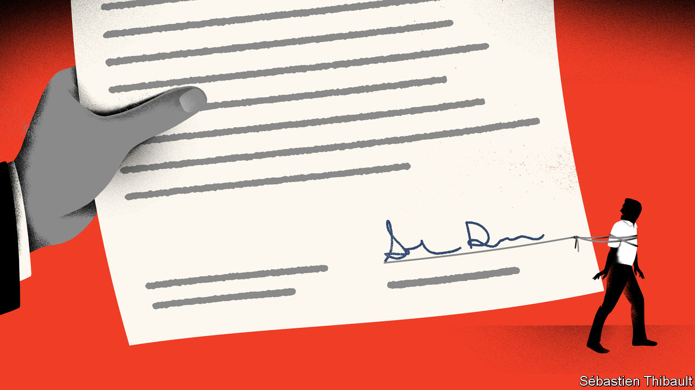

###### Leaders

# America’s trustbusters plan to curtail the use of non-compete clauses. Good 

##### The clue is in the name 

 

> Jan 12th 2023 

Three-quarters of Americans who work, do so for a . They have contracts setting out their pay, holiday, benefits and sometimes the appropriate way to dress (although not in journalism). A lot of contracts also say whether employees may work for a competitor if they leave the company. It is hard to know what share of  are restricted by these non-compete clauses, but the available evidence suggests it may be as high as one in five. More worrying, these clauses are as likely to apply to workers operating deep-fat fryers in fast-food kitchens as they are to workers operating in the conference rooms of white-shoe law firms.  has these clauses in its sights, on the grounds that they are anticompetitive and suppress wages. 

Fans of non-compete clauses argue that scrapping them by decree will invite the state into the realm of private contracts, a symptom of regulatory excess. They have a point, but the FTC’s case is stronger.

It is easy to see why firms like non-compete clauses, which are designed to suppress competition. It suits companies to be able to prevent a star employee from joining a rival, or starting out on their own and wooing clients. But there are also some arguments that non-competes could serve the public interest. Companies sometimes say that the clauses incentivise them to think about talent in a longer-term way. Why bother to spend time and money on training employees if they then join rival firms that go on to reap the benefit of the investment? Some companies also have legitimate worries about trade secrets walking off to a competitor when an employee leaves.

However, a non-compete clause is a heavy-handed way to achieve those ends. Intellectual-property law and non-disclosure agreements exist to preserve true trade secrets, and lots of firms find ways to keep valuable employees without shackling them to their jobs using non-compete clauses. The public interest also conflicts with the firm’s interest: innovation and productivity spread when better ideas about how to do things become widely adopted. Hiring people with specific knowledge and experience can speed this process up, which is one reason why the engineers fired by tech giants like Meta and Twitter are sought after by firms in older industries eager to learn.

If the theory points in one direction, the evidence from how non-competes are used practically screams. In 2014 Jimmy John’s, a chain of sandwich shops, was found to have inserted a two-year non-compete clause in its employees’ contracts which barred them from seeking employment with any rival business that made money by “selling submarine, hero-type, deli-style, pita and/or wrapped or rolled sandwiches” within a three-mile radius of where they currently worked. After this egregious example came to light, the company ended the practice. But franchises often stop employees from going to work at other outlets of the same franchise, reducing their bargaining power.

It strains credulity to argue that these workers are the guardians of trade secrets. Instead, the evidence is that firms use non-compete clauses to drive down wages by lowering the value of workers in the job market. About half of people with non-compete clauses in their contracts work in states where they cannot legally be enforced. They may get away with it because employees do not know their rights, especially those in the low-paid part of the labour market. 

The evidence that non-compete clauses really make companies more innovative and higher-skilled is scarcely more convincing. Washington state, home to Amazon and Microsoft, takes a middle path by restricting non-compete clauses to the contracts of high-earners. California, the global hq of disruptive innovation, goes a step further and bans non-competes altogether. The FTC should do the same, on the grounds that they are anticompetitive. ■

