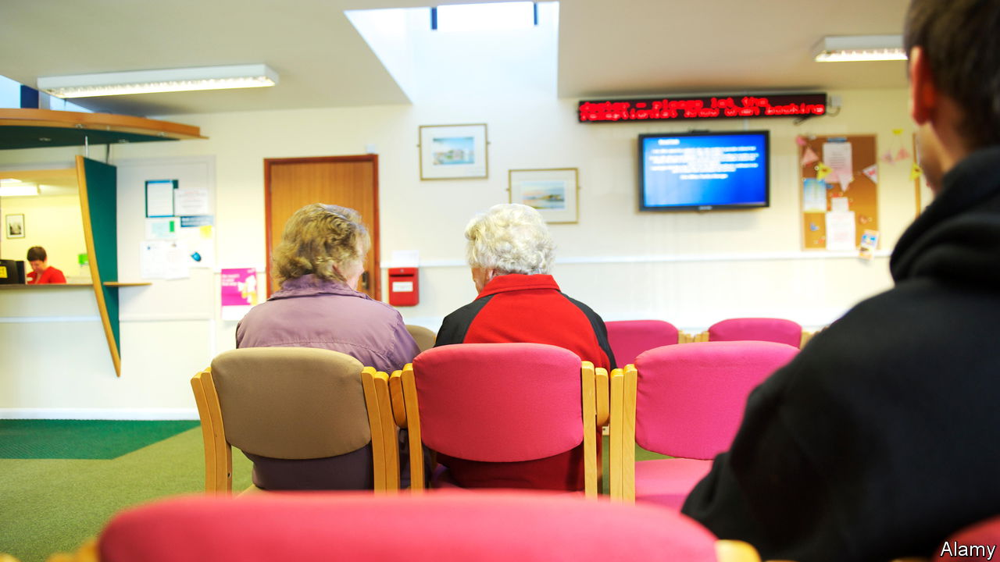
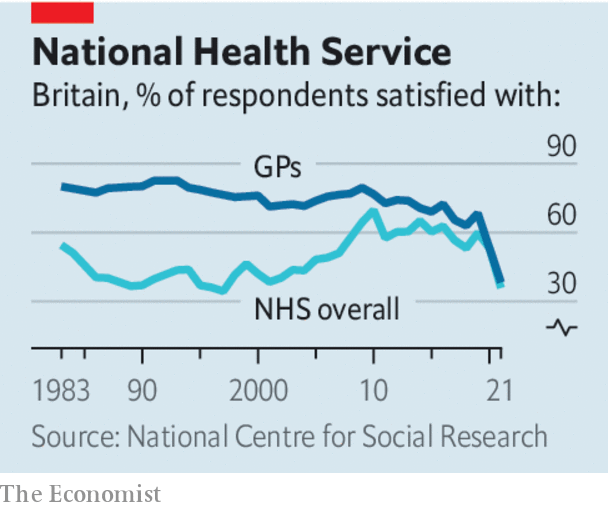

###### Waiting-longer rooms

# Fixing Britain’s health service means fixing its family doctors 

##### Don’t change the partnership model. Do change the targets 

 

> Jan 12th 2023 

Britons used to see the  as a source of pride. It is now a source of danger. Leaked data suggest that, in one week in December, over 50,000 sick people in England waited more than 12 hours to be admitted to hospital from accident-and-emergency (A&amp;E) departments. ’s mortality model echoes the warnings from emergency doctors: around one in four excess deaths in recent months is attributable to  in emergency care. 

The scenes in A&amp;E are just the most alarming symptoms of a . Downstream, one in seven patients is ready to leave the wards, which would free up beds for those clamouring to get in, but they would have no one to look after them if they were released from hospital. The government’s proposed solution—an extra £200m ($243m) to block-book places in private care homes—seems sensible. But it will take more than that to deal with the deeper problem: a chronic shortage of staff.

 


Upstream, the same issue bedevils general practice, the network of family doctors where many of the pressures on the NHS first build.  are conventionally a patient’s first and most frequent point of contact with Britain’s health-care professionals. But the system is buckling. Demand is rising—owing partly to a backlog in cases from the pandemic and partly to an increase in patients with complex, chronic diseases. And the number of doctors is dwindling, as GPs retire early, emigrate or reduce their hours. There are 15% more junior doctors in hospitals than there were in 2019, but 2% fewer full-time family doctors (albeit more practice staff). As a result, millions are not getting the care they need. Many turn directly to the hospitals. Polling shows that one in five people who cannot see their family doctor goes to A&amp;E instead. Many simply get sicker. 

To slow the stampede of older GPs retiring early, the government should exempt doctors from pension-tax rules that penalise high-earners. More advanced technology, including automated telephone services and online consultations, would calm the 8am panic to book an appointment. 

More profound changes are needed to make this foundation of the NHS sturdy again. General practices are businesses, most commonly owned by GP partners. The building will collapse if partners continue to quit. One option is to make all GPs salaried NHS employees, as consultants are in hospitals. The Labour Party is considering this approach, along with other reforms such as allowing self-referrals to certain specialists.

Buying out GP partners and their premises would be costly. It would also be risky to jettison a model that, for all its faults, remains the envy of other countries. Primary care provides most of the NHS’s patient contacts for just 9% of its budget. Specialists, meanwhile, have seen their hospital waiting lists spiral to over 7m: self-referrals would make the problem worse.

It would be better to make changes from within. The NHS should abolish the Quality and Outcomes Framework, a pointless pay-for-performance scheme which means that GPs spend hours filling out forms instead of seeing patients. Pharmacies and other parts of the primary-care system should be encouraged to do more. Practices specialising in chronic illnesses should receive higher fixed fees per patient, enabling continuity of care for those who most need it. Reweighting funding to benefit clinics in the poorest areas would reduce health disparities: they care for 10% more patients than practices in the richest areas, but receive 7% less cash. 

The NHS’s most urgent problem lies in its hospitals. But the health service will not be fixed unless general practice is, too. ■

