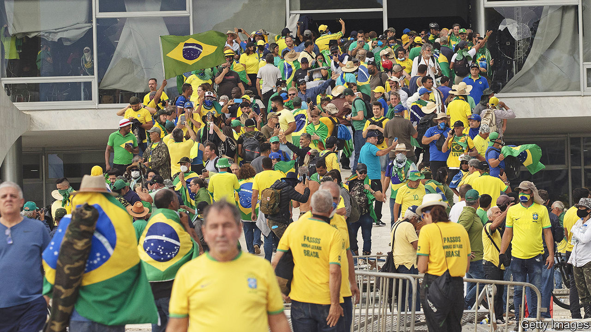

###### The storming of Brazil’s Congress

# How Brazil should deal with the bolsonarista insurrection 

##### Punish those who broke the law, but govern inclusively 

 

> Jan 12th 2023 

Draped in Brazilian flags, they smashed offices, stole files, thumped police and injured at least five journalists. On January 8th thousands of supporters of Jair Bolsonaro , Supreme Court and presidential palace, demanding the overturning of an . The parallels with the attack on America’s Capitol by supporters of Donald Trump in 2021 are obvious—and far from coincidental. Mr Bolsonaro has long admired  and copied his methods. 

In Brasília as in Washington, a right-wing populist lost a fair vote but has never accepted the result. Mr Bolsonaro did not explicitly urge his supporters to storm the seat of government (if so, he may have been arrested). And he eventually denounced the violence. But he has spent months insisting that the only way he could lose the election in October last year was if the other side cheated—allegations he repeated on January 10th, seemingly wishing to whip up more trouble. 

He claims that his opponent, , was not merely a communist but also in league with the devil. (He is neither.) On spurious grounds, Mr Bolsonaro’s party sued to have the ballot annulled, and he refused to attend Lula’s inauguration on January 1st, when he was supposed to hand the presidential sash to his successor. Mr Bolsonaro has tried to convince his followers that he is the rightful president, and they are victims of a dastardly conspiracy. Many , like many Trumpists, believe they have a duty to reverse a stolen election. Such is the power of a big lie told by a charismatic charlatan. 

Yet delusion is no excuse for treason. Those who broke the law should be punished. Around 1,000 have been arrested. This is a good start, but three more things should be done to shore up Brazil’s beleaguered democracy. 

First, the government must restore order. That means not only prosecuting those who plotted and perpetrated the riot, but also making sure that police serve the law, not their favourite politician. Several officers were caught on camera chatting with rioters and taking selfies; others escorted protesters from their camp outside an army base, where they had been calling for a coup, to the government buildings. Mr Bolsonaro is popular among the main police forces, having defended their gold-plated pensions and tendency to shoot suspects. Lula should insist on police who, when on duty, are politically impartial.

Second, Brazil’s opposition should condemn the violence. Several politicians who used to work for Mr Bolsonaro have done so unequivocally. But rank-and-file  remain devoted to their hero; in one poll 37% of Brazilians favoured a coup to remove Lula. In America senior Republicans initially condemned Mr Trump for inciting a lethal riot, but piped down when it became clear that he had not lost his hold over Republican voters. Their Brazilian peers should show more courage. 

Third, Lula needs to govern his divided country inclusively. He should avoid inflammatory language. He was wrong to call the rioters “Nazis”, for example. He ought to try harder to reassure those who did not vote for him that he will govern fairly for all. Prosecutors, meanwhile, should not overreach. The call to seize Mr Bolsonaro’s assets before he has even been charged with a crime should be rejected.

The omens are not all bad. Lula has shown himself willing to compromise and to work with former  lawmakers in Congress, filling a huge hole in the budget before he even took office. If he governs pragmatically, many who dislike him may at least come to accept his presidency. After the falsehood and fury of the Bolsonaro years, Brazil needs calm leadership. If Lula fails, Mr Bolsonaro, or someone like him, could win power again. ■

