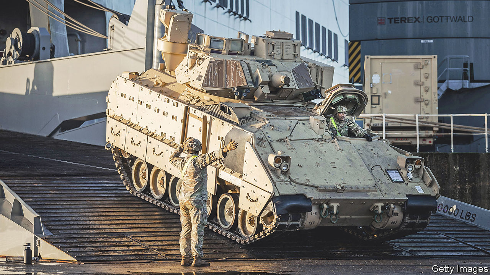

###### The tools for the job

# The West should supply tanks to Ukraine 

##### Allies have been too cautious about giving it the means to resist Russian aggression 

 

> Jan 11th 2023 

ALMOST eleven months after Russia launched its unprovoked invasion of Ukraine, the war has turned static. Since the liberation of the southern city of Kherson two months ago, the battle lines have . Fighting is largely restricted to bloody pounding along a short section of the front around Bakhmut, a city in the east of the country that the Russians have been trying to take since August at an . (On January 10th they claimed to have captured the nearby town of Soledar, but even this is disputed.) Unable to advance, Russia has resorted to blasting Ukraine’s civilian infrastructure. Ukraine, however, is getting better at intercepting missiles and drones, and mitigating the damage using speedy repairs and a swarm of back-up generators.

But a frozen conflict suits the invader well enough, leaving Ukraine weak and vulnerable, its crippled economy dependent on foreign bail-outs while Russia malevolently squats along the vital coastline that provides sea access to the outside world. A frozen conflict allows Russia time to dig in, reinforce its lines and prepare for a fresh assault, or the permanent occupation of its new acquisitions. Ukraine therefore needs to keep pushing back, and to plan for the launch of its third big counter-offensive. 

So it is good news that America, France and Germany are at last  more powerful weapons—Bradley Fighting Vehicles, the similar French AMX and the German Marder. But that is not enough; these are armoured infantry carriers with guns, rather than , which have tougher armour and more powerful cannons. If Ukraine is to continue the work of ejecting Russia from the land that has been stolen, it will need more: heavy tanks and longer-range missiles. 

Britain, reportedly, is close to approving the dispatch of around ten Challenger battle tanks. Ukraine’s other allies should follow that lead; Poland is keen. American Abrams tanks and German Leopards—both much better than the Soviet-designed machines that Ukraine has already received from its eastern European allies—would give it a chance of punching a hole through the Russian-held land bridge that connects occupied Crimea to Russia, and of driving Russia back at least to the lines it held on the eve of war last February. Longer-range munitions for Ukraine’s Western-supplied HIMARS rocket systems would put pressure on the invaders, who have pulled back their logistics hubs and command-and-control centres just beyond Ukraine’s range. 

This escalation of weaponry is , as every such decision has been since the start of the war. Some voices in the West fear that Ukraine could seek to drag NATO into direct conflict by launching an attack on Russia itself—as opposed to Russian troops in the bits of Ukraine which the Kremlin pretends are Russian. Another worry is that, if Russia is pushed too far or too fast, its president, Vladimir Putin, could escalate and, in the worst case, even .

These are not baseless fears. However, as Ukraine’s financier and armourer, the West is in a position to insist that its weapons are not used to attack Russia. Moreover, Mr Putin has been threatening fire and brimstone since the start of the war. On its first day he said: “To anyone who would consider interfering from outside: if you do, you will face consequences greater than any you have faced in history.” Despite these threats, sustained Western interference has met with no military consequences. Likewise the application of Sweden and Finland to join NATO, supposedly another Russian red line, until it wasn’t. 

You might argue that this is a vindication of Western gradualism. However, time is short. Spring is only a few weeks away (though, with the mercury down to -10°C in Kharkiv, it hardly feels that way today). If Ukraine cannot break the stalemate soon, it risks a repeat of 2014, when Russia and its proxies grabbed chunks of eastern Ukraine and, after intense fighting died down, the contact line between the two sides froze into something like a frontier. If so, although Mr Putin will have failed in his original aim to seize control of Ukraine, he may still prevent it from thriving as a prosperous, democratic, independent country—and that would count as a victory of sorts.

If Mr Putin concludes that his nuclear threats won him this victory, it would set a terrible precedent. For one thing, it would tell him that he should use more uranium-tipped coercion in his next misadventure. For another, every would-be aggressor would be encouraged to see nuclear weapons as a way to prevail when conventional arms fall short. Yielding to Mr Putin’s nuclear threats today sets up more perilous stand-offs tomorrow.

The assessment that providing a Marder is much safer than sending in a Leopard is flawed. War is dangerous, but Ukraine needs to finish the job. It should be given the tools it needs. ■


