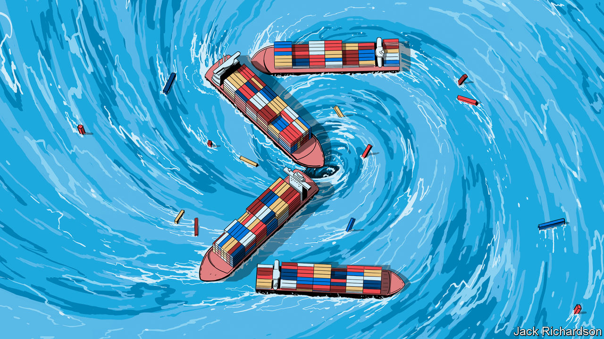

###### Zero-sum

# The destructive new logic that threatens globalisation 

##### America is leading a dangerous global slide towards subsidies, export controls and protectionism 

 

> Jan 12th 2023 

Since 1945 the  has run according to a system of rules and norms underwritten by America. This brought about unprecedented economic integration that boosted growth, lifted hundreds of millions of people out of poverty and helped the West prevail over Soviet Russia in the cold war. Today the system is in peril. Countries are racing to subsidise , lure manufacturing away from friend and foe alike and restrict the flow of goods and capital. Mutual benefit is out and national gain is in. An era of zero-sum thinking has begun. 

The old system was already under strain, as America’s interest in maintaining it waned after the global financial crisis of 2007-09. But President Joe Biden’s abandonment of free-market rules for an  has dealt it a fresh blow. America has unleashed , amounting to $465bn, for green energy, electric cars and semiconductors. These are laced with requirements that production should be local. Bureaucrats tasked with scrutinising inward investments to prevent undue foreign influence over the economy now themselves hold sway over sectors making up 60% of the stockmarket. And officials are banning the flow of ever more exports—notably of high-end chips and chipmaking equipment to China.

For many in Washington, muscular industrial policy holds a seductive appeal. It could help seal America’s technological ascendancy over China, which has long pursued self-sufficiency in vital areas using state intervention. As carbon pricing is politically unfeasible, it could foster decarbonisation. And it reflects a hope that government intervention might succeed where private enterprise failed, and reindustrialise America’s heartlands. 

The immediate consequence, however, has been to set off a dangerous spiral into protectionism worldwide. Build a chipmaking plant in India and the government will stump up half the cost; build one in South Korea and you can avail yourself of generous tax breaks. Should seven other market economies that have announced policies for “strategic” sectors since 2020 match America’s spending as a share of gdp, total outlays would reach $1.1trn. Last year nearly a third of the cross-border business deals that came to the attention of European officials received detailed scrutiny. Countries with the raw materials needed to make batteries are eyeing export controls. Indonesia has banned nickel exports; Argentina, Bolivia and Chile may soon collaborate, OPEC-style, on the output of their lithium mines.

Economic conflict with China looks increasingly inevitable. As China became more deeply integrated into the global economy at the turn of this century, many in the West predicted that it would become more democratic. The death of that hope—combined with the migration of a million manufacturing jobs to Chinese factories—caused America to fall out of love with globalisation. Today Mr Biden’s administration frets about the danger of depending on China for batteries the way Europe relied on Russia for gas before the invasion of Ukraine. Democrats and Republicans alike worry that the loss of America’s lead in advanced chipmaking to Taiwan will undermine its ability to develop artificial intelligence—on which, they predict, armies of the future will rely to plan strategy and guide missiles. 

Some simply want to stop China becoming too rich—as if impoverishing 1.4bn people were either moral or likely to ensure peace. Others, more wisely, focus on increasing America’s economic resilience and maintaining its military edge. A reindustrialisation of the heartland, they argue, will rekindle support for market capitalism. In the meantime, as the global hegemon, America can weather other countries’ complaints.

This thinking is misguided. If zero-sum policies were seen as a success, abandoning them would only become harder. In reality, even if they do remake American industry, their overall effect is more likely to cause harm by corroding global security, holding back growth and raising the cost of the green transition. 

One problem is their extra economic costs. estimates that replicating the cumulative investments of firms in the global tech-hardware, green-energy and battery industries would cost $3.1trn-4.6trn (3.2-4.8% of global gdp). Reindustrialisation will raise prices, hurting the poor most. Duplicating green supply chains will make it costlier for America and the world to wean themselves off carbon. History  that vast amounts of public money could go to waste.

Another problem is the fury of friends and potential allies. America’s genius after the second world war was to realise that its interests lay in supporting openness in global commerce. As a result it pursued globalisation despite, by 1960, making up nearly 40% of global dollar gdp. 

Today its share of output has fallen to 25% and America needs friends more than ever. Its ban on exports to China’s chipmakers will work only if the Dutch firm ASML and Japan’s Tokyo Electron also refuse to supply them with equipment. Battery supply chains will likewise be more secure if the democratic world operates as one bloc. Yet America’s protectionism is irking allies in Europe and Asia. 

Integration and differentiation 

America must also woo emerging powers. By 2050 India and Indonesia will be the world’s third- and fourth-largest economies, projects Goldman Sachs, a bank. Both are democracies but not close friends of America. By 2075 Nigeria and Pakistan will have gained economic clout, too. If America demands that other countries freeze out China without offering sufficient access to its own markets then it will be spurned by rising powers. 

A final worry is that the more economic conflict proliferates, the harder it becomes to solve problems that demand global collaboration. Despite racing to secure green technology, countries are squabbling over how to help the poor world decarbonise. It is proving hard to rescue countries in debt distress, such as Sri Lanka, because of obstruction by China, a big creditor. If countries cannot co-operate to tackle some problems, these will become impossible to fix and the world will suffer accordingly.

Nobody expects America to go back to the 1990s. It is right to seek to preserve its military pre-eminence and to avoid a dangerous dependence on China for crucial economic inputs. Yet this makes other forms of global integration all the more essential. It should seek the deepest co-operation between countries that is possible, given their respective values. Today this probably requires a number of overlapping forums and ad hoc deals. America should, for instance, join the Comprehensive and Progressive Agreement for Trans-Pacific Partnership, an Asian trade pact based on an earlier deal it helped write but then abandoned.

Saving globalisation may seem impossible, given the protectionist turn in American politics. But Congress’s aid to Ukraine shows that voters are not insular. Surveys suggest the popularity of free trade is recovering. There are signs that the Biden administration is responding to allies’ concerns about its subsidies.

Yet rescuing the global order will require bolder American leadership that once again rejects the false promise of zero-sum thinking. There is still time for that to happen before the system collapses completely, damaging countless livelihoods and imperilling the causes of liberal democracy and market capitalism. The task is enormous and urgent; it could hardly be more important. The clock is ticking. ■


