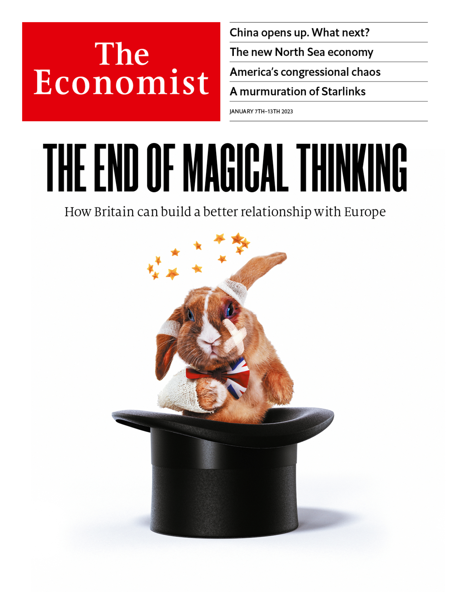

###### On Italy, James Callaghan, mental health, education in Sierra Leone, inflation, cricket, The Economist’s cover price

# Letters to the editor 

##### A selection of correspondence 

 

> Jan 12th 2023 


Opportunities for Italy

Your special report on Italy () gave an accurate picture of the problems the country faces, particularly the “missed opportunity” for reform on joining the euro and that the debt problem is fundamentally a GDP growth problem. Many of the ambitious reforms you advocated are part of the national recovery and resilience plan (PNRR) that was initiated by the administration of Mario Draghi.

But the overall picture you painted may be a touch pessimistic. Taking a step back, Italy has been a net loser in the wave of globalisation that was triggered in the early 1990s. As globalisation goes into reverse, Italy could benefit. The country has produced few truly multinational corporations. Whereas Germany and France supported their global industrial champions, Italy’s protectionist instincts were propping up lost causes, such as Alitalia, an airline, and Monte dei Paschi, a bank. An analysis of the degree of internationalisation of the “blue chip” companies listed on the Milan stock exchange does not compare favourably with the French and German equivalents. The limited number of global champions and low foreign investment into Italy are a significant driver of relatively poor levels of research and development, salaries and economic growth.

However, the macro picture is turning to Italy’s advantage and may provide a tail wind in the next decade. The likelihood of creating global champions is low. But the country can compete credibly in attracting foreign investment from the wave of reshoring we are seeing in the euro zone. Inflationary pressures compare favourably with other euro-zone economies given that Italy is far from full employment, particularly among young graduates. And the PNRR is catalysing a step-change in the level and diversity of venture capital and startup activity linked to centres of research excellence. Thus far, foreign investors seem to be responding.

Davide Taliente

Former adviser to the Draghi administration


In the introductory article of your special report we read that the Italian public administration “remains too large”. Quite the opposite. In Italy there are some 3,200,000 employees in the public sector, compared with around 5,750,000 in Britain and 5,600,000 in France. The population of both countries is less than 12% larger. The production of the Italian public sector is quite poor, for lack of personnel; the productivity is arguably quite high.

Guido Ortona

Università del Piemonte Orientale


 


James Callaghan’s religion

Bagehot was mistaken when he claimed that Sir Keir Starmer would be the first avowedly atheist prime minister of Britain since Jim Callaghan (). My father, Jim Callaghan, was brought up as a practising Baptist and as a young man was a Sunday school teacher. As a young man embracing socialism he had difficulties reconciling his new beliefs with the teachings of his church, but he was persuaded to stay in his Baptist chapel. He explains in his autobiography that from then on the Labour Party had the first charge on his energies. He went on to write “I never forget the immense debt I owe to a Christian upbringing, nor have I ever escaped its influence.” Incidentally, the title of his autobiography is “Time and Chance”, a quote from Ecclesiastes 9: 11.

Michael Callaghan


 


Mental-health problems

Regarding forced treatment for the mentally ill in America, the Donaldson standard, which flows from the Supreme Court’s decision in , has been applied in almost all the states since the ruling in 1975. Broadening this legal test for involuntary care beyond whether a person is a danger to self or others might make it easier to provide short-term treatment for the acute phase of chronic mental illness, but it does not solve the problem of a lack of services for the homeless mentally ill (“”, December 24th). 

The United States might have followed the example of Italy, which, after the abrupt closure of its often ghastly hospitals in 1978, has created 30,000 places in open, community-based residential facilities with between ten and 20 beds. The cost per bed is about the same as the estimated cost of sanitation alone generated by a person sleeping in the open in a large American city. With the right combination of supported accommodation and persistent care, the long-term involuntary treatment of people with chronic forms of mental illness is rarely necessary.

Olav Nielssen

Professor of psychiatry

Macquarie University


 


Linking results to pay

“” (December 10th) drew well-deserved attention to efforts of the government in Sierra Leone to increase public spending on primary-school students. But this fourfold rise in spending over four years is hardly a bet on schools. Even with the overdue increase, it will take years to overcome a legacy of low spending to improve education in Sierra Leone.

The bulk of your article pins its hopes on a fashionable aid project that will make more resources available if certain results are achieved. The approach assumes that low education quality is not down to lack of funding but, rather, the result of government (agent) moral hazard. Should  not turn the argument on its head? Should aid projects not make the salary payments of development-agency staff (principal) conditional on the success of the projects they designed? 

Manos Antoninis

Director

Global Education Monitoring Report


Inflation during crises

Jack Goldstone did consider, in a paper from 1986, why the state broke down on a large scale from 1550 to 1650 (“”, December 24th). But the study of what has become known as the General Crisis of the 17th century originated with an article published by Eric Hobsbawm in 1954. Hobsbawm attributed the crisis to the transition from feudalism to capitalism. Although his main focus was on the changing nature of trade, he did observe that upward “secular price-movements tally quite well with the periods of crisis”. Marxist in his historiography, Hobsbawm deftly translates the social effects resulting from this economic upheaval.

Jason Albert


 


Bowled out

It is a pity that your article on cricket in America (”, December 24th) didn’t mention the Hollywood Cricket Club, founded in 1932 by the actors C. Aubrey Smith and Boris Karloff. Its foundation was given impetus by an international match with Vic Richardson’s Australian touring team, which included Donald Bradman. 

Smith made 24 runs against the Australians, which is a bit more than some of the English batsmen made against Australia in the most recent Ashes contest.

Noel Turnbull


Inflationary pressures

I see that the newsstand cover price of a printed edition of  in Britain has increased from £6.99 to £7.99 over the new year, a rise of 14.3%. This is clearly inappropriate at a time of fiscal and monetary prudence. A price rise of this measure will fuel inflation further as readers seek higher wages to compensate and other publications make similar price increases. We must all make sacrifices as, after all, we are all in it together (or perhaps not).

 


As such the Independent Price Review Body here (that’s me and the missus) has decided to make an extremely generous offer of an acceptable 4% increase, over three years, in the price of . However, we expect this rise to be accompanied by increased productivity and an end to outdated working practices at your newspaper. Your correspondents will have to cover at least two continents and double the number of words they write. Furthermore the editorial staff will have to display more rigorous analysis of current events so that we do not have to read such nonsense as “The beginning of the end of Putin” () and predictions of oil at $5 a barrel (“Drowning in oil”, ). 

Many of these changes could be accomplished by publishing more letters from readers.

Stephen Lacey


