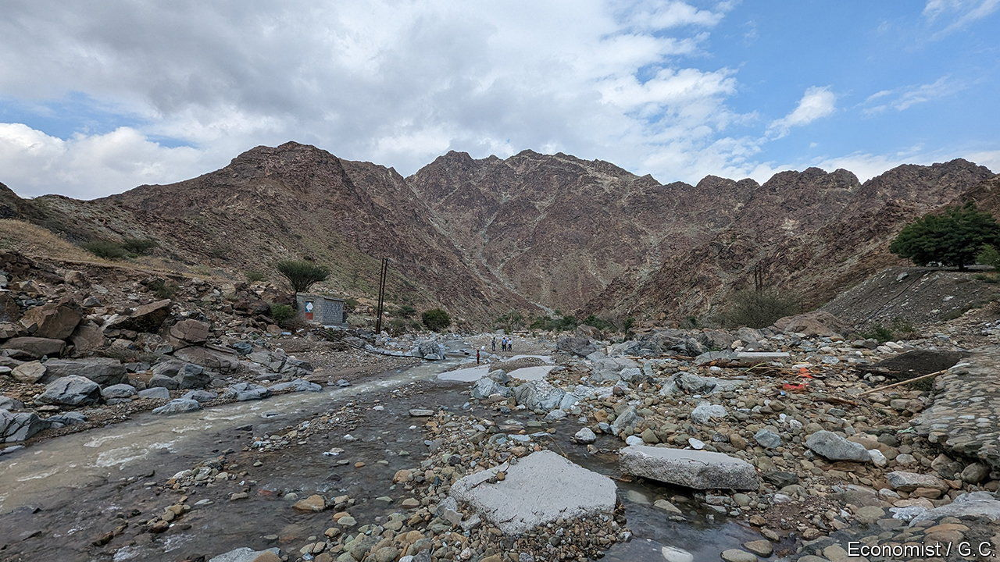
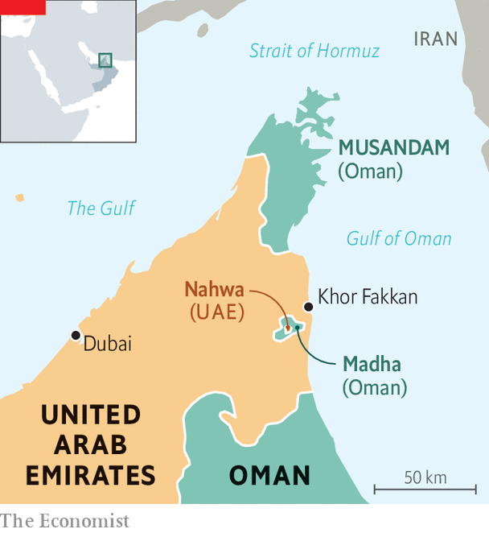

###### Oil and water

# A century-old choice created one of the Gulf’s oddest geopolitical features 

##### The Gulf villages of Madha and Nahwa are a rare example of a double enclave 

 

> Jan 12th 2023 

THE BUSIEST petrol station in the United Arab Emirates (UAE), one local jokes, is not in the UAE. Head south from Khor Fakkan, a town on the country’s east coast, and a right turn takes you across a near-invisible border (see map). There are no police posts or customs checks, only a small sign welcoming you to Oman—and queues at the filling station, where a litre of petrol goes for 62 cents. Across the street, and across the border, it costs 18% more.

 


The villages of Nahwa and Madha are a geopolitical oddity: an enclave of the UAE within an enclave of Oman within the UAE. On a map they look a bit like a fried egg, with Nahwa as the yolk. Only a handful of these double enclaves exist in the world. There is a complicated one on the border between Belgium and the Netherlands. Bangladesh and India had them until 2015.

The story begins a century ago, when this corner of the Arabian peninsula was known as the Trucial States, a collection of sheikhdoms administered by Britain. Four clans were vying for control of Musandam, a rocky headland that juts into the Strait of Hormuz. In the 1930s—or perhaps the 1940s, no one is quite sure—they sent emissaries to secure pledges of allegiance from nearby villagers. Those in Nahwa sided with the Qassemis, a powerful clan on the west coast.

Their neighbours in Madha, who were, then, well-off, chose differently. Oil had yet to be ; water was a more valuable commodity. The Madhawis had plenty of it, and other clans had fought over it. They thought the sultan of Oman would protect their well.

History has a sense of irony. Siding with Oman was logical back then. It had been an empire, while the Qassemis, jokes an old-timer in Madha, had a reputation as pirates. But the Qassemis went on to join the UAE; today their descendants rule two of its seven emirates. Buoyed by the world’s eighth-largest oil reserves, Emiratis now enjoy the second-highest GDP per person in the Middle East. Oman is much poorer.

The fortunes of the two enclaves have diverged. Villagers in Nahwa moved in the 1990s to a new town with a clinic and a school. There are farms, date-palm groves and a hanging garden. Madha feels like it has not changed in decades.

There is idle talk of turning it into a tourist attraction: the enclave boasts spectacular hiking trails. When your correspondent visited, the day after a heavy winter rain, the roads were full of cars from elsewhere in the UAE, families and friends come to picnic in newly filled streams. Almost a century later, water is still the valley’s main draw—although today, no one is fighting over it.

