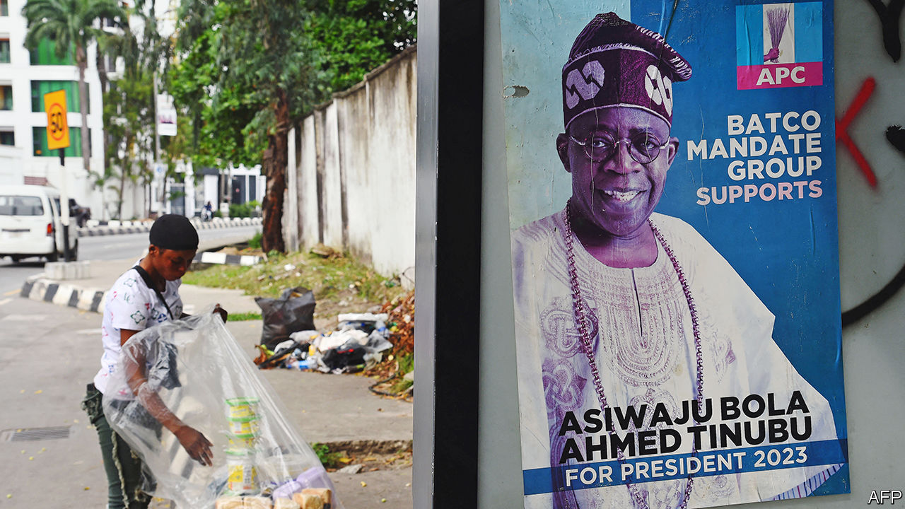
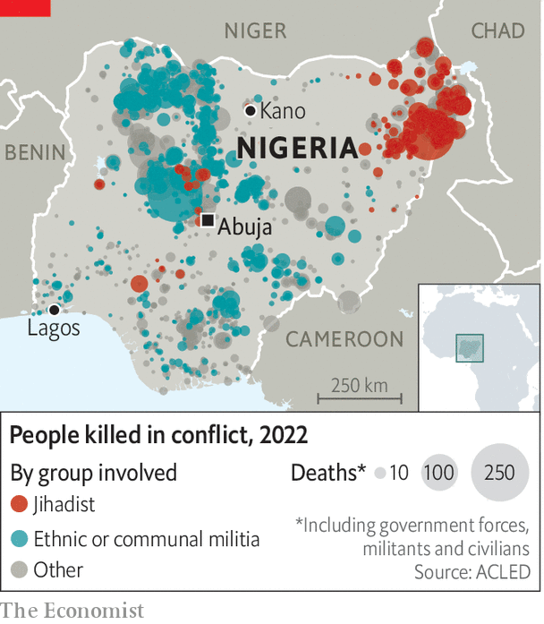

###### Baba go-slow to go-go

# After eight dismal years, Nigeria prepares to replace President Buhari 

##### His failure to bring peace or prosperity offers lessons for his successor 

 

> Jan 9th 2023 

“Buhari has given us very big (trouble),” says Usama Sani, a student in Kano, the biggest city in northern Nigeria. “There is  and unemployment,” he complains, before shouting: “We are going to kick Buhari aside!” President Muhammadu Buhari used to be popular in Kano; he won landslide support there in two presidential elections. Now, says another student, Umar Garba Umar, “we are so hungry for change.” Even members of Mr Buhari’s own All Progressives Congress (APC) are down on the outgoing president. Kashim Shettima, the APC’s vice-presidential candidate, concedes that Mr Buhari has done only “modestly well”.

When Mr Buhari was first elected, in 2015, many hoped Nigeria was about to turn a corner. This newspaper . Yet he has floundered on almost every measure. Between 2015 and 2020 the average income per person (adjusted for purchasing power) slid from $5,400 to $4,900 a year. The share of Nigerians living on less than $1.90 a day, which had fallen from about 43% to 37% in the previous five years, increased to almost 40% in 2019, before covid-19 hit. 

 


Violence has spread. Last year jihadists, bandits and separatists hit at least 550 of the country’s 774 local government areas (see map). More than 3,000 people were kidnapped last year, an almost 30-fold increase on 2016. Many were children. And a wave of attacks on electoral offices could lead to a delay of the general election, scheduled for February 25th.

Not all of this was Mr Buhari’s fault. The price of oil, Nigeria’s only big export, plunged just as he took office, kneecapping the budget. The state he took charge of was weak and corrupt. The taxes it raised (not counting oil royalties) were a paltry 5% of gDP. Covid buffeted Nigeria during his second term, and the war in Ukraine added to food-price inflation. 

Even so, Mr Buhari has failed to impress. He is indecisive: he took 166 days to swear in his first cabinet. He is reluctant to delegate, but often unavailable to make decisions himself because his health is poor. He has spent more than 200 days in Britain, primarily for medical treatment, leaving his government paralysed. 

His administration has failed to co-ordinate its decisions, or to execute them competently. To get things done, a Nigerian president has “to be a coach and a referee at the same time”, says Amaka Anku of Eurasia Group, a consultancy. Failing to co-ordinate, manage and strike deals is Mr Buhari’s biggest failing, she says.

Though perhaps this was a mercy: many of his economic decisions have made things worse. A former general (and military ruler in the 1980s), he likes to give orders. But markets tend not to obey them. After oil prices plunged in 2014-15 he should have let the currency weaken. Instead he tried to prop it up by banning many imports, from toothpicks to sardines. Investors fled; factories closed. In 2019 he closed Nigeria’s land borders to imported goods, hoping to stimulate local production. Instead, he spurred inflation. Those bits of the economy that have flourished—information technology, music and film-making, all relying on Nigerian talent—have done so mainly by staying away from the state. 

Mr Buhari has not provided the unifying leadership Nigeria needs to ease the (sometimes violent) rifts between its many ethnic groups and faiths. He rarely speaks in public, creating a vacuum that more extreme voices fill. Separatist movements have grown. Clashes between farmers and herders have become more deadly. 

At times Mr Buhari has stoked division. After winning his first term in 2015, he said that places where he won only 5% of the vote could not expect the same treatment as those that gave him 97%. In 2021 he reminded separatists in the south-east of Nigeria’s civil war in the late 1960s, in which perhaps 1m people died. If they kept on “misbehaving” they would be dealt with in “the language they understand”, he said.

 


His government appears reluctant to acknowledge mistakes. It insists it has improved security. In reality, the main jihadist group, Boko Haram, was suffering big reverses when he took over, which continued for a while. But then other groups started causing mayhem across far more of the country. Last year about 10,000 people were killed by jihadists, kidnappers, bandits or the army (see chart). This is comparable to the worst years of the Boko Haram insurgency in 2014-15. 

In December Reuters, a news agency, alleged that the Nigerian army ran a forced-abortion programme in the north-east, ending the pregnancies of at least 10,000 women who were thought to have been made pregnant by jihadists, often in rapes. Reuters suggested the motive was a baseless belief that the children of insurgents would inevitably become insurgents too, so it was better to destroy them before they were born. The army accused Reuters of “demonic journalism”.

Governments that minimise or deny problems tend not to solve them. Incompetent officials are seldom held to account, laments Idayat Hassan of the Centre for Democracy and Development, a think-tank in Abuja. In eight years, Mr Buhari has sacked just three ministers. “As long as you are seen as personally loyal to him, it doesn’t matter how poor your performance is,” says Cheta Nwanze of SBM Intelligence, a consultancy in Lagos. 

His administration can point to some achievements. It has worked with the legislature to pass much-needed electoral reforms and an overhaul of the oil-and-gas sector. And it has completed major rail and road projects that have been in the works for decades (though it has struggled to keep travellers using them safe). 

Pity the victor

Surveys suggest that Nigerians are keen to have younger, more energetic and more communicative leadership. Peter Obi, a third-party candidate who fits this description, tops many polls and was recently endorsed by Olusegun Obasanjo, an influential former president. 

Many pundits still expect the eventual victor to be Bola Tinubu, the APC’s candidate. His campaign has deep pockets, and the ruling party holds many state-governor offices, making it easier to prod and pay people to vote for its candidate. Like Mr Buhari, Mr Tinubu is old (70) and dogged by rumours of infirmity. He has struggled to articulate a vision. His supporters note that he had a good record as the governor of Lagos between 1999 and 2007, increasing the state’s tax take nearly sixfold.

The stakes are high. “There is a lot of anger,” says Osita Chidoka, a former minister in the opposition People’s Democratic Party. “People are going to vote and are going to express that anger.” Maybe so, but Mr Tinubu has no official role in Mr Buhari’s government, so he may be able to distance himself from it in voters’ eyes while still enjoying the muscle of the ruling party. “Sadly” for the opposition, says Mr Chidoka, “Buhari is not on the ballot.” ■

