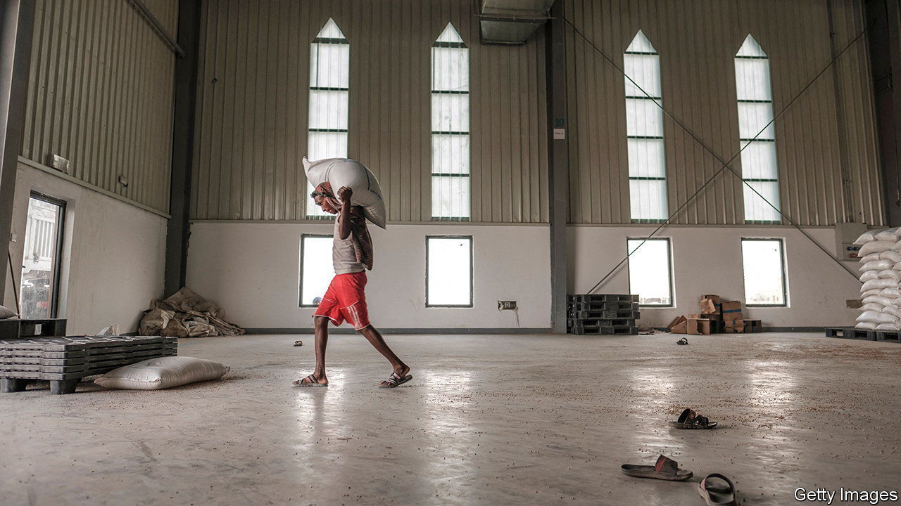
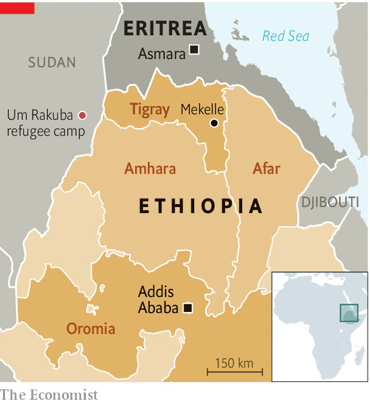

###### Uneasy peace

# Ethiopia’s war in Tigray has ended, but deep faultlines remain 

##### Lands remain occupied and Eritrean troops have not left 

 

> Jan 12th 2023 

Inside his makeshift hut, Fisseha Gebreselassie contemplates all he has lost. Days after Ethiopia’s  in November 2020, Ethiopian soldiers killed his 12-year-old son in front of him. Fearing for his life, he fled Tigray, the northern region at the centre of the fighting, for Sudan, leaving behind his wife and three remaining children, hoping they would be safe. But militiamen from the neighbouring Amhara region soon seized their home, forced them onto a truck and drove them across the river to central Tigray.

More than two years later, the family is still separated. A peace deal  has raised hopes that Fisseha and thousands like him might be able to go home. It has stopped both the fighting and a blockade of Tigray by federal forces that led to probably hundreds of thousands of deaths from bombs, bullets or war-induced famine and disease. By resetting relations between the two main belligerents—Ethiopia’s government and the Tigrayan People’s Liberation Front (TPLF)—the deal is also reshaping alliances inside Ethiopia and perhaps the wider region.

This rapprochement seemed fanciful just months ago. Leaders from the TPLF and the government smile while posing for photographs. Food and medicine are being delivered to starving civilians. Internet and phone networks to Tigray that have been cut for much of the war are being partially switched back on. For the first time in two years, Fisseha can call his wife.

But it is a fragile and uncertain peace. That much is evident in the Um Rakuba refugee camp in eastern Sudan, which shelters some 16,000 Tigrayans. Most are from the contested area known officially as Western Tigray. Refugees there say they cannot return home because their land is occupied by Amhara militias and settlers, or by soldiers from Eritrea, who fought alongside the Ethiopian government and are implicated in some of the war’s worst atrocities. “If there is peace, why are Eritreans still on our land?” asks Fisseha.

The peace agreement did not explicitly make any mention of Eritrea, which was part of Ethiopia until seceding in 1993. A subsequent “road map” drawn up by military commanders says the demobilisation of Tigray’s forces should take place alongside “the withdrawal of foreign and non-ENDF [federal Ethiopian] forces”, suggesting Eritrean and Amhara troops would leave.

That has not happened. Eritrean troops are still in Tigray, albeit in smaller numbers, where they have continued to loot towns and rape and murder civilians. Western Tigray, as well as disputed territory in the south of Tigray, remains occupied by forces from Amhara. The tplf is handing over its heavy weaponry, but it still has armed men. Tigrayan military sources in eastern Sudan, for instance, say they still have some 20,000 fighters at the border. 

At the heart of the problem lies Ethiopia’s troubled relationship with Eritrea, with which it fought a war between 1998 and 2000. In 2018 Abiy Ahmed, Ethiopia’s prime minister, struck a peace deal with Issaias Afwerki, Eritrea’s dictator, ending hostilities that had lasted nearly two decades. But that deal offered Issaias a chance to settle old scores with the TPLF, which was in charge when Ethiopia defeated his forces in the border war. He is thought to have egged Abiy on when he first sidelined the tplf and then sent his army into Tigray to crush it. Eritrean troops crossed into Tigray almost immediately. 

Since Issaias is not a signatory to the latest peace agreement, he may not feel bound by its terms. Even if he eventually pulls his troops out, he may still find ways to stir up trouble to weaken the tplf—and possibly Ethiopia, too, if he thinks it has gone soft on his main foe. Eritrea is supporting Tigrayans opposed to the TPLF, in some cases through forced recruitment. In Um Rakuba a group of young Tigrayan men said they were abducted and taken to Eritrea for compulsory military training. They later managed to escape to Sudan.

 


Also present in Sudan are smaller rebel groups that are not party to the peace deal. Some are linked to minor Ethiopian ethnic groups. But one, the Oromo Liberation Army (OLA), says it is fighting for the self-determination of Ethiopia’s largest ethnic group (see map). The ola is a major headache for Abiy, who is himself Oromo. He has recently stepped up military operations against it, including launching drone strikes that have killed large numbers of civilians. If the war in Oromia escalates further, the OLA might seek support from Issaias, an old ally: Eritrea hosted it and several other Ethiopian rebel groups before the peace deal in 2018.

How Abiy will respond should Eritrea sabotage the peace in Tigray is hard to predict. Under the deal the federal army is responsible for protecting Ethiopia’s sovereignty. By that logic, Abiy may eventually feel compelled to use force to kick the Eritrean troops out if they do not leave. Some Ethiopians speculate he might even join forces with the tplf to do this; such a dramatic “reconfiguration of alliances” is not implausible, suggests an Oromo opposition leader. But Abiy’s relationship with Issaias, though surely strained, may not break down yet. Allowing Eritrean troops to remain inside Ethiopia could be the price he decides to pay in order to avoid a showdown with Issaias. It may also keep the tplf on the back foot.■

