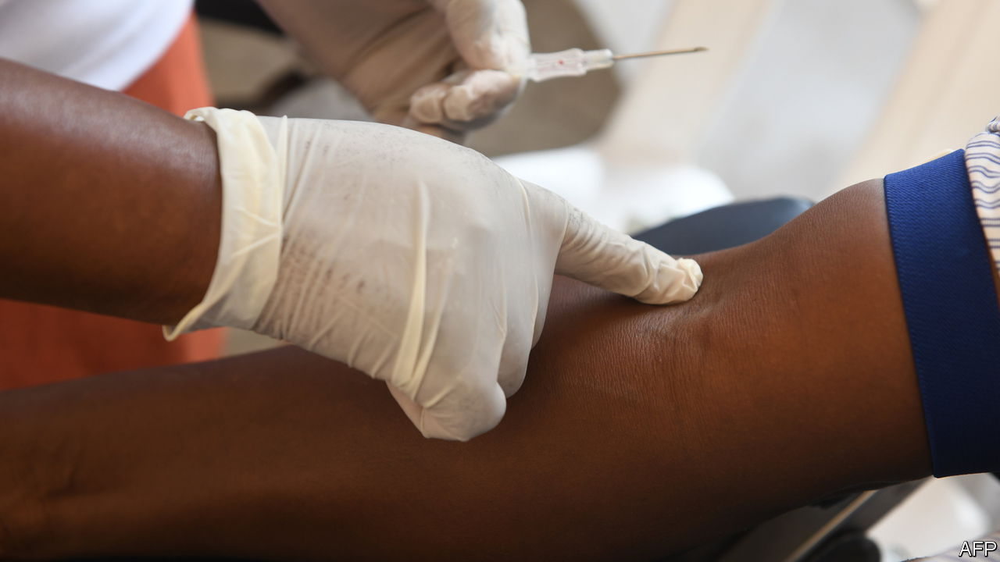

###### Blood money

# Kenya’s blood shortage and the kicking of an aid addiction 

##### When America cut its funding, Kenya’s blood service ran dry 

 

> Jan 12th 2023 

Tragedy led Mariam Mwinyiusi to open a vein. Last year her friend died when she could not get a blood transfusion in time. “I can prevent it from happening to another person,” she says at a blood bank in Nairobi, Kenya’s capital. 

Blood shortages have been a huge problem in Kenya——for years. The cost is untold suffering, mainly of . Researchers at Imperial College in London found that almost 52% of children in three east African countries admitted to hospital with severe anaemia died if they did not receive blood transfusions within eight hours. By contrast, 96% of those who got blood promptly survived. 

Other studies found that 26% of women who died in childbirth in sub-Saharan Africa could have been saved, had blood been available. The World Health Organisation estimates that 65,000 pregnant women in sub-Saharan Africa die every year from blood loss. Kenya’s government reckons that 35% of maternal deaths in 2020 were linked to blood shortages. 

There are several reasons why Kenya has so little bottled blood. Until recently the government spent little on blood drives to attract donors, who tended to show up only when a friend or relative needed a pint. Many worry that if they give to the bank, they could then be left dry, should a relative need a top-up. 

Yet before 2020 most of the funding for Kenya’s blood service came from America through the President’s Emergency Plan for AIDS Relief (PEPFAR). This focused mainly on ensuring that blood was tested to curb the spread of infections such as hiv, rather than on promoting donations. 

In 2019 America stopped writing cheques as part of a long-running programme to wean African countries off their dependence on aid for their blood services. It had successfully done so in countries including Ethiopia and Tanzania, where governments picked up the full tab for their blood banks between 2014 and 2016. But in Kenya the government’s share of spending on transfusion centres declined. 

Money problems were exacerbated when covid-19 struck in 2020. With schools closed, blood drives cancelled and people urged to avoid mixing, donations slumped. Between July 2019 and June 2020 Kenya’s transfusion centres collected just 164,000 units, against an estimated need of 470,000-1m units. Yet the crisis also brought an emergency infusion of cash from the World Bank. Of $50m in concessional money allocated to help Kenya battle covid, $10m was earmarked for improving its blood-transfusion infrastructure, including 15 new blood banks (taking the total to 45) and frequent blood drives. It is paying off. In the 12 months to June 2022, Kenya collected 348,000 units of blood.

However, Kenya’s reliance on concessional funding still leaves its blood banks in a precarious position: another sudden cut could once again leave Kenya anaemic, though with luck new blood donors such as Ms Mwinyiusi will become regular givers. “The good thing about donating blood,” she says, “is that we are helping reduce the number of people suffering from high to low.” ■

