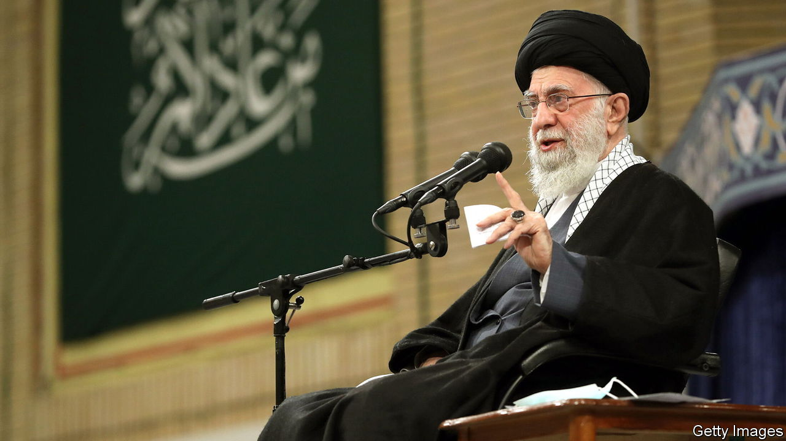

###### The rope tightens

# Protests have subsided in Iran, but clerics cannot yet proclaim victory 

##### The regime has quelled the protests but Iranians are still seething 

 

> Jan 12th 2023 

IRAN’S SUPREME LEADER, Ayatollah Ali Khamenei, may be sighing with relief. After the death in September of Mahsa Amini, a young woman arrested for not wearing a “proper” headscarf, the country saw daily protests, many led by women. Four months on, the cries of “Women, life, freedom” have all but petered out. University campuses, where demonstrations continued longest, resemble citadels, policed by security guards and cameras. Banners praising the Islamic Republic abound. And yet Iranians are still seething.

The regime has sentenced over a hundred protesters to death after cursory trials for the all-encompassing crime of “corruption on Earth”. Four have been hanged. It has locked up nearly 20,000 people, including top footballers, film stars, journalists and students. Digital communication is more restricted than ever. “Ever more people are disappointed and getting back to their lives,” says one Iranian journalist.

Mr Khamenei was slow to respond to the protests at first, but the 83-year-old cancer survivor now looks energised. He gives regular sermons to the faithful, addressing vast gatherings of women swathed in black chadors one day, and turbaned clerics the next. The rioters are “treasonous”, he thunders, dangling the threat of execution over anyone questioning his rule.

His opponents, by contrast, have mostly fallen quiet. The slogans formed of rhyming couplets are no longer heard. Their graffiti have been painted over. After previous crackdowns, Iranians vowed to stay put. Now many are planning to leave.

Mr Khamenei would, however, be wrong to conclude that he has won. Iranians are still defiant. “Be off or I’ll take off my trousers, too,” an elderly woman was recently heard shouting at police who demanded she put on a headscarf in a women-only carriage on Tehran’s metro. Segregation by sex is back in university canteens, so male and female students eat packed lunches together outside.

Nor have the protests died away entirely. The commemoration of a passenger jet accidentally shot down by the regime in 2020 reignited them for the first time in a month. On January 9th hundreds marched on a prison in Karaj, near Tehran, where two more protesters were to be hanged. “I will kill the killer of my brother,” they chanted as security forces fired on them. The executions have yet to take place.

Mr Khamenei may also worry about divisions among his allies. Some, including stalwarts with ties to the Islamic Revolutionary Guard Corps, the regime’s praetorian guard, have called for more compromise with protesters and a relaxation of the requirement for women to wear the veil. Former presidents have cautioned against responding to the unrest with an iron fist. On the streets, police look nervy. “I felt the fear in his eyes,” says one driver, who confronted a policeman. “It’s as if he was tormented by choosing between his duty to his leader and his country.”

Worse still for Mr Khamenei, his state is a mess. Organised strikes have subsided. But Iranians wanting to travel around the country struggle to find tickets for planes, trains and buses. The rial has lost 50% of its value against the dollar since August 2021. As inflation spirals, many are turning to barter. On smartphone apps you can get a formal shirt in exchange for some chicken. For now, the regime continues to subsidise petrol prices at the rial rate, meaning a litre costs the equivalent of five American cents. But given biting sanctions few expect that to last. Hikes in petrol prices have sparked unrest before. When the next one comes, Mr Khamenei may find it harder to tamp down his people’s anger. ■

