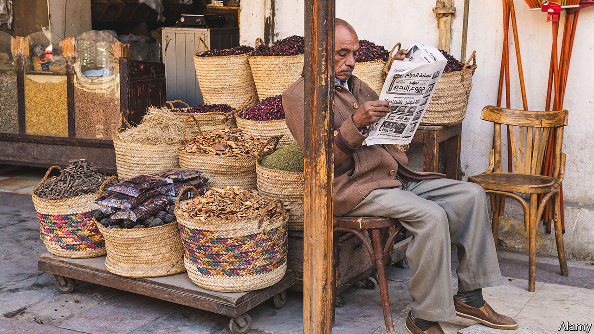

###### Hard to believe

# The Arab world’s rulers have turned journalists into courtiers 

##### Intimidation and financial pressure make real reporting hard 

 

> Oct 13th 2022 

In much of the world the closure of independent media triggers an uproar. Not in Algeria. Only a handful of reporters attended a press conference on January 7th called by the lawyers of Ihsane el-Kadi, a journalist, after he was arrested and the radio station and website he owned were closed. Goons confiscated his journalists’ mobile phones and computers. “People are too shocked and scared by the arrest to publish it,” says Tin Hinane, his daughter, a respected Algerian analyst. “Algeria’s media have all been co-opted by the state or forced to shut down.” 

This was not always so. For decades Arab rulers put up with an independent press of sorts. Some saw it as a safety-valve and a way to gauge public opinion. They kept a tight grip on journalists but did not dictate coverage. “We wrote about corrupt arms deals, local support for jihadists and the suppression of women’s rights,” recalls a nostalgic Saudi journalist of the 1990s. 

No longer. Eight of the 15 worst abusers of press freedom are in the Middle East, says Reporters Without Borders, an international watchdog, up from five 20 years ago. The despots who swept back  of 2011 have reduced journalists to mere mouthpieces. In 2019 most of Egypt’s main newspapers printed the same 42-line obituary for Muhammad al-Morsi, its deposed president. “An intelligence officer oversees your work, so you just have to adjust and write about the leader’s great projects—his bridges and roads,” laments a seasoned Egyptian journalist.

Increasingly for Arab regimes, the only permissible news is good news. Last summer the United Arab Emirates (UAE) closed a local newspaper, , and sacked its editor and dozens of journalists, after it reported on cheaper petrol prices in Oman. “If you are working in a government institution you have to toe the institution’s line,” explained an official. Regimes also buy up advertising agencies so that wayward newspapers can instantly be deprived of revenue. As funds dry up, governments or their friends snap up independent outlets—or let them fold. 

Some governments have brought in laws banning news deemed to disturb social stability. Journalists can be hounded with software such as Pegasus, an Israeli-made system which snoops on smartphones. Many are simply being locked up. Egypt is the world’s third-largest jailer of journalists. The  in 2018 of , a Saudi journalist, scared many into silence, reckons the Committee to Protect Journalists, an NGO in New York. 

Today three Gulf states—Qatar, Saudi Arabia and the uAE—dominate the pan-Arab market. Lebanon, whose capital, Beirut, was once the media hub of the Arab world, still hosts the leading Shia stations. But it is too broke to invest in big outlets.

Foreign broadcasters used to offer an alternative. When Egypt announced during the 1967 Arab-Israeli war that Israeli warplanes were falling from the sky like flies, the BBC reported that Israel’s forces were advancing on all fronts. But in September the BBC said it was ending 84 years of transmission by its Arabic radio service and cutting many of its staff. “The BBC is being neutered,” says Hugh Miles, author of a book on Arab media. “It’s become very frightened of tackling Gulf regimes.” 

Other Western-owned outlets, such as Bloomberg and Sky News, are arranging partnerships with Gulf regimes; these may limit their reporting. Regimes stymie foreign reporting by expelling journalists, restricting visas and blocking news sites. 

For over a century Arab journalists sought refuge in the West when things became too bad at home. After civil war swept Lebanon in the 1970s, London became the Arab world’s media capital. But there are signs that Arab governments may be hauling their London-based media home, the better to control them. , a newspaper, and Al Ghad, a satellite TV channel, both Emirati-financed, have recently retreated from London. In August Al-Araby Al-Jadeed, a Qatari-owned satellite channel, moved its headquarters from London to Doha, Qatar’s capital. “Hires in most of the Arab world would have to do what you tell them to,” says Abdulrahman ElShayyal, until recently the channel’s boss. “Editors behave like government ministers.” 

Under greater surveillance, standards slip. Demoralised editors copy and paste press releases as news. TV presenters are so nervous of departing from the official text messages received during broadcasts that they sometimes include “brought to you by Samsung” in their bulletins. The numbers in prison have declined a bit; in 2021 there were 72 detained journalists in the Arab world, just 25% of the global total, down from 32% in 2020. But that is only because their reporting has become less critical.

Circulation and audience figures are treated as state secrets, so it is unclear whether ratings have slumped as programmes become more anodyne. But it is a fair bet. “Arabs are deserting the mainstream media,” says Abdel Bari Atwan, a Palestinian journalist in London. In a survey of Arab youth in 2019 by Asda’a, a UAE-based pollster, 80% favoured social media for their news, up from 25% in 2015. 

Governments are delighted that their citizens seem keener on dramas and sport than current affairs. Saudi Arabia and Qatar have invested heavily in sports. The Saudi-owned MBC Group, the Arab world’s largest media provider, shows multiple TV soap operas simultaneously. Still, Arab rulers may yet regret silencing the fourth estate, predicts Abdelaziz Alkhamis, a Saudi journalist. “If you can’t alert leaders to the anger and problems in society, another Arab spring might surprise them again.” ■

