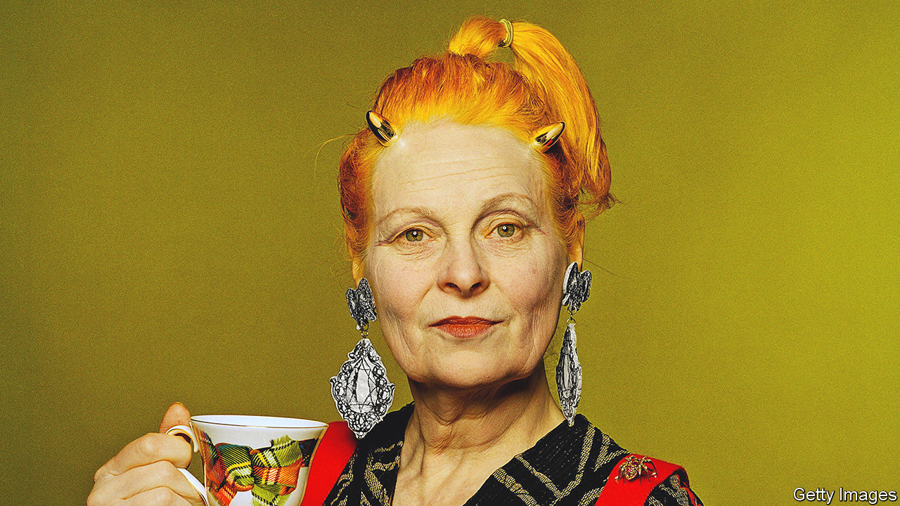

###### Breaking, making

# Vivienne Westwood sowed never-ending revolution all through the fashion world 

##### The designer and iconoclast died on December 29th, aged 81 

 

> Jan 11th 2023 

Number 430 King’s Road, where London’s Chelsea swerves towards Fulham, was a shop you entered in the 1970s only if you dared. The couple who ran it, Vivienne Westwood and her on-off partner Malcolm McLaren, liked it that way. Shocks to the system were their stock in trade. Any system, more or less. 

First the shop had catered to Teddy Boys, then to Rockers. In 1974 it became SEX, with frightening staff who might greet you with a middle finger or a parade of naked rumps. By 1977 it was Seditionaries, a punk shop. More than that, it was the centre of punk’s empire. McLaren had recruited punk’s premier band, the Sex Pistols, who paraded their nastiness on stage by swearing, spitting, reviling the status quo and breaking things. Vivienne, who had appeared in SEX in a see-through rubber negligee, was in charge of their look, and the shop stocked it: ripped shirts and bondage trousers, held together with chains and safety pins. She created the logo too, a brash red A for Anarchy in a crude red circle. It all shouted the glamour of nihilistic destruction. 

Back in her dingy Clapham flat, the mood was different. Here she produced much of the stock, labouring with her sewing machine, or dyeing stuff in the bath, to turn bulk-buy T-shirts and leather jackets into garments that were unique. When she designed the ripped shirts she cut them with a couturier’s care. The fabric had to have a dynamic drape, and the edge had to look good ragged. She was a craftswoman. What she created had to be the best.

Making and mending had been dinned in by her factory-worker parents in Derbyshire. She had watched her mother turn out clothes on a treadle machine, and learned how to darn. Sewing and jewellery-making, which she studied, might just about provide a living if she worked hard. Though she was crowned Queen of Punk by the press, her true slogan was never “I wanna be anarchy”. She was too keen on a fine cut and the feel of conservative fabric, like worsted or Harris Tweed. She was also too dedicated. Her favourite motto was one well-suited to her dry northern tones: “You get out what you put in.” 

 What she put into fashion as the business grew was a mind ablaze with ideas. Most of them were joyously contrarian. When punk’s brief energy fizzled out she turned to heroes and renegades instead, putting the models in her first show in 1981 into pirate boots, billowy trousers and bicorne hats. When fashion went lean and minimalist, at the start of the 1990s, she produced embroidered mini-crinolines, frills and flounces, impossibly high platform shoes (Naomi Campbell fell over in hers) and plastic corsets carrying yards of train. An artist friend, Gary Ness, encouraged her to discover 19th-century France, 17th-century Dutch painting, Russian ballet and Chinese art. She would seize on motifs she saw—such as the slashed-silk clothing of Renaissance soldiers—and boldly use them on viscose or denim. 

All through she played with gender, putting women in heavy-shouldered suits and men in lovely kilts and skirts. The public mockery didn’t faze her at all. Those suits made women look important, and there was nothing sexier than that. (Except, perhaps, her phallic key-rings and her T-shirts of Mickey and Minnie Mouse making out.) Some looks misfired, but she produced them so fast that it hardly mattered. She seemed to know better than the young themselves what they were really craving. 

Running a business was harder. Early on, she had two sons to bring up; she was sometimes broke and always too busy. But she was reluctant to scale up or send out the work, unless she could find craftspeople good enough. Friends kept her afloat while the enterprise was small. After that, as it grew into an international brand, her main helper and co-designer became her second husband Andreas Kronthaler. He was much younger, her best student when she taught fashion briefly at the University of Applied Arts in Vienna, but they thought exactly alike. With him in charge she could focus on what she really wanted to do: change the world. 

She was against pretty much everything. War of course, capitalism, nuclear power, inequality, poverty, austerity, global warming. The world as it was. Her plan to save it—for she had to rebuild as well as knock down—was to stop war, establish that land belonged to no one, give up cars and be altruistic. Simple.

In this battling scenario, fashion was a baddie. The high street was clearly to blame for piles of cheap clothes that people wore once, then threw away. Even she had several rails of clothes she no longer had a use for. Reduce, reuse, recycle was her mantra now. She made her plea on video, not forgetting to flaunt her breasts in a T-shirt emblazoned with the words “BUY LESS”. Looking great could at least get a message noticed. In 2015 she wore a sharply tailored jacket to drive a white tank up to David Cameron’s home in Oxfordshire to show what she thought of fracking. 

The true role of fashion, though, went deeper than that. Proper couture like hers was too costly to be consumerist. It was about the fit of clothes to the body, ideally so perfect that it enhanced the experience of life. It was also about fabric that lasted and became a treasure. In 2011, between her campaigning, she was looking for a type of gold ribbon that could be woven with formalised eagles, like a medieval sample she had seen in a book. She could use it as a motif on a sweater, perhaps in some loose-woven fabric in a neutral shade. The contrast would be stark, timeless beauty seen in a new way. Did all ideas come from the young? No! She overturned the world of fashion by cherishing the masters of the past. 

In old age she combined completely the roles of wise ancient and fist-waving revolutionary. Her make-up was impeccable, just crayoned with red or blue as she saw fit. Her hair had subsided from fiery to white and her clothes were elegant—until she hitched them up to show bare thighs above black lace socks. The harder she fought against the establishment, the closer it embraced her. In 1992 she became an OBE, in 2006 a dame. On both occasions she went to the Palace in her finest tailoring, and with no knickers on. ■

