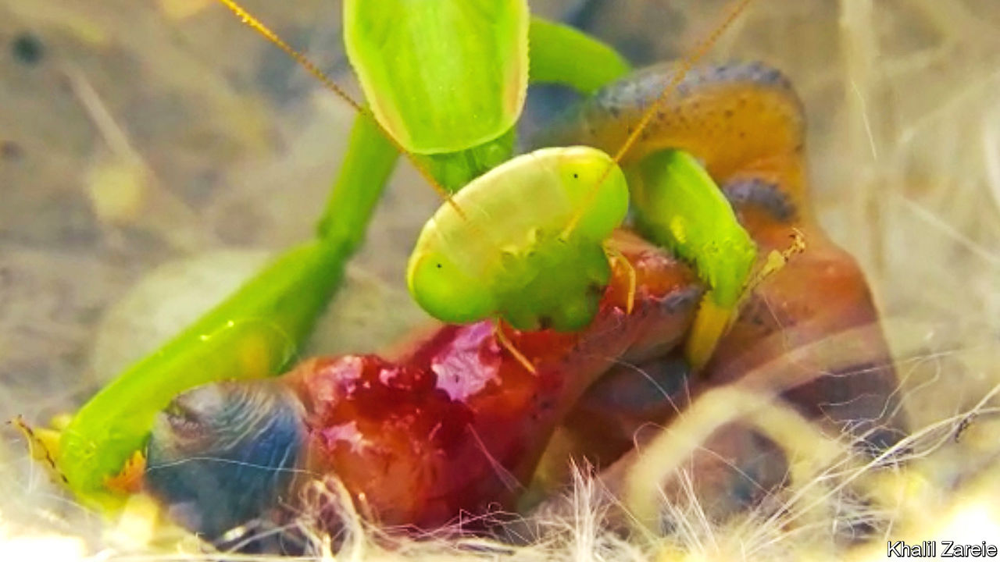

###### Bug bites bird

# A praying mantis attacks a nestling 

##### It is rare for insects to be predators of vertebrates 

 

> Jan 11th 2023 

Birds feast on bugs, not the other way around. But that role-reversal is what Mahmood Kolnegari of the Avaye Dornaye Khakestari Institute, in Iran, and Connor Panter of the University of Nottingham, in Britain, saw when they put a camera near the nest of a purple sunbird, in Kerman province, Iran. As they report in , their camera captured footage of a praying mantis killing a nestling and eating from it. Praying mantises are known for their aggression, but even so, the attack was a surprise to the researchers. They assumed it was a bizarre one off until, a month later, they caught a second mantis killing and feeding on a nestling crested lark. Searching the literature to see if such predation had been noted before, they found a single, century-old report documenting a similar finding. A more general internet search revealed a couple of non-scientific reports, from Taiwan and Brazil, of mantids eating nestlings. ■


