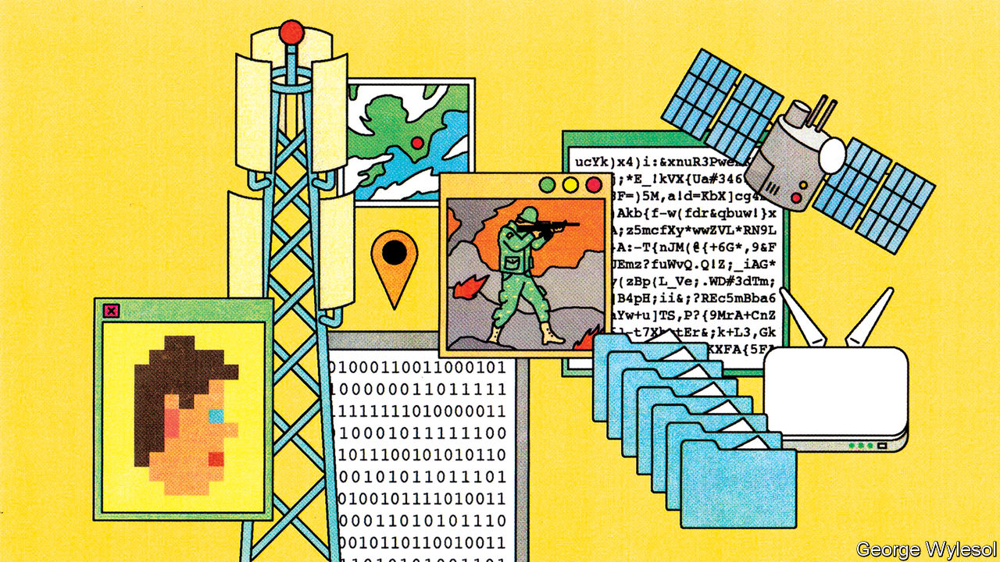

###### Authenticating images

# Proving a photo is fake is one thing. Proving it isn’t is another 

##### But, for the reporting of war crimes, it matters 

 

> Jan 9th 2023 

That truth is the first casualty of war is an old aphorism. One recent instance is the proliferation of images and videos of things that did not happen, in wars such as those currently going on in Ukraine and Syria. Some of these are outright fakes. Others are manipulated versions of honestly recorded material. Last year a doctored video appeared of Ukraine’s president, Volodymyr Zelensky, apparently telling Ukrainian soldiers to surrender.

The proliferation of such fakes has, though, led to a second, more subtle approach to lying with images. This is to use their ubiquity to cast doubt on the veracity of inconvenient pictures that are real. 

Shortly after Russia invaded Ukraine last year, for example, the Associated Press released a video of doctors failing to revive a young girl who had been hit in the shelling of Mariupol. The footage soon appeared on Russian television with the word “fake” stamped on it. Since it is hard to prove a negative (ie, that material has not been doctored), such evidence may thus be challenged, possibly even in court, and allegations of crimes based on that evidence may, as a result, not stick.

Ways to establish the authenticity of digital imagery would therefore be valuable. And one is now available. “Glass-to-glass” warning systems create special software “ecosystems” within which pictures and video can be taken, stored and transmitted in a way that alerts viewers to alterations, no matter when and where those changes are introduced in an image’s journey from lens to screen.

A plate of hash

One such system has been developed by eyeWitness to Atrocities, a charity based in London. The app at its core does two things. First, when a photo or video is taken by a phone fitted with that app, it records the time and location of the event, as reported by hard-to-deny electronic witnesses such as GPS satellites and nearby mobile-phone towers and Wi-Fi networks. This is known as the controlled capture of metadata, and is more secure than collecting such metadata from the phone itself, because a phone’s time and location settings can be changed.

Second, the app reads the image’s entire digital sequence (the zeros and ones which represent it) and uses a standard mathematical formula to calculate an alphanumeric value, known as a hash, unique to that picture. All this done, it then puts the metadata and the hash into a file called a proof bundle that is separate from the image and sends an encrypted copy of the image and its proof bundle to a special server. 

Wendy Betts, director of eyeWitness to Atrocities, describes this server as a digital evidence locker. If an image’s authenticity needs to be verified, it suffices to rescan its digital sequence, recalculate its hash, and then ask the repository whether or not it contains an identical hash. If even a single pixel of the image has been altered, the recalculated hash will not match the original. If it does match, then the image has not been retouched. 

As an additional service, roughly 80 lawyers, each working for the charity without pay for a few hours a week, review the incoming images. They package those which seem to record abuses into dossiers that are then sent to prosecuting authorities including Europol (a law-enforcement agency of the European Union), the International Criminal Court and Ukraine’s Office of the Prosecutor-General.

Andriy Kostin, the prosecutor-general himself, is a fan of the eyeWitness system—and not just because it provides the security of authenticity that courts require. He also likes the fact that it helps overcome a second obstacle to his efforts: witnesses’ fear of being found out.

Making connections

In areas of Ukraine that are occupied by Russia, this is a serious risk. Were soldiers manning a checkpoint, for example, to discover on someone’s phone video evidence collected by that person of war crimes, the consequences could be severe. To make this less likely to happen, the app’s icon does not reveal its purpose. Moreover, if it is then tapped by a probing official and an incorrect passcode entered, that opens the phone’s normal photo gallery. Maryna Slobodianiuk, lead investigator at Truth Hounds, a human-rights group in Kyiv, says of the evidence of attacks she has collected using eyeWitness: “Even if I will be captured…no one will reach it.”

The first version of eyeWitness’s system, available , was released in 2015, so most of the bugs have been dealt with. Uptake in Ukraine has soared over the past year. Ms Betts says that of the 40,000 submissions received in 2022 which her team considers relevant for investigations, more than 27,000 were sent from Ukraine.

Police officers and journalists are particularly eager users. So are analysts at the Ukrainian Healthcare Centre, a think-tank in Kyiv that employs the app to gather evidence of attacks on medical facilities. 

Nor is eyeWitness the only provider of glass-to-glass services. The Guardian Project, in Valhalla, New York, has released a smartphone app called . Like eyeWitness, ProofMode combines controlled-capture metadata and the image’s hash into a proof bundle. Instead of operating the receiving server itself, though, ProofMode uses repositories run by other firms, such as Google, which log them in the fashion of a notary. Viewers of an image taken with ProofMode can upload it to a Guardian Project website that recalculates its hash and checks the repositories for a match. If it fails to find one, the image is declared altered.

Soon, the Guardian Project will add a new feature, Synchrony. This will link an image’s location and time-of-capture to OpenStreetMap, an online cartography of the world, and also to a detailed geographical record of the world’s weather over the past few years (which one, has yet to be decided). That will make it easy to check for inconsistencies between the place and time someone claims a picture was taken, and the local landscape and the weather conditions on that day. The idea, says Nathan Freitas, the Guardian Project’s founder, is to “sync images to the real world as it was”. He hopes to link to other databases, as well—including those that record when and where street protests have happened.

A third operator, Truepic, of La Jolla, California, is taking a more commercial approach. Charities pay nothing to use its software, but companies that employ it to keep an eye on things like supply chains, progress at construction sites, compliance with loan terms, and the whereabouts and condition of expensive kit, must stump up.

Truepic provides two services. One scans smartphones for malware designed to facilitate the falsification of metadata. The other spots so-called rebroadcasting attacks, in which a doctored image is photographed to create a new picture, which thereby lacks traces of tampering in its code. Mounir Ibrahim, once a member of America’s diplomatic corps (he served, , in Damascus, a hotbed of photographic deception), and now head of public affairs at Truepic, is cagey about how this is done. But the trick, he notes, is to look for clues that all of an image’s pixels have recorded a uniformly flat surface. 

In 2021 Truepic joined forces with Adobe, ARM, the BBC, Intel and Microsoft to form the Coalition for Content Provenance and Authenticity (C2PA). This is trying to create a set of image-authentication technological standards for makers of hardware and software. The aim is to eliminate the need to fuss with special apps. Instead, the coalition wants metadata capture, hashing and the transmission of data to repositories to take place behind the scenes and without royalties.

If C2PA’s standards were widely adopted, even web browsers would be able to check an online repository of hashes and put a warning on images with no match. Eventually, hashes might be distributed automatically across blockchain ledgers. The Starling Lab, based at Stanford University, is running trials of such a system. 

Hurdles, however, remain. Jonathan Dotan, the Starling Lab’s founding director, points to one in particular. The technology could potentially allow authoritarian regimes to identify devices, and thus people, who have taken damning pictures. Researchers, he says, must first find a way to make such tracing impossible. Transparency is all very well, but even the good guys recognise that, sometimes, too much of it can be too much of a good thing. ■


