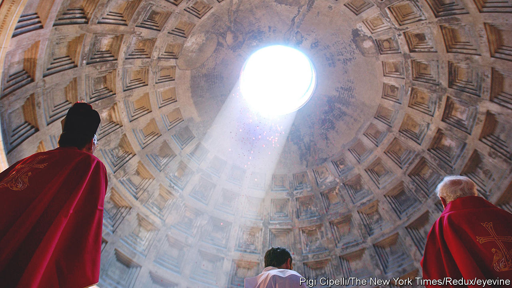

###### Ancient concrete

# Roman civil engineering has lessons for the modern world 

##### The concrete used was self-healing and anachronistically green 

 

> Jan 11th 2023 

The Romans were master builders. Many of their works, from the Pantheon (pictured above) and the Colosseum in Rome itself, to the Pont du Gard in southern Gaul and the equally impressive aqueduct of Segovia, in Spain, have withstood the ages. What damage has been done to such constructions is more often the result of stone robbery than structural failure.

Roman work of another sort has survived the centuries, too. “De Architectura” is a ten-book series by Marcus Vitruvius Pollio, an engineer and architect of the first century BC, who is believed by many scholars to have worked with Julius Caesar on some of his military campaigns. These volumes include various tips intended to ensure that buildings “don’t fall into ruins over a long passage of time”.

One reason for Roman engineers’ success was concrete. (The Pantheon’s roof is the largest unsupported concrete dome in the world.) Roman concrete is known to defy the centuries without losing much of its firmness. Indeed, it can even get stronger with age. How this happens is only now coming to light. 

Part of the explanation lies in the volcanic rocks of areas such as the Alban Hills, south-east of Rome, and Pozzuoli, near Naples. These provided crucial ingredients. As Vitruvius himself describes, the cement Romans used to bind the aggregates of concrete was a mixture of lime and volcanic ash. (The aggregates themselves were generally sand or crushed volcanic rock—which, in the case of the Pantheon, included pumice, to make the structure lighter.)

Several recent studies have shown that the ash not only contributed to the concrete’s strength and durability, but also enhanced cohesion between the aggregate particles after the mixture had been cured. This happened when water seeped in, dissolving some of the volcanic minerals and creating calcium aluminosilicate hydrates (C-A-S-H), the main binding material in the concrete. That also slowed the propagation of microscopic cracks. Moreover, some crack walls showed C-A-S-H infill—an indication that Roman concrete possessed a certain self-healing power.

In one of these studies, published in 2021, a team led by Marie Jackson of the University of Utah and Admir Masic of the Massachusetts Institute of Technology described the structure of the mortar (a fine form of concrete) of a brick wall in the tomb of Caecilia Metella, which stands beside the stretch of the Appian Way between Rome and the Alban Hills. In part because of its solid masonry (so solid that it was repurposed as the keep of a castle during the Middle Ages), this building is one of the best-preserved monuments decorating that antique Roman highway. 

The researchers studied how leucite, a potassium-rich volcanic mineral, dissolved in the water and reconfigured the chemical bonds between the cement and the aggregates, strengthening the interfaces between them, and making the whole structure more resilient.

This volcanic touch is, though, only part of the story. Lime, the other ingredient of Roman cement, also had a role in the post-curing strengthening of concrete. That, at least, is the conclusion of another paper by Dr Masic and a group of colleagues, which has just been published in . 

This time the researchers took samples from a city wall in Privernum, an archaeological site also to the south-east of Rome. These dated from the second century BC. They discovered that in this case it was mainly the lime that had caused cracks and fissures to be sealed, thus healing damage that might have gone on, if not nipped in the bud, to become serious.

The lime involved here was not the pure white powder described by Vitruvius. Rather, it was clumps a millimetre or so across that had failed to dissolve when the concrete was being prepared. Such clumps are often found in Roman concrete. Their role seems to have been as a reservoir of calcium carbonate for the processes of self-healing, permitting that material to be dissolved by seeping water admitted by tiny cracks and then re-precipitated in those cracks to seal them up.

Moreover, the distribution and the shape of the clumps suggest that the lime was added to the mix as quicklime, rather than, as is common today, slaked (hydrated) lime. This would mean that Roman concrete was made, at least partly, by hot mixing—for slaking quicklime with water releases enough heat to raise the temperature of a concrete mix above 80°C. Today, concrete is mostly mixed cold, for hot mixing has the disadvantage that the concrete can expand. On the other hand, the practice allows faster curing. Possibly that is why Roman engineers preferred it.

By Jove and all the gods

This approach may hold lessons for today’s builders. “Roman concrete”, says Didier Snoeck, a structural-design engineer at the Free University of Brussels, in Belgium, “shows that modern cement, of which the production emits huge amounts of CO, is not indispensable for strong and durable concrete.” “We can’t”, he says, “replace all Portland cement with volcanic material, due to the necessary volumes of concrete to build infrastructure, but we can do it partially. And we can also use fly ashes, blast furnace slags and limestone calcined clays instead.”

Studying Roman concrete could also help modern engineers develop recipes for more durable, self-healing concrete. Increasing concrete’s lifespan would mean less repair and renovation was needed, helping buildings last longer. Who knows? Some of them might even outlast the Pantheon and the Colosseum. ■


