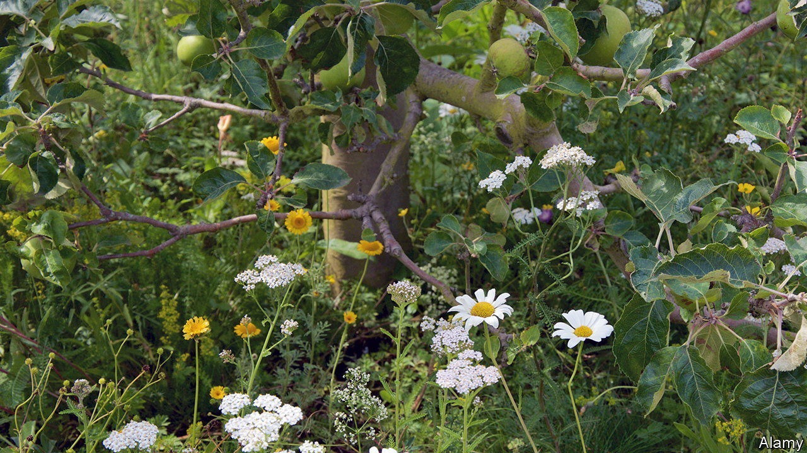

###### Horticulture

# Wasp larvae that eat aphids alive may save apple crops 

##### Insecticides are more effective. But you lose your organic certification 

 

> Jan 11th 2023 

Few insects strike greater fear into the hearts of orchard-owners than rosy apple aphids. These tiny bugs feed on the leaves of apple trees, draining them of nutrients. Their saliva, meanwhile, contains a toxin which causes those leaves to curl up and harden, providing an excellent place for them to shelter, including from insecticidal sprays. And the honeydew they excrete once they have extracted what nutrients they need from the sap they have ingested encourages the growth of a sooty mould that can further harm a tree. A bad rosy-apple-aphid infestation can reduce an orchard’s yield by 80%. 

In the battle against these aphids some propose harnessing the services of tiny wasps called  and . Like many of their kin, these insects are parasitoids, a trophic status halfway between being parasites and predators. Instead of killing and then eating their prey, parasitoid wasps eat and thus kill them—or, rather, their larvae do.

Females inject their eggs into their victims—in this case rosy apple aphids—once they have mated. The larvae that hatch from them go on to devour their hosts’ organs before pupating and emerging as adults. If the wasps’ services could be harnessed, it might thus be possible to reduce, or even dispense with, chemical insecticides. That would save money. And it would also make life easier for orchard-owners who seek the premium-price-generating imprimatur “organic” for their produce, a label which is incompatible with such chemicals.

Mobilising parasitoid wasps for pest control has a long history, beginning in the 1920s with their employment in greenhouses against whitefly. Unfortunately, attempts to use and  to control rosy apple aphids have so far failed. But Louise Ferrais and Thierry Hance of the Catholic University of Louvain, in Belgium, think they know why. Previous efforts, they reckons, have been so focused on the dietary requirements of the carnivorous larvae that they have neglected those of the nectar-loving adults. As they describe in the , they propose to change that by planting banks of flowers beside the trees.

To test this idea, they ran an experiment in an organic apple orchard. They divided it into six plots, each of 700 square metres. Three, they planted with strips of a mixture of 30 wildflower species. The other three they left flowerless, as controls. As winter ended, and aphid season drew nigh, they attached to each of nine trees per plot a tube containing about 1,250 wasp pupae (a mixture of the two species) from which adults were about to emerge—and repeated that between ten and 20 days later, to bolster the population. Then they examined selected trees at ten-day intervals for colonies of aphids.

The presence of flowers, they found, was associated with a reduction in the number of aphids in a plot by a third, compared with the controls. Though that is not as impressive as the 80-90% drop which would follow a pesticide blitz, it is a proof of principle, and might be improved by better management of the wasps and more understanding of their ecological needs. And that would, indeed, be valuable to fruit growers who wish to retain the all-important “organic” label while having at least some crop left to harvest. ■


