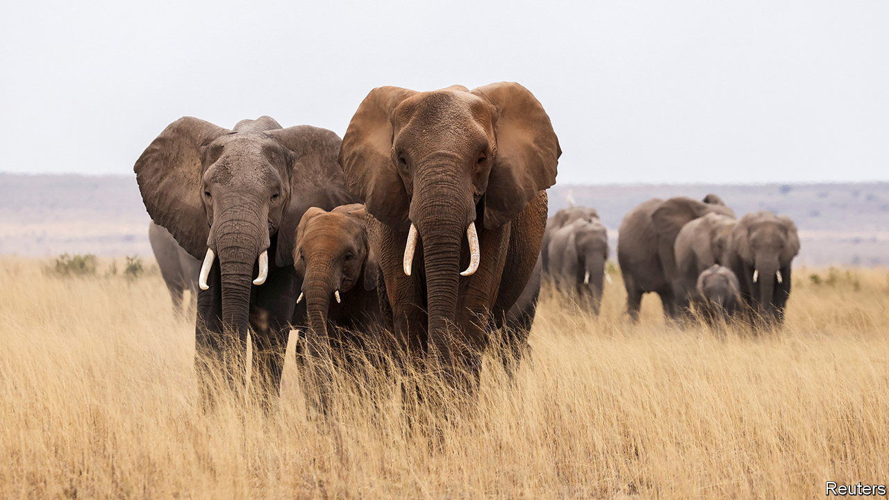

###### The elephant in the room

# What causes elephant poaching? 

##### Poor, badly governed people, mainly 

 

> Jan 11th 2023 

Every day, thousands of rangers patrol national parks and other protected areas in Africa. Their job is fraught with danger, both from hostile humans armed with automatic weapons and from the unappreciative and potentially aggressive wildlife, armed with tusks, teeth and claws, which they are helping to preserve. But their work is important, not least because the data they collect are crucial to conservation planning. 

That is particularly true of data on poaching, which remains, in both senses of the word, an elephantine problem. Since 2006 African elephant populations have declined by around 30%. In 2021, according to Monitoring the Illegal Killing of Elephants (MIKE), a conservation programme, around 40% of elephant deaths were a result of poaching. 

The severity of elephant poaching varies from place to place. The MIKE data show a welcome fall in rates throughout the 2010s, but according to research published in 2020 by Scott Schlossberg of Elephants Without Borders, a charity, this can be attributed entirely to a decline in eastern Africa. 

Elsewhere, there is great variation in the pressure on pachyderms. Some parks, like Garamba in the Democratic Republic of Congo (DRC), are badly hit—with more than 90% of the carcasses found by rangers being victims of poachers. In others, like Chobe, in Botswana, less than 10% of dead elephants discovered have been killed illegally. 

To untangle the factors influencing poaching, Timothy Kuiper of the University of Cape Town, Eleanor Milner-Gulland at Oxford, and a team of collaborators have analysed data collected for MIKE by rangers from 64 sites in 30 African countries over the course of 19 years. They correlated these with potentially relevant factors, both natural and human, and have published their findings in the . 

Natural variables such as habitat type, they discovered, make little difference. Human ones predominate. Unsurprisingly, but nevertheless pertinently, low household wealth, poor health, poor law enforcement and poor national governance all contributed to higher rates of poaching. So did the price of ivory. 

There was one unexpected result, though—the impact of armed conflict. For there did not seem to be much. What impact there was, was a consequence of a few special cases in DRC, the Central African Republic and Ethiopia, rather than a general rule about young men with guns behaving badly. 

One factor that was unquantifiable, and therefore untestable, according to Dr Kuiper, was local political will to preserve wildlife. But this study does nevertheless confirm observations made elsewhere, that the best form of conservation is a prosperous population.


