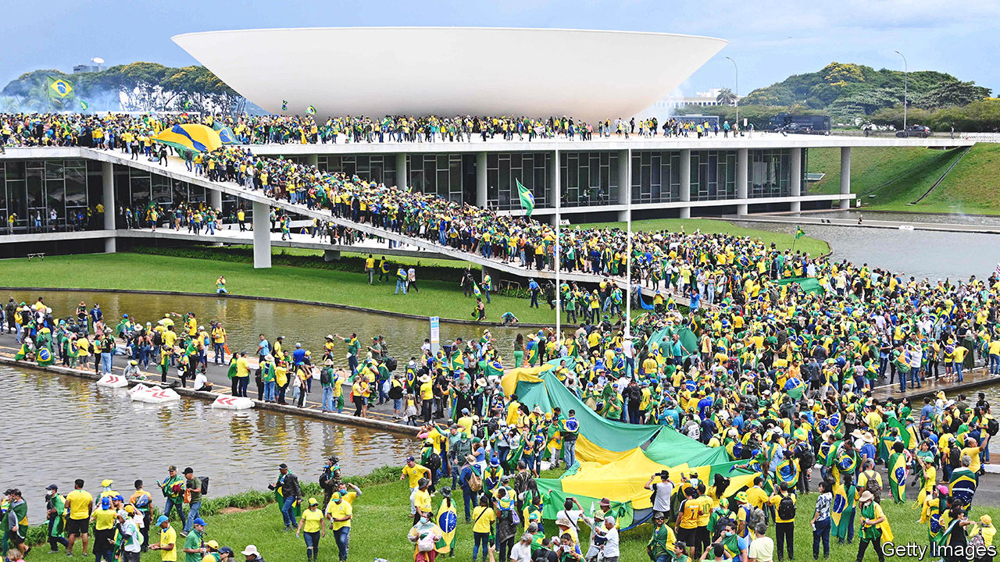

###### The storming of Congress

# A copycat insurrection in Brazil, and its troubling aftermath 

##### The new president will find it hard to restore calm 

 

> Jan 12th 2023 

The invasion of Brazil’s presidential palace, Congress and Supreme Court lasted for three hours on January 8th. The damage to Brazilian democracy will last much longer. 

Thousands of supporters of Jair Bolsonaro, the country’s former president, broke into government buildings and demanded that their hero, a right-wing populist who lost an election last year, be reinstated. The insurrection occurred a week after the inauguration of Luiz Inácio Lula da Silva, the leftist who won that election.

Many, if not most, of Mr Bolsonaro’s supporters believe, without evidence, that Lula cheated. Mr Bolsonaro has encouraged this lie. He refused to concede defeat. His party tried to get the result annulled. For the past two months his fans have camped outside military barracks, urging the armed forces to stage a coup. 

When that failed, they took matters into their own hands; seemingly with little objection from police in Brasília, the capital. Despite days of warnings that  were plotting something, a security plan was apparently cast aside by Brasília’s governor at the last minute. Few roads were blocked. No reinforcements were sent to the government buildings. 

The insurrection echoed, and was inspired by, the storming of the United States Capitol by supporters of Donald Trump on January 6th 2021. In the Brazilian Senate rioters climbed onto a stage and slid down it as if they were in a playground. In the Supreme Court they ripped a door from a justice’s quarters and hoisted it in the air like a trophy. Police eventually used tear-gas and pepper spray to disperse the rioters. Mr Bolsonaro, who has been in Florida since December, was slow to condemn the violence, tweeting that it “crossed a line” only after it was nearly over. On January 10th he posted a video to Facebook, a social-media site, which questioned the election result once more (the video was then deleted).

Lula declared a federal intervention in Brasília, which puts security in the district under the direct control of his government until January 31st. Hundreds of people were arrested and many criminal investigations have been opened. Investigators will try to work out how the protests were planned. They will also want to know why the police did so little to prevent them, intervening only when the ransacking was well under way. Carlos Fico at the Federal University of Rio de Janeiro thinks that part of the explanation is that “the vast majority” of police officers sympathise with Mr Bolsonaro, a former army captain. 

Mr Bolsonaro spent decades building a political base among cops and soldiers, fighting to increase their budgets and benefits. He excluded soldiers and military police from pension cuts in 2019, and pardoned police convicted of illegal killings. He also attempted to pass a law which would in effect have given the police immunity in such cases. By contrast Lula’s hand-picked successor, Dilma Rousseff, sparked fury among the armed forces by launching a commission in 2011 to investigate crimes committed during Brazil’s military dictatorship of 1964 to 1985, under which she was tortured.

Lula’s government is unlikely to change cops’ political preferences. But it can root out commanders and officers who are shown to have neglected their duty to protect, thus sending a message that cops must uphold the law impartially. 

A federal prosecutor has opened an investigation into what he referred to as “complete inaction” by police commanders in Brasília. Similarly, Alexandre de Moraes, a Supreme Court justice loathed by , suspended Ibaneis Rocha, the district’s governor, for 90 days, accusing him of “omission and connivance”. Mr Rocha had defended the right of  to what he called “uncensored political protest” and had ignored requests to increase security or block roads around the government buildings that were attacked. 

Brazilians are not merely divided; polarisation has warped one side’s view of reality. In an online poll conducted by Atlas Intelligence almost 40% of respondents said they believed Mr Bolsonaro had won the election. Although nearly 76% disapproved of the invasion of government buildings, 18% approved. And a terrifying 37% said they would support a military coup to overturn Lula’s electoral victory. On the day of Lula’s inauguration, many protesters camped outside army barracks worried that Brazil would soon become a communist dictatorship. “I don’t want to see my son eating from rubbish bins,” said Geisi Avila, clutching her two-year-old.

Lula is unlikely to win over Brazilians who believe such things. But he can try to restore calm. Chris Garman of Eurasia Group, a consultancy, thinks Lula will have to “walk a fine line” between toughness and restraint. He needs to show that insurrectionists and police who support them will be punished, but avoid playing into the narrative that  (and Christians and conservatives) are victims of persecution. On the night of the riots he called the rioters “Nazis” and “fascists”, which was unwise and untrue. The next day he adopted more statesmanlike language.

A swell of political goodwill in the wake of the crisis may help Lula build the support he needs in Congress for a series of tricky economic reforms, such as a shake-up of taxes to boost growth. But whatever popularity boost he receives will probably be temporary. And having been reminded of Brazil’s angry divisions and the lasting strength of, the president may become more risk-averse. He has already extended wasteful fuel subsidies that were put in place by his predecessor, against his finance minister’s advice.

Investors seem to be giving Lula the benefit of the doubt. The Brazilian real gained against the dollar just after the election, and dipped only slightly after the chaos in Brasília. But it would be a mistake for the government to retreat from reforms for fear of future protests. An economic crisis would only make unrest worse. ■

