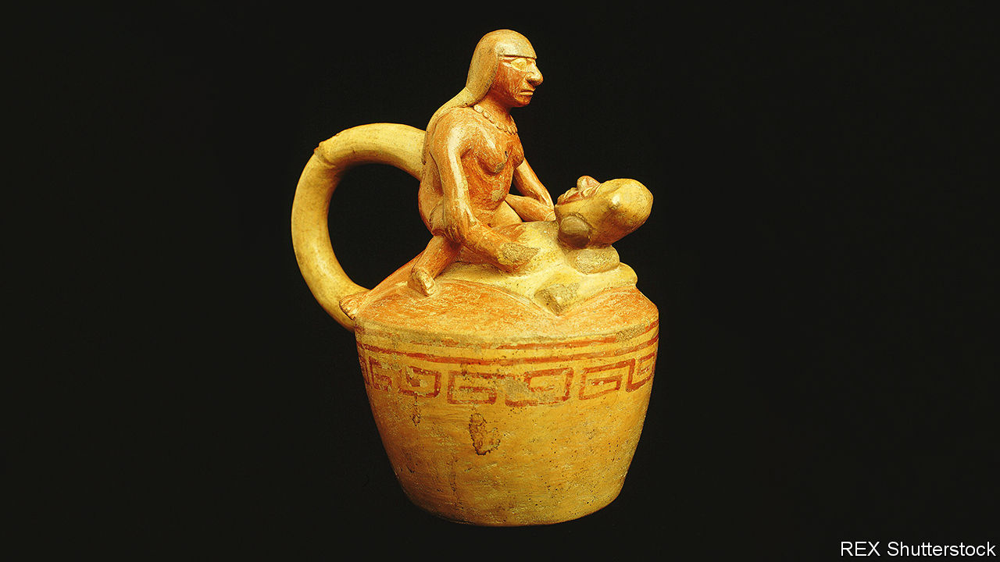

###### Sex pots

# Erotic statues in Peru are challenging taboos 

##### Ancient art has started a national conversation about sex 

 

> Jan 12th 2023 

Peru is socially , especially when it comes to sex. It was, after all, the former seat of the Spanish empire in South America, which punished sodomy, masturbation and sex outside marriage with lashings and death. Today, gay couples cannot marry and women are allowed abortions only if their lives are at risk. Prissy parents have a veto over  in schools. Politicians embrace the status quo. Antauro Humala, a former convict who is now aspiring to run for president, uses a slur when referring to gay people.

For a reminder that Peru has not always been so uptight, look no further than the Moche valley in northern Peru. For the past decade, the foggy coastal region has been a sleepy hub for tourists visiting the Temples of the Sun and the Moon, vast adobe monuments used as ceremonial sites by the Moche people, a pre-Colombian civilisation that lived on the coast between the second and eighth centuries. Over the past year, however, the main tourist attraction is at a roadside park with a carnivalesque atmosphere. There, as  blasts through a loudspeaker, tourists line up to take a selfie with a giant fibreglass statue of a Moche man gripping his enormous phallus, his other hand raised in a fist.

The statue, unveiled at the start of 2022, pays homage to Moche “sex pots”. These are ceramic vessels that depict engorged genitalia and a variety of sex acts, from fellatio and anal sex to otherwordly copulation with skeletons, deities and animals. 

Several hundred Moche sex pots survive today, offering a glimpse of non-Western attitudes to sex that once led Alfred Kinsey, a sexologist, to collect them. Though scholarly speculation about what the pots meant has varied over time, today they are thought to have symbolised the sacred flow of life-giving liquids for a society that flourished by irrigating desert valleys and harvesting fish from the sea, long before the rise of the Inca empire.

Branded “the erotic statue of fertility” by municipal authorities, the homage to the Moche sex pot provoked outrage among prudes and was burned down soon after it was installed. (It is unclear who was to blame; no case has been opened.) But the mayor of Moche, César Arturo Fernández, was undeterred. He commissioned two more and eventually added half a dozen other sex-pot-themed statues, featuring group masturbation, threesomes and gay sex. At first all this was dismissed by many Peruvians as a political stunt. But now the original statue has turned into a national sensation, inspiring memes and imitations worn at discos and weddings.

On a recent Saturday, tourists struck daring poses under the main statue’s towering phallus. Shy giggles gave way to shrieks. Some embrace the member. Others pretend to kiss or lick it, or bow to it in a sign of worship. The other statues invite similar play: mothers place their children inside a cave-like vagina to re-enact their birth. A man caresses the testicles of one of the statues of a gay couple, as his boyfriend takes a photo. “We’ve taken a lot of selfies,” he says. “It’s our anniversary.” Irma Liñan, a 64-year-old widow on holiday with friends, says she will tell her whole family to visit. 

Not everyone is pleased. On January 4th Milagros Jáuregui de Aguayo, a conservative lawmaker, proposed a law to forbid erotic artwork from being displayed in public spaces. But Ulla Holmquist, the director of the Larco museum in Lima, where a collection of Moche pots are kept in a discreet gallery, says that whatever the initial political motives for creating the site, it has provided a rare opportunity to discuss taboos. And late last year Mr Fernández was elected mayor of the much larger municipality of Trujillo. Who says Peruvians don’t want to talk about sex? ■

