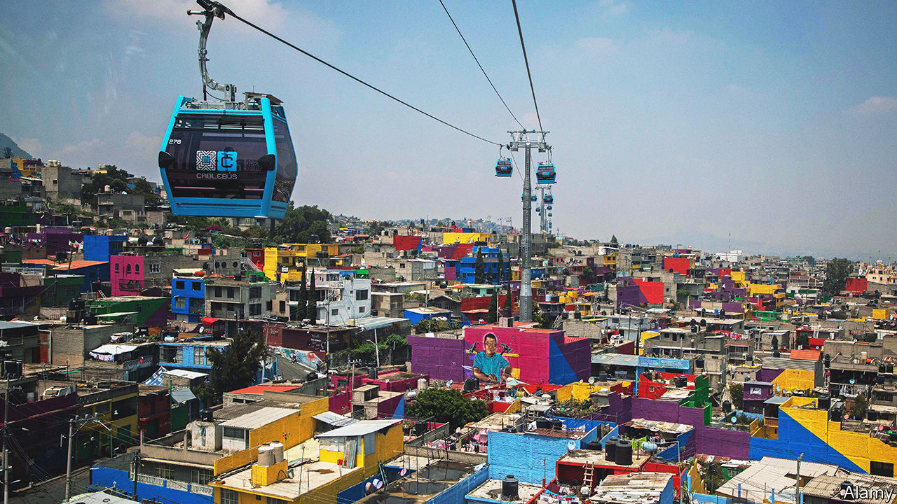
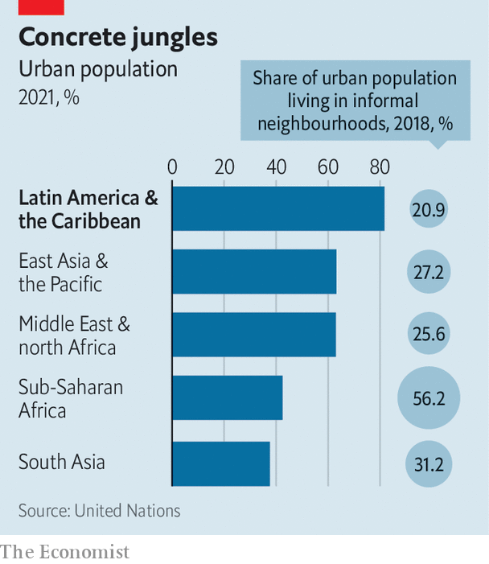

###### Barrios and baristas

# Latin American cities are becoming far nicer for poorer inhabitants 

##### The world’s most urbanised region holds lessons for developing countries 

 

> Jan 12th 2023 

It is hard not to bump into a hipster in La Condesa or Roma Norte, two trendy districts in Mexico City. The areas are abuzz with cafés, shops bursting with vintage clothes, and parks pullulating with “digital nomads” who upped sticks during the pandemic and moved there from the United States. Inevitably, locals grumble about gentrification, rising rents and  speaking English. Yet these two districts exemplify a broader trend: Latin American cities are much nicer than they used to be.

 


Fully 81% of Latin Americans live in cities. It is the world’s most urbanised region. Rural people flocked to the cities in huge numbers from the 1950s onwards, seeking better jobs, schools and health care. Many moved to a few big hubs. Urban planners could not keep pace. Housing was often unaffordable to newcomers. Instead, many built their own homes on the outskirts of towns. Between 2000 and 2010, Rio de Janeiro’s formal population grew by only 3.4%, but that of its  grew by 27%. A fifth of the region’s inhabitants live in informal neighbourhoods (see chart).

Partly as a result, by the 1990s Latin American cities had a bad reputation. But today many are transformed. São Paulo in Brazil, Buenos Aires in Argentina and Santiago in Chile all boast lower murder rates than Miami (which suffers 12.8 homicides per 100,000 people each year). 

What is striking is that most of the improvements are in the poor, unplanned settlements. Take Iztapalapa, a municipality of around 2m people in the east of Mexico City. Clara Brugada, the area’s mayor, claims that when she came to power at the end of 2018 the neighbourhood had been “abandoned”. Out of 2,454 municipalities it ranked in the top ten for violence. There was no street lighting. But now many main streets are well-lit. Since then, crime has declined. The murder rate in the municipality fell from a high of 19 per 100,000 people in 2019 to 12 in 2021. This is much lower than the country as a whole, which has a whopping 28 murders per 100,000 people each year.

Ms Brugada is not the only politician making her mark. In the past two decades, a series of mayors have integrated slums into main cities. They have improved transport networks, roads and public plazas. They have built parks. By 2014 Medellín, for decades the drug capital of Colombia, had opened up four square metres of public space per resident, including public libraries, science museums and a botanical garden. In 2022 the government of Iztapalapa built dozens of green spaces and turned cul-de-sacs into playgrounds.

Federal laws have helped. In 2001 Brazil passed one which meant that rather than eliminate slums, politicians were expected to work with their inhabitants. But the biggest driver of change is that many of these mayors have more powers than those elsewhere. The government of Buenos Aires controls education and has its own police force. It can also raise its own taxes, including stamp duty, property and income taxes. That is significantly more fiscal power than the mayor of London, though slightly fewer powers than the mayor of New York. In Medellín Sergio Fajardo, a centrist mayor from 2004 to 2007, allowed residents to choose how 5% of the municipal budget would be spent in their area. During his term, Mr Fajardo dedicated a whopping 40% of the city’s budget to education. 

The spur for innovation partly comes from the fact that Latin American mayors are directly elected, rather than appointed by the federal government. Often they want to run for national office, and so are keen to make a good impression. Claudia Sheinbaum, the mayor of Mexico City, is the favourite to become president in 2024. Mauricio Macri, mayor of Buenos Aires from 2007 to 2015, went on to become president. His successor, Horacio Rodríguez Larreta, is the frontrunner to be president in Argentina’s general elections in October.

Latin America’s city governments have also found clever ways to fund their projects, says Anacláudia Rossbach of the Lincoln Institute, an American think-tank. Cities in federal systems such as Mexico, Argentina and Brazil are often cash-strapped because they depend on transfers from the central government to fund infrastructure, and they often give more money than they receive. Colombian cities use “betterment levies”: residents whose property will appreciate in value when a road is built must pay an extra tax to fund it, and this applies to other public infrastructure, too. Many mayors also strike up public-private partnerships or apply for loans from international institutions.

Still, there is much work to be done. Crime remains high in many cities. In Mexico City the murder rate has fallen but extortion has risen, making it hard for people to start businesses. Many mayors worry that as climate change worsens, it will drive ever more migrants into the precarious outskirts of towns. Children across Latin America do worse in school than those in most other regions. And inflation squeezes budgets.

But like the hipsters and slum-dwellers, other mayors are taking note of Latin America’s progress. Late last year Buenos Aires hosted the C40 summit, which brought together mayors of 97 of the world’s biggest cities. Not far from the posh conference centre, Lis Miguel, a 49-year-old cook who once lived under a noisy highway in Villa 31, a notorious slum, opened the windows of her new home, built last year by the city government with help from the World Bank and Inter-American Development Bank. When she first arrived in the slum a decade ago, she told herself: “The first chance I get I will get out of here.” Now, she says, beckoning to her living room and open-plan kitchen, “I am here in my own peace.” ■

