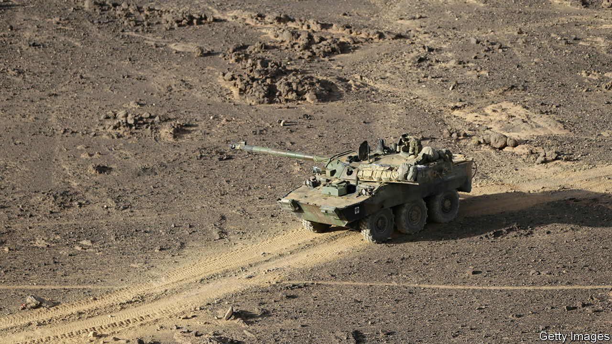

###### The Economist explains

# What is a tank—and does France’s gift to Ukraine fit the bill? 

##### Defining one is harder than you think 

 

> Jan 5th 2023 

“WE ARE NOT entering the war,” declared Emmanuel Macron, France’s president, in June 2022. “Thus, it has been agreed not to supply certain weapons—including attack aircraft or tanks.” Mr Macron has changed his tune. On January 4th he said that he had agreed to supply Ukraine with the AMX-10RC, which he described as a “light battle tank”. Among military geeks, that sparked a furious debate: does the AMX-10RC meet the definition? And what is a tank, anyway?

On the face of it, the answer is obvious. Like Justice Potter Stewart’s memorable definition of obscenity, you know a tank when you see it: a big armoured thing with a big gun. Yet this heuristic quickly leads you astray. Take Germany’s , supplied to Ukraine in 2022. It has armour, tracks and a suitably menacing gun protruding from the front. But it is not a tank. It is a howitzer; the long barrel is in fact an artillery tube, designed to fire shells high into the air and tens of kilometres away—much farther than any tank. It looks like a tank, but it does not quack like a tank.

So does the AMX-10RC count? The French vehicle is an “oddity”, says Olivier Schmitt of the Centre for War Studies at the University of Southern Denmark. In the first world war, tanks evolved to break through the front lines across rough terrain into the enemy rear with firepower and good protection. The AMX-10RC was originally designed for reconnaissance—scouting ahead of the main force—and is therefore light and quick, rather than beefy. It was a key part of France’s rapid action force, says Mr Schmitt, a group of five divisions created in the 1980s to dash 1,000km east through Germany to engage the first echelon of an invading Soviet army within 48 hours.

Its own armour is relatively light, and would not survive a hit from most modern tanks. Its gun was designed to take out Soviet tanks of the era—which is why it was called a tank “hunter”—and performed well against Iraq’s Soviet-made tanks in the Gulf war of 1991. But it could struggle to penetrate the newest Russian armour. Most controversially of all, the AMX-10RC has wheels rather than tracks. These allow it to move faster and more quietly than a traditional tank—but mean it would struggle on boggy ground and tougher terrain. For these reasons, NATO, and most purists, would consider the AMX-10RC to fall below the threshold of tank-dom. The truth is that the boundary is blurry.

During the cold war, light tanks such as this were common. But in modern armies, the balance between mobility on the one hand, and protection and firepower on the other, . Light tanks have been squeezed out at the lower end by infantry fighting vehicles (IFVs) like the Russian BMP-3 or American Bradley and at the upper end by main battle tanks (MBTs). The MBT—like America’s Abrams and Germany’s Leopard—is now the quintessential tank: very big, heavy, strong and well-armed, though correspondingly expensive and harder to maintain and operate. (Read  on the future of the tank).

Ultimately the debate is somewhat philosophical. Ukraine is  of any sort so it can mount more counter-offensives. Ukraine has long sought Germany’s Leopard tanks, which are considered among the best MBTs in the world. They are used by 13 European armies, which have more than 2,000 of them in total, according to the European Council on Foreign Relations, a think-tank. 

Germany’s government has  in part because, as Emily Haber, Germany’s ambassador in Washington observed in September, “no other nation has so far provided Ukraine with Western-made battle tanks”. Mr Macron’s decision to call the AMX-10RC a light tank is thought to have been intended as a spur to Olaf Scholz, his German counterpart.

If so, it worked—in part. On January 5th Germany said it would send the Marder, an IFV which is less capable than the Leopard but has been the workhorse of the Bundeswehr since the 1970s. At the same time, America confirmed that it would send its own Bradley IFVs, which have highly advanced sights, fire control systems and guns. 

The French announcement also underscores how far Western red lines, including Mr Macron’s, have shifted since last spring: from warning against offensive weaponry to providing a capability that will aid Ukrainian counter-offensives. “There is something touching to see the VABs [French armoured vehicles supplied earlier] and the AMX-10 do in 2022 what they had been designed for,” reflects Mr Schmitt: “Fighting the Russians.” ■

