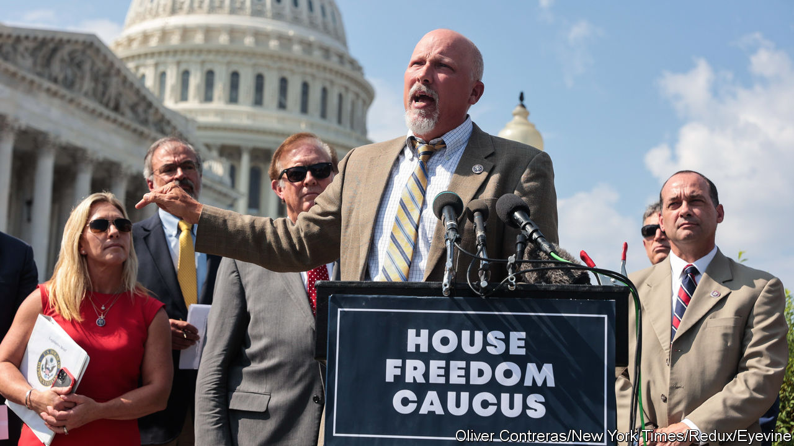

###### The Economist explains

# What is the House Freedom Caucus? 

##### A band of far-right Republicans will wield more power in America’s Congress than ever before 

 

> Jan 9th 2023 

THEY HAVE been likened by fellow Republicans to “lemmings with suicide vests”, “legislative terrorists” and the Taliban. When they formed a voting bloc in 2015 they considered naming themselves the “Reasonable Nut Job Caucus”. Members of the House Freedom Caucus, a troupe of about 50 far-right Republicans in America’s House of Representatives (out of 222 Republicans in the chamber), are unabashed agents of chaos. In this Congress they became kingmakers. Nineteen of the 20 lawmakers who forced  for the position of speaker belong to the group. Only after Kevin McCarthy granted them significant concessions did he win the job on January 7th. What is the Freedom Caucus—and what power do its members now wield?

The caucus was formed by Republican members who considered the leadership of the House (then, as now, in Republican hands) too amenable to compromise with House Democrats and the Obama administration. Ironically the group was borne of frustration with the Republican Study Committee (RSC), a once similarly minded caucus established during the Nixon administration, which had lost its insurgent character. Unlike the RSC, the Freedom Caucus’s membership was secret and invitation-only. Its bylaws stressed unity: on certain measures, if four-fifths of members agreed to vote one way, all had to follow suit. Its defiance of the House leadership quickly earned punishment. Some of its members were stripped of committee assignments and denied party funds for re-election. Yet its ranks have swelled in recent years.

Freedom Caucus members want to cut spending and shrink the government. Many support a national ban on abortion and greater restrictions on immigration. Much of that is standard conservative fare. But the caucus is willing to deploy hardball tactics that other lawmakers eschew—threatening sovereign default, for example, or holding vital legislation on budgets or the debt ceiling hostage—in pursuit of its goals. Members have been more effective at sinking bills than passing them, earning them the sobriquet the “Hell No” caucus. Among their notable victories was a mutiny in 2015 against John Boehner, the Republican speaker, who resigned rather than face a confidence vote. In 2017 they scuppered Republicans’ attempts to , the Affordable Care Act, a longtime goal of the party, because they wanted to repeal it entirely.

Mr McCarthy’s concessions will empower the caucus like never before. He promised to reduce spending to the level of the 2022 fiscal year; to restore the “motion to vacate”, which allows a single congressman to call a snap vote to oust the speaker (the threat of which felled Mr Boehner); and to install several Freedom Caucus members on the Rules Committee, which decides what bills are presented to the House. Mr McCarthy will also allow amendments to appropriations bills (legislation usually passed annually to allocate money to government departments). Rank-and-file lawmakers will find it easier to block spending. That will complicate negotiations with the Senate and the White House. A fight over the  looms later this year. Without raising the limit, America risks defaulting on its debt.

The Freedom Caucus has the most leverage when the Republican majority is thin, as it is now, with a margin of only four votes. Moderate Republicans could work with Democrats to head off the caucus. Tony Gonzales, a Republican from Texas, said he would vote against the package of rules that Mr McCarthy agreed to when it comes before the House on January 9th; Nancy Mace of South Carolina said she was “on the fence”. But bipartisanship proved to be Mr Boehner’s downfall. Mr McCarthy knows that his hold on the speakership is tenuous. In the current Congress the Freedom Caucus has the whip, says Ruth Bloch Rubin of the University of Chicago. Why not crack it? ■

