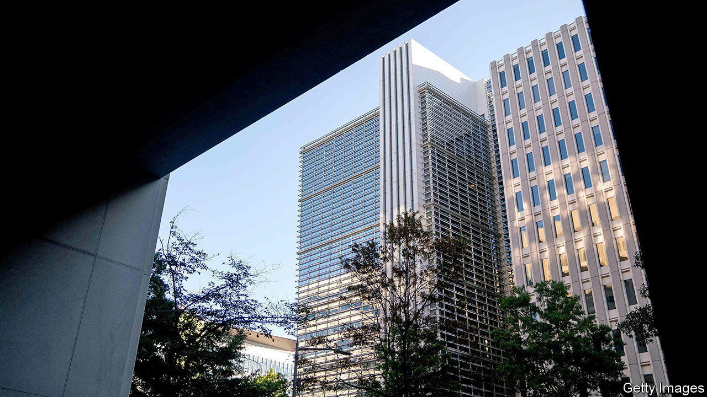
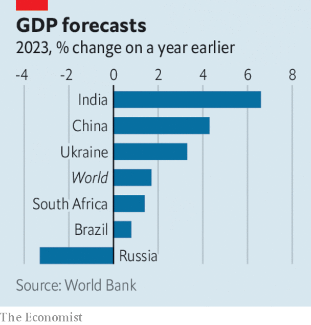

###### The world this week

# Business 

#####  

 

> Jan 12th 2023 

 


The World Bank sharply reduced its forecast of  this year, to 1.7%, which would be the third-weakest pace in nearly three decades, behind the global recessions of 2009 and 2020. The bank said the lower forecast reflected a “synchronous” tightening of monetary policy and continuing disruption caused by Russia’s war in Ukraine. It warned that small countries reeling from the pandemic and the effects of Russia’s war could see permanent losses to their output. Assuming that the war does not escalate, Ukraine’s economy is expected to grow by 3.3%, but only after a third of its GDP was wiped out last year. 

Jerome Powell said the  would not adjust its polices to tackle climate-change issues, and would instead “stick to our knitting” of making judgments related to inflation and supporting the job market. Some central banks take climate change into consideration in their deliberations. But the Fed’s chairman thinks that this would undermine support for its decisions, especially when there are tough calls to make on interest rates. 

The  inflation rate dropped to 9.2% in December from 10.1% in November, helped by a sharp fall in the cost of energy. An exceptionally mild start to the winter in Europe has helped push wholesale gas prices down to where they were before the start of Russia’s invasion of Ukraine, which should help ease inflationary pressures further. Along with positive news about German factory output and lower unemployment, the euro zone has had an optimistic start to the year, allaying fears of stagflation. 

As South Africa struggles through its worst-ever blackouts, Cyril Ramaphosa, the country’s president, warned that the energy ministry could end up taking control of , the state-owned electricity provider. The threat came after allegations emerged that an attempt was made to poison Eskom’s chief executive in December, when he submitted his resignation. 

“Restore the magic”

An almighty proxy battle was shaping up at , after the company said it did not want to give Nelson Peltz a seat on the board. Mr Peltz, a prolific activist investor, thinks Disney has paid too much for some acquisitions, such as 21st Century Fox in 2018, and wants a successor named for Bob Iger, who was recently re-installed as chief executive. 

 started a cull of around 6% of its employees, its biggest cost-cutting exercise since the financial crisis of 2007-09. The bank is anticipating a slowdown, but it had also kept on workers during the pandemic that it would normally have let go, leading to higher staffing levels. 

The upheaval in the crypto industry following the  of FTX continued to spread, as , another exchange, said it would cut 950 jobs, about a fifth of its workforce, in order to “weather downturns” in the market. 

, a Chinese fintech giant, confirmed that  is to give up control of the company and that several agreements that boosted his influence will be terminated and his voting rights vastly reduced. The announcement will please the Chinese government, which forced Ant to abandon an IPO in November 2020 at the start of its crackdown on tech companies. 

Since its launch last year, supporters and critics alike say that  has had the ability to , education and even the use of search engines.  is now reportedly considering making a $10bn investment in OpenAI, the startup behind the generative artificial intelligence chatbot. ChatGPT creates text from simple instructions. New York City has banned it from schools, in case students use it to write homework. 

 reported an 8% rise in sales for its latest quarter, year on year. Last October Albertsons agreed to merge with Kroger in a $24.6bn deal, but the combination of two of America’s biggest supermarket chains has attracted intense scrutiny from competition regulators.

 had a record year in 2022, selling 6,021 vehicles, the first time in its 118-year history that annual sales have exceeded 6,000. The carmaker, which is owned by BMW, said that this was despite a drop in orders from Russians amid the war in Ukraine. 

Don’t dine with me

The market for high-end fine dining could face a shake-up, with the news that  is to shut its doors from the end of 2024. The Copenhagen hotspot, famed for its tasting menu of Nordic cuisine (reindeer heart and slightly wet hay are some of its delights), has been rated the world’s best restaurant several times. Although customers fork out $800 for the tasting menu, René Redzepi, Noma’s founder, thinks the industry is unsustainable. Noma will instead become a cooking laboratory, with occasional pop-up nights. 

